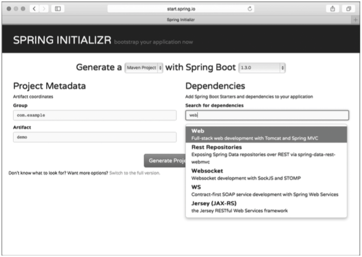
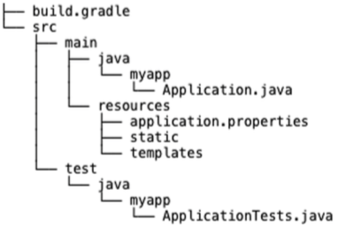
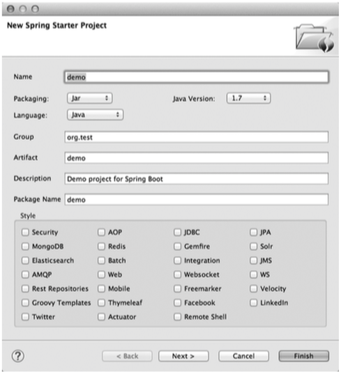
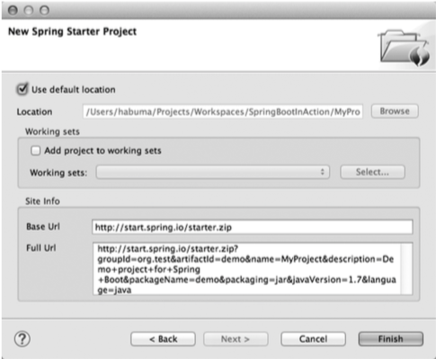

# Bootstarting Spring
# Spring Boot入门

This chapter covers  
__本章内容涉及__

* How Spring Boot simplifies Spring application development  
Spring Boot是如何简化Spring应用程序开发的
* The essential features of Spring Boot  
Spring Boot的基本特性
* Setting up a Spring Boot workspace  
设置Spring Boot工作区

The Spring Framework has been around for over a decade and has found a place as the de facto standard framework for developing Java applications. With such a long and storied history, some might think that Spring has settled, resting on its laurels, and is not doing anything new or exciting. Some might even say that Spring is legacy and that it’s time to look elsewhere for innovation.  
Spring Framework已经有超过十年的历史了，它已然成为了Java应用程序开发框架的事实标准。在如此悠久的历史背景下，有人可能会认为Spring放慢了脚步，躺在了自己的荣誉簿上，再也做不出什么新鲜的东西，或者是让人激动的东西了。更有甚者已经把Spring说成了遗留项目，是时候去看看其他创新的东西了。

Some would be wrong.  
这些人说错了。

There are many exciting new things taking place in the Spring ecosystem, including work in the areas of cloud computing, big data, schema-less data persistence, reactive programming, and client-side application development.  
在Spring的生态圈里出现了很多让人激动的新鲜事物，涉及的领域涵盖云计算、大数据、无模式的数据持久化、响应式编程以及客户端应用程序开发。

Perhaps the most exciting, most head-turning, most game-changing new thing to come to Spring in the past year or so is Spring Boot. Spring Boot offers a new paradigm for developing Spring applications with minimal friction. With Spring Boot, you’ll be able to develop Spring applications with more agility and be able to focus on addressing your application’s functionality needs with minimal (or possibly no) thought of configuring Spring itself. In fact, one of the main things that Spring Boot does is to get Spring out of your way so you can get stuff done.  
在过去的一年多时间里，最让人兴奋的、回头率最高的、最能改变游戏规则的东西大概就是Spring Boot了。Spring Boot提供了一种新的编程范式，让你能在最小的阻力下开发Spring应用程序。有了它，你就可以更加敏捷地开发Spring应用程序，专注于应用程序自己的功能，不用在Spring的配置上多花功夫（也可能是完全不用配置）。实际上，Spring Boot的一项重要工作就是让Spring不再成为你成功路上的绊脚石。

Throughout the chapters in this book, we’ll explore various facets of Spring Boot development. But first, let’s take a high-level look at what Spring Boot has to offer.  
全书通篇，我们会看到Spring Boot开发的诸多方面，但在开始前，我们先概要性地了解一下Spring Boot所提供的东西。

## 1.1 Spring rebooted
## 1.1 Spring风云再起

Spring started as a lightweight alternative to Java Enterprise Edition (JEE, or J2EE as it was known at the time). Rather than develop components as heavyweight Enterprise JavaBeans (EJBs), Spring offered a simpler approach to enterprise Java development, utilizing dependency injection and aspect-oriented programming to achieve the capabilities of EJB with plain old Java objects (POJOs).  
Spring诞生时是作为Java Enterprise Edition（当时称为JEE或J2EE）的轻量级代替品。无需开发重量级的Enterprise JavaBeans（EJBs）组件，Spring为企业级Java开发提供了一种相对简单的方法，通过依赖注入和面向切面编程用POJO（plain old Java object）实现了EJB的功能。

But while Spring was lightweight in terms of component code, it was heavyweight in terms of configuration. Initially, Spring was configured with XML (and lots of it). Spring 2.5 introduced annotation-based component-scanning, which eliminated a great deal of explicit XML configuration for an application’s own components. And Spring 3.0 introduced a Java-based configuration as a type-safe and refactorable option to XML.  
虽然Spring的组件代码很轻量级，但它的配置却很重量级。一开始，Spring是用XML配置的（而且是很多XML配置）。Spring 2.5引入了基于注解的组件扫描，这消除了大量针对应用程序自身组件的显式XML配置。在Spring 3.0里引入了基于Java的配置，这是一种类型安全、可重构的配置方式，可以代替XML。

Even so, there was no escape from configuration. Enabling certain Spring features such as transaction management and Spring MVC required explicit configuration, either in XML or Java. Enabling third-party library features such as Thymeleaf-based web views required explicit configuration. Configuring servlets and filters (such as Spring’s DispatcherServlet) required explicit configuration in web.xml or in a servlet initializer. Component-scanning reduced configuration and Java configuration made it less awkward, but Spring still required a lot of configuration.  
尽管如此，我们还是没能逃脱配置的魔爪。开启某些Spring特性时还是需要用XML或Java进行显式的配置，比如事务管理和Spring MVC。启用第三方库时也需要显式配置，比如基于Thymeleaf的Web视图。配置Servlet和过滤器（比如Spring的`DispatcherServlet`）也需要在web.xml或Servlet初始化代码里进行显式配置。组件扫描减少了配置量，Java配置让它看起来不这么难看了，但Spring还是需要不少配置。

All of that configuration represents development friction. Any time spent writing configuration is time spent not writing application logic. The mental shift required to think about configuring a Spring feature distracts from solving the business problem. Like any framework, Spring does a lot for you, but it demands that you do a lot for it in return.  
所有的这些配置都代表了开发时遭遇的损耗，花时间写配置就浪费了写应用程序逻辑的时间。你需要在思考如何配置Spring特性和如何解决业务问题之间进行思维切换。和任何框架一样，Spring为你做了很多事情，但与此同时它也要求你做不少事以示回报。

Moreover, project dependency management is a thankless task. Deciding what libraries need to be part of the project build is tricky enough. But it’s even more challenging to know which versions of those libraries will play well with others.  
除此之外，项目的依赖管理也是件吃力不讨好的事情。决定项目里要用哪些库就已经够让人头痛的了，你还要知道这些库的哪个版本和其他库不会有冲突，这件事的挑战实在是太大了。

As important as it is, dependency management is another form of friction. When you’re adding dependencies to your build, you’re not writing application code. Any incompatibilities that come from selecting the wrong versions of those dependencies can be a real productivity killer.  
依赖管理也是一种损耗，当你添加依赖时，你没有在写应用程序代码。一旦选错了依赖的版本，随之而来的不兼容问题毫无疑问会是生产力杀手。

Spring Boot has changed all of that.  
Spring Boot让这一切成为了过去。

### 1.1.1 Taking a fresh look at Spring
### 1.1.1 重新认识Spring

Suppose you’re given the task of developing a very simple Hello World web application with Spring. What would you need to do? I can think of a handful of things you’d need at a bare minimum:  
假设你受命用Spring开发一个简单的Hello World Web应用程序。你该做什么？我能想到一些你需要的最基本的东西：

* A project structure, complete with a Maven or Gradle build file including required dependencies. At the very least, you’ll need Spring MVC and the Servlet API expressed as dependencies.  
一个项目结构，其中有一个包含必要依赖的Maven或者Gradle构建文件。最起码，你要有Spring MVC和Servlet API这些依赖。
* A web.xml file (or a WebApplicationInitializer implementation) that declares Spring’s DispatcherServlet.  
一个web.xml（或者一个`WebApplicationInitializer`实现），其中声明了Spring的`DispatcherServlet`。
* A Spring configuration that enables Spring MVC.  
一个启用了Spring MVC的Spring配置。
* A controller class that will respond to HTTP requests with “Hello World”.  
一个控制器类，它会用“Hello World”来响应HTTP请求。
* A web application server, such as Tomcat, to deploy the application to.  
一个用于部署应用程序的Web应用服务器，比如Tomcat。

What’s most striking about this list is that only one item is specific to developing the Hello World functionality: the controller. The rest of it is generic boilerplate that you’d need for any web application developed with Spring. But if all Spring web applications need it, why should you have to provide it?  
最让人难以接受的是这份清单里只有一个东西是和你所开发的Hello World功能相关的，即控制器，剩下的都是那种所有用Spring开发的Web应用程序都需要的通用样板。既然所有Spring Web应用程序都要用到它们，那为什么还要你来提供这些东西呢？

Suppose for a moment that the controller is all you need. As it turns out, the Groovy-based controller class shown in listing 1.1 is a complete (even if simple) Spring application.  
暂且假设控制器就是你所需要的一切，那么你会发现，代码1.1所示的基于Groovy的控制器类（虽然很简单）就是一个完整的Spring应用程序。

Listing 1.1 A complete Groovy-based Spring application  
__代码1.1 一个完整的基于Groovy的Spring应用程序__

```groovy
@RestController
class HelloController {
  @RequestMapping("/")
  def hello() {
    return "Hello World"
  }
}
```

There’s no configuration. No web.xml. No build specification. Not even an application server. This is the entire application. Spring Boot will handle the logistics of executing the application. You only need to bring the application code.  
这里没有配置，没有web.xml，没有构建说明，甚至都没有应用服务器，但这就是整个应用程序了。Spring Boot会搞定执行应用程序所需的各种后勤工作的，你只要搞定应用程序的代码就好了。

Assuming that you have Spring Boot’s command-line interface (CLI) installed, you can run HelloController at the command line like this:  
假设你已经装好了Spring Boot的命令行界面（CLI），可以像下面这样在命令行里运行`HelloController`：

```
$ spring run HelloController.groovy
```

You may have also noticed that it wasn’t even necessary to compile the code. The Spring Boot CLI was able to run it from its uncompiled form.  
相比你已经注意到了，这里甚至都没有编译代码，Spring Boot CLI可以运行未经编译的代码。

I chose to write this example controller in Groovy because the simplicity of the Groovy language presents well alongside the simplicity of Spring Boot. But Spring Boot doesn’t require that you use Groovy. In fact, much of the code we’ll write in this book will be in Java. But there’ll be some Groovy here and there, where appropriate.  
我之所以选择用Groovy来写这个范例控制器，是因为Groovy语言的简单性与Spring Boot的简单性有异曲同工之妙。但Spring Boot并不强制你使用Groovy。实际上，本书中的很多代码都是用Java写的，但在恰当的时候，偶尔也会出现一些Groovy代码。

Feel free to look ahead to section 1.21 to see how to install the Spring Boot CLI, so that you can try out this little web application. But for now, we’ll look at the key pieces of Spring Boot to see how it changes Spring application development.  
不要客气，直接跳到1.21小节吧，看看如何安装Spring Boot CLI，这样你就能试试这个小小的Web应用程序了。现在，我们将看到Spring Boot的关键部分，看看它是如何改变Spring应用程序的开发方式的。

### 1.1.2 Examining Spring Boot essentials
### 1.1.2 Spring Boot精要

Spring Boot brings a great deal of magic to Spring application development. But there are four core tricks that it performs:  
Spring Boot将很多魔法带入了Spring应用程序的开发之中，其中最重要的就是以下四个核心：

* Automatic configuration—Spring Boot can automatically provide configuration for application functionality common to many Spring applications.  
___自动配置___——针对很多Spring应用程序常见的应用功能，Spring Boot能自动提供相关配置。
* Starter dependencies—You tell Spring Boot what kind of functionality you need, and it will ensure that the libraries needed are added to the build.  
___起步依赖___——告诉Spring Boot你需要什么功能，它就能引入你需要的库。
* The command-line interface—This optional feature of Spring Boot lets you write complete applications with just application code, but no need for a traditional project build.  
___命令行界面___——这是Spring Boot的可选特性，让你只用写代码就能完成完整的应用程序，无需传统项目构建。
* The Actuator—Gives you insight into what’s going on inside of a running Spring Boot application.  
___Actuator___——让你能够深入运行中的Spring Boot应用程序，一探究竟。

Each of these features serves to simplify Spring application development in its own way. We’ll look at how to employ them to their fullest throughout this book. But for now, let’s take a quick look at what each offers.  
这每一个特性都在通过其自己的方式简化着Spring应用程序的开发。全书会让你了解到如何将它们发挥到极致，但就目前而言，先简单看看它们都提供了哪些东西吧。

#### AUTO-CONFIGURATION
#### 自动配置

In any given Spring application’s source code, you’ll find either Java configuration or XML configuration (or both) that enables certain supporting features and functionality for the application. For example, if you’ve ever written an application that accesses a relational database with JDBC, you’ve probably configured Spring’s JdbcTemplate as a bean in the Spring application context. I’ll bet the configuration looked a lot like this:  
在任何Spring应用程序的源代码里，你都会找到Java配置或者XML配置（或者两者皆而有之），它们为应用程序开启了特定的特性和功能。举个例子，如果你写过用JDBC访问关系型数据库的应用程序，那你一定在Spring应用程序上下文里配置过`JdbcTemplate`这个Bean。我打赌那段配置看起来是这样的：

```java
@Bean
public JdbcTemplate jdbcTemplate(DataSource dataSource) {
  return new JdbcTemplate(dataSource);
}
```

This very simple bean declaration creates an instance of JdbcTemplate, injecting it with its one dependency, a DataSource. Of course, that means that you’ll also need to configure a DataSource bean so that the dependency will be met. To complete this configuration scenario, suppose that you were to configure an embedded H2 database as the DataSource bean:  
这段非常简单的Bean声明创建了一个`JdbcTemplate`的实例，通过它的依赖注入了一个`DataSource`。当然，这意味着你还需要配置一个`DataSource`的Bean，这样才能满足依赖。假设你将配置一个嵌入式H2数据库作为`DataSource` Bean，完成这个配置场景的代码大概是这样的：

```java
@Bean
public DataSource dataSource() {
  return new EmbeddedDatabaseBuilder()
          .setType(EmbeddedDatabaseType.H2)
          .addScripts('schema.sql', 'data.sql')
          .build();
}
```

This bean configuration method creates an embedded database, specifying two SQL scripts to execute on the embedded database. The build() method returns a DataSource that references the embedded database.  
这个Bean配置方法创建了一个嵌入式数据库，并指定在该数据库上执行两段SQL脚本。`build()`方法返回了一个指向该数据库的引用。

Neither of these two bean configuration methods is terribly complex or lengthy. But they represent just a fraction of the configuration in a typical Spring application. Moreover, there are countless Spring applications that will have these exact same methods. Any application that needs an embedded database and a JdbcTemplate will need those methods. In short, it’s boilerplate configuration.  
这两个Bean配置方法都不复杂，也不是很长，但它们只是典型Spring应用程序配置的一个很小的部分。除此之外，还有无数的Spring应用程序有着完全相同的方法。所有需要用到嵌入式数据库和`JdbcTemplate`的应用程序都会用到那些方法。简而言之，这就是一个样板配置。

If it’s so common, then why should you have to write it?  
既然它如此常见，那为什么还要你去写呢？

Spring Boot can automatically configure these common configuration scenarios. If Spring Boot detects that you have the H2 database library in your application’s classpath, it will automatically configure an embedded H2 database. If JdbcTemplate is in the classpath, then it will also configure a JdbcTemplate bean for you. There’s no need for you to worry about configuring those beans. They’ll be configured for you, ready to inject into any of the beans you write.  
Spring Boot会为这些常见配置场景进行自动配置。如果Spring Boot在应用程序的Classpath里发现H2的库，那么它就自动配置一个嵌入式H2数据库。如果Classpath里发现`JdbcTemplate`，那么它还会为你配置一个`JdbcTemplate`的Bean。你无需操心那些Bean的配置，Spring Boot会准备好那些Bean，随时可以注入到你写的Bean里。

There’s a lot more to Spring Boot auto-configuration than embedded databases and JdbcTemplate. There are several dozen ways that Spring Boot can take the burden of configuration off your hands, including auto-configuration for the Java Persistence API (JPA), Thymeleaf templates, security, and Spring MVC. We’ll dive into auto-configuration starting in chapter 2.  
Spring Boot的自动配置远不止嵌入式数据库和`JdbcTemplate`，它有大把的办法帮你减轻配置负担，这些自动配置涉及Java Persistence API（JPA）、Thymeleaf模板、安全和Spring MVC。在第2章里我们还会深入讨论自动配置这个话题。

#### STARTER DEPENDENCIES
#### 起步依赖

It can be challenging to add dependencies to a project’s build. What library do you need? What are its group and artifact? Which version do you need? Will that version play well with other dependencies in the same project?  
向项目中添加依赖是件富有挑战的事。你需要什么库？它的Group和Artifact是什么？你需要哪个版本？哪个版本不会和项目中的其他依赖发生冲突？

Spring Boot offers help with project dependency management by way of starter dependencies. Starter dependencies are really just special Maven (and Gradle) dependencies that take advantage of transitive dependency resolution to aggregate commonly used libraries under a handful of feature-defined dependencies.  
Spring Boot通过起步依赖的方式为项目的依赖管理提供帮助。起步依赖其实就是特殊的Maven（和Gradle）依赖，它们利用了传递依赖解析把常用库聚合在一起，组成了几个为特定功能而定制的依赖。

For example, suppose that you’re going to build a REST API with Spring MVC that works with JSON resource representations. Additionally, you want to apply declarative validation per the JSR-303 specification and serve the application using an embedded Tomcat server. To accomplish all of this, you’ll need (at minimum) the following eight dependencies in your Maven or Gradle build:  
举个例子，假设你正在用Spring MVC构造一个REST API，并将JSON作为资源表述。此外，你还想运用遵循JSR-303规范的声明式校验，并使用嵌入式的Tomcat服务器来提供服务。要实现以上目标，你在Maven或Gradle里将（最少）需要以下八个依赖：

* org.springframework:spring-core
* org.springframework:spring-web
* org.springframework:spring-webmvc
* com.fasterxml.jackson.core:jackson-databind
* org.hibernate:hibernate-validator
* org.apache.tomcat.embed:tomcat-embed-core
* org.apache.tomcat.embed:tomcat-embed-el
* org.apache.tomcat.embed:tomcat-embed-logging-juli

On the other hand, if you were to take advantage of Spring Boot starter dependencies, you could simply add the Spring Boot “web” starter (org.springframework.boot:spring-boot-starter-web) as a build dependency. This single dependency will transitively pull in all of those other dependencies so you don’t have to ask for them all.  
但如果你打算利用Spring Boot的起步依赖，就只需添加Spring Boot “web”起步依赖（org.springframework.boot:spring-boot-starter-web），仅此一个。它会根据依赖传递把其他所需依赖引入项目里，你都不用考虑它们。

But there’s something more subtle about starter dependencies than simply reducing build dependency count. Notice that by adding the “web” starter to your build, you’re specifying a type of functionality that your application needs. Your app is a web application, so you add the “web” starter. Likewise, if your application will use JPA persistence, then you can add the “jpa” starter. If it needs security, you can add the “security” starter. In short, you no longer need to think about what libraries you’ll need to support certain functionality; you simply ask for that functionality by way of the pertinent starter dependency.  
比起减少依赖数量，起步依赖还引入了一些微妙的变化。向项目中添加了“web”起步依赖后，你实际是指定了应用程序所需的一类功能。因为你的应用是个Web应用程序，所以你加入了“web”。类似的，如果你的应用程序要用到JPA持久化，那么久可以加入“jpa”起步依赖。如果需要安全功能，那就加入“security”。简而言之，你不再需要考虑支持某种功能要用什么库了，只要引入相关起步依赖就行了。

Also note that Spring Boot’s starter dependencies free you from worrying about which versions of these libraries you need. The versions of the libraries that the starters pull in have been tested together so that you can be confident that there will be no incompatibilities between them.  
此外，Spring Boot的起步依赖还把你从“需要这些库的哪些版本”这个问题里解放了出来。起步依赖引入的库的版本都是经过测试的，因此你可以完全放心，它们之间不会出现不兼容的情况。

Along with auto-configuration, we’ll begin using starter dependencies right away, starting in chapter 2.  
和自动配置一样，我们马上会在第2章里用到起步依赖。

#### THE COMMAND-LINE INTERFACE (CLI)
#### 命令行界面（CLI）

In addition to auto-configuration and starter dependencies, Spring Boot also offers an intriguing new way to quickly write Spring applications. As you saw earlier in section 1.1, the Spring Boot CLI makes it possible to write applications by doing more than writing the application code.  
除了自动配置和起步依赖，Spring Boot还提供了一种很有意思的方法，可以快速开发Spring应用程序。正如之前在1.1节里看到的那样，Spring Boot CLI让只写代码就能实现应用程序成为可能。

Spring Boot’s CLI leverages starter dependencies and auto-configuration to let you focus on writing code. Not only that, did you notice that there are no import lines in listing 1.1? How did the CLI know what packages RequestMapping and RestController come from? For that matter, how did those classes end up in the classpath?  
Spring Boot CLI利用了起步依赖和自动配置，让你能专注于代码本身。不仅如此，你是否注意到代码1.1里没有`import`？CLI是怎么知道`RequestMapping`和`RestController`来自哪个包呢？说到这个问题，那些类最终又是怎么跑到Classpath里的呢？

The short answer is that the CLI detected that those types are being used, and it knows which starter dependencies to add to the classpath to make it work. Once those dependencies are in the classpath, a series of auto-configuration kicks in and ensures that DispatcherServlet and Spring MVC are enabled so that the controller can respond to HTTP requests.  
说的简单一点，CLI检测到你使用了哪些类，它知道要向Classpath中添加哪些起步依赖才能让它运转起来。一旦那些依赖出现在Classpath中，一系列自动配置就会接踵而来，确保启用了`DispatcherServlet`和Spring MVC，这样就能响应HTTP请求了。

Spring Boot’s CLI is an optional piece of Spring Boot’s power. Although it provides tremendous power and simplicity for Spring development, it also introduces a rather unconventional development model. If this development model is too extreme for your taste, then no problem. You can still take advantage of everything else that Spring Boot has to offer even if you don’t use the CLI. But if you like what the CLI provides, you’ll definitely want to look at chapter 5 where we’ll dig deeper into Spring Boot’s CLI.  
Spring Boot CLI是Spring Boot的一个非必要组成部分。虽然它为Spring开发带来了惊人的力量，并大大简化了开发，但还是引入了一套不太常规的开发模型。要是这种开发模型与你的口味相去胜远也没关系，就算不用CLI，你还是可以利用Spring Boot提供的其他东西。但要是你喜欢CLI，你一定会想看看第5章，其中深入探讨了Spring Boot CLI。

#### THE ACTUATOR
#### Actuator

The final piece of the Spring Boot puzzle is the Actuator. Where the other parts of Spring Boot simplify Spring development, the Actuator instead offers the ability to inspect the internals of your application at runtime. With the Actuator installed, you can inspect the inner workings of your application, including details such as  
Spring Boot里的最后一块拼图是Actuator，其他几个部分都是旨在简化Spring开发，而Actuator则是要提供在运行时检视应用程序内部情况的能力。安装了Actuator之后，就能窥探应用程序的内部情况了，包括如下细节

* What beans have been configured in the Spring application context  
Spring应用程序上下文里配置了什么Bean
* What decisions were made by Spring Boot’s auto-configuration  
Spring Boot的自动配置做了什么决策
* What environment variables, system properties, configuration properties, and command-line arguments are available to your application  
应用程序取到了什么环境变量、系统属性、配置属性和命令行参数
* The current state of the threads in and supporting your application  
应用程序里线程的当前状态
* A trace of recent HTTP requests handled by your application  
应用程序最近处理过的HTTP请求的追踪情况
* Various metrics pertaining to memory usage, garbage collection, web requests,
and data source usage  
各种和内存用量、垃圾回收、Web请求和数据源用量相关的指标

The Actuator exposes this information in two ways: via web endpoints or via a shell interface. In the latter case, you can actually open a secure shell (SSH) into your application and issue commands to inspect your application as it runs.  
Actuator通过两种方式向外提供信息：Web端点和Shell界面。在第二种方式里，你可以打开一个安全Shell（SSH），登入运行中的应用程序，发送指令查看它的情况。

We’ll explore the Actuator’s capabilities in detail when we get to chapter 7.  
在第7章里我们会一起探索Actuator的细节。

### 1.1.3 What Spring Boot isn’t
### 1.1.3 Spring Boot不是什么

Because of the amazing things Spring Boot does, there has been a lot of talk about Spring Boot in the past year or so. Depending on what you’ve heard or read about Spring Boot before reading this book, you may have a few misconceptions about Spring Boot that should be cleared up before continuing.  
因为Spring Boot实在是太惊艳了，过去一年多的时间里有不少和它相关的言论。鉴于在阅读本书前你听到或看到的东西，可能给你造成了一些误解，在继续本书前应该先澄清一下。

First, Spring Boot is not an application server. This misconception stems from the fact that it’s possible to create web applications as self-executable JAR files that can be run at the command line without deploying applications to a conventional Java application server. Spring Boot accomplishes this by embedding a servlet container (Tomcat, Jetty, or Undertow) within the application. But it’s the embedded servlet container that provides application server functionality, not Spring Boot itself.  
首先，Spring Boot不是一个应用服务器。造成这个误解的原因是这样的，Spring Boot可以把Web应用程序变为可自执行的JAR文件，不用部署到传统Java应用服务器里就能在命令行里运行。Spring Boot在应用程序里嵌入了一个Servlet容器（Tomcat、Jetty或Undertow），藉此来实现这一功能的。但这是内嵌的Servlet容器提供的功能，不是Spring Boot实现的。

Similarly, Spring Boot doesn’t implement any enterprise Java specifications such as JPA or JMS. It does support several enterprise Java specifications, but it does so by automatically configuring beans in Spring that support those features. For instance, Spring Boot doesn’t implement JPA, but it does support JPA by auto-configuring the appropriate beans for a JPA implementation (such as Hibernate).  
类似的，Spring Boot也没有实现诸如JPA或JMS之类的企业级Java规范。它的确支持不少企业级Java规范，但是通过在Spring里自动配置Bean来支持那些特性的。例如，Spring Boot没有实现JPA，不过它自动配置了某个JPA实现（比如Hibernate）的Bean。

Finally, Spring Boot doesn’t employ any form of code generation to accomplish its magic. Instead, it leverages conditional configuration features from Spring 4, along with transitive dependency resolution offered by Maven and Gradle, to automatically configure beans in the Spring application context.  
最后，Spring Boot没有引入任何形式的代码生成，而是利用了Spring 4的条件配置特性，以及Maven和Gradle提供的传递依赖解析，以此实现Spring应用程序上下文里的自动配置。

In short, at its heart, Spring Boot is just Spring. Inside, Spring Boot is doing the same kind of bean configuration in Spring that you might do on your own if Spring Boot didn’t exist. Thankfully, because Spring Boot does exist, you’re freed from dealing with explicit boilerplate configuration and are able to focus on the logic that makes your application unique.  
简而言之，从本质上来说，Spring Boot就是Spring，它做了那些没有它你自己也会去做的Spring Bean配置。谢天谢地，幸好有Spring，你不用在写这些样板配置了，可以专注于应用程序的逻辑，这些才是让你的应用程序变得独一无二的东西。

By now you should have a general idea of what Spring Boot brings to the table. It’s just about time for you to build your first application with Spring Boot. First things first, though. Let’s see how you can take your first steps with Spring Boot.  
现在你应该对Spring Boot有个大概的认识了，现在是时候构建你的第一个Spring Boot应用程序了。先从重要的事情开始，该怎么入手呢？

## 1.2 Getting started with Spring Boot
## 1.2 Spring Boot入门

Ultimately, a Spring Boot project is just a regular Spring project that happens to leverage Spring Boot starters and auto-configuration. Therefore, any technique or tool you may already be familiar with for creating a Spring project from scratch will apply to a Spring Boot project. There are, however, a few convenient options available for kickstarting your project with Spring Boot.  
从根本上来说，Spring Boot的项目只是普通的Spring项目，只是它们正好用到了Spring Boot的起步依赖和自动配置而已。因此，那些你早已熟悉的从头创建Spring项目的技术或工具都能被用于Spring Boot项目。然而，还是有一些简便的途径来开始一个新的Spring Boot项目的。

The quickest way to get started with Spring Boot is to install the Spring Boot CLI so that you can start writing code, such as that in listing 1.1, that runs via the CLI.  
最快的方法就是安装Spring Boot CLI，然后你就可以开始写代码了，就像代码1.1一样，接着通过CLI来运行就好了。

### 1.2.1 Installing the Spring Boot CLI
### 1.2.1 安装Spring Boot CLI

As we discussed earlier, the Spring Boot CLI offers an interesting, albeit unconventional, approach to developing Spring applications. We’ll dive into the specifics of what the CLI offers in chapter 5. But for now let’s look at how to install the Spring Boot CLI so that you can run the code we looked at in listing 1.1.  
如前文所述，Spring Boot CLI提供了一种有趣的、不同寻常的方式来开发Spring应用程序。在第5章里我们会详细了解CLI提供的功能，但先让我们来看看如何安装Spring Boot CLI，这样你才能运行代码1.1里的东西。

There are several ways to install the Spring Boot CLI:  
Spring Boot CLI有好几种安装方式：

* From a downloaded distribution  
用下载的分发包进行安装
* Using the Groovy Environment Manager  
使用Groovy Environment Manager进行安装
* With OS X Homebrew  
通过OS X Homebrew进行安装
* As a port using MacPorts  
使用MacPorts进行安装

We’ll look at each installation option. In addition, we’ll also see how to install support for Spring Boot CLI command completion, which comes in handy if you’re using the CLI on BASH or zsh shells (sorry, Windows users). Let’s first look at how you can install the Spring Boot CLI manually from a distribution.  
让我们分别看一下这几种方式，除此之外，我们还将了解如何安装Spring Boot CLI的命令行补全支持，要是你是在BASH或zsh Shell里使用CLI这会非常有用（抱歉了，各位Windows用户们）。先让我们看看如何用分发包手工安装Spring Boot CLI吧。

#### MANUALLY INSTALLING THE SPRING BOOT CLI
#### 手工安装Spring Boot CLI

Perhaps the most straightforward way to install the Spring Boot CLI is to download it, unzip it, and add its bin directory to your path. You can download the distribution archive from either of these locations:  
也许安装Spring Boot CLI最直接的方法就是下载、解压，随后将它的bin目录添加到系统路径里。你可以从以下这些地址下载到分发包：

* http://repo.spring.io/release/org/springframework/boot/spring-boot-cli/1.3.0.RELEASE/spring-boot-cli-1.3.0.RELEASE-bin.zip
* http://repo.spring.io/release/org/springframework/boot/spring-boot-cli/1.3.0.RELEASE/spring-boot-cli-1.3.0.RELEASE-bin.tar.gz

Once you’ve downloaded the distribution, unpack it somewhere in your filesystem. Inside of the unpacked archive, you’ll find a bin directory that contains a spring.bat script (for Windows) and a spring script for Unix. Add this bin directory to your system path and you’re ready to use the Spring Boot CLI.  
一旦下载完成，把它解压到文件系统的任意目录里，在解压后的目录里你会找到一个bin目录，其中包含了一个spring.bat脚本（用于Windows环境）和一个spring脚本（用于Unix环境）。把这个bin目录添加到系统路径里，然后你就能使用Spring Boot CLI了。

> __SYMBOLICALLY LINKING TO SPRING BOOT__ If you’re using the Spring Boot CLI on a Unix machine, it may be helpful to create a symbolic link to the unpacked archive and add the symbolic link to your path instead of the actual directory. This will make it easy to upgrade to a newer version of Spring Boot later (or even to flip between versions) by simply reassigning the symbolic link to the directory of the new version.  
> __为Spring Boot建立符号链接__ 如果是在Unix机器上使用Spring Boot CLI，最好建立一个指向解压目录的符号链接，然后把这个符号链接添加到系统路径里，而不是实际的目录。这样在后续升级Spring Boot新版本时就会很方便，只要简单地重建一下符号链接，指向新版本就好了。

You can kick the tires a little on the installation by verifying the version of the CLI that was installed:  
你可以先浅尝辄止一下，看看你所安装的CLI的版本号：

```
$ spring --version
```

If everything is working, you’ll be shown the version of the Spring Boot CLI that was installed.  
如果一切正常，你会看到安装好的Spring Boot CLI的版本号。

Even though this is the manual installation, it’s an easy option that doesn’t require you to have anything additional installed. If you’re a Windows user, it’s also the only choice available to you. But if you’re on a Unix machine and are looking for something a little more automated, then maybe the Software Development Kit Manager can help.  
虽然这是手工安装的，但一切都很容易，而且不要求你安装任何附加的东西。如果你是一名Windows用户，那你也别无选择，这是唯一的安装方式。但如果你使用的是Unix机器，而且想要稍微自动化一点的方式，那么可以试试Software Development Kit Manager。

#### INSTALLING WITH THE SOFTWARE DEVELOPMENT KIT MANAGER
#### 使用Software Development Kit Manager进行安装

The Software Development Kit Manager (SDKMAN; formerly known as GVM) can be used to install and manage multiple versions of Spring Boot CLI installations. In order to use SDKMAN, you’ll need to get and install the SDKMAN tool from http://sdkman.io. The easiest way to install SDKMAN is at the command line:  
Software Development Kit Manage（SDKMAN，前称是GVM）也能用来安装和管理多个版本的Spring Boot CLI。为了使用SDKMAN，你需要先从[http://sdkman.io](http://sdkman.io)获取并安装SDKMAN，最简单的安装方式是用命令行：

```
$ curl -s get.sdkman.io | bash
```

Follow the instructions given in the output to complete the SDKMAN installation. For my machine, I had to perform the following command at the command line:  
遵从输出的指示就能完成SDKMAN的安装，在我的机器上，我在命令行里执行了如下命令：

```
$ source "/Users/habuma/.sdkman/bin/sdkman-init.sh"
```

Note that this command will be different for different users. In my case, my home directory is at /Users/habuma, so that’s the root of the shell script’s path. You’ll want to adjust accordingly to fit your situation.  
请注意，用户不同，这条命令也会有所不同。我的用户目录是`/Users/habuma`，所以这也是Shell脚本的根路径。你需要根据你的实际情况稍作调整。

Once SDKMAN is installed, you can install Spring Boot’s CLI like this:  
一旦安装好了SDKMAN，就可以用下面的方式来安装Spring Boot CLI了：

```
$ sdk install springboot
$ spring --version
```

Assuming all goes well, you’ll be shown the current version of Spring Boot.  
假设一切正常，你将看到Spring Boot的当前版本号。

If you want to upgrade to a newer version of Spring Boot CLI, you just need to install it and start using it. To find out which versions of Spring Boot CLI are available, use SDKMAN’s list command:  
如果想升级新版本的Spring Boot CLI，只需安装并使用就行了。要找到可用的版本，使用SDKMAN的`list`命令：

```
$ sdk list springboot
```

The list command shows all available versions, including which versions are installed and which is currently in use. From this list you can choose to install a version and then use it. For example, to install Spring Boot CLI version 1.3.0.RELEASE, you’d use the install command, specifying the version:  
`list`命令列出了所有可用版本，包括已经安装的和正在使用的，从中选择一个进行安装后就可以正常使用了。举例来说，要安装Spring Boot CLI 1.3.0.RELEASE，直接使用`install`命令，指定版本号：

```
$ sdk install springboot 1.3.0.RELEASE
```

This will install the new version and ask if you’d like to make it the default version. If you choose not to make it the default version or if you wish to switch to a different version, you can use the use command:  
这将安装一个新版本，随后会询问你是否将其设置为默认版本。要是你不想把它作为默认版本，或者想要切换到另一个版本，可以用`use`命令：

```
$ sdk use springboot 1.3.0.RELEASE
```

If you’d like that version to be the default for all shells, use the default command:  
如果你希望把那个版本作为所有Shell的默认版本，使用`default`命令：

```
$ sdk default springboot 1.3.0.RELEASE
```

The nice thing about using SDKMAN to manage your Spring Boot CLI installation is that it allows you to easily switch between different versions of Spring Boot. This will enable you to try out snapshot, milestone, and release candidate builds before they’re formally released, but still switch back to a stable release for other work.  
使用SDKMAN来管理Spring Boot CLI有一个好处，它允许你方便地在Spring Boot的不同版本之间进行切换。这样你可以在正式发布前试用快照版本（snapshot）、里程碑版本（milestone）和候选版本（release candidate），试用后再切回稳定版本进行其他工作。

#### INSTALLING WITH HOMEBREW
#### 使用Homebrew进行安装

If you’ll be developing on an OS X machine, you have the option of using Homebrew to install the Spring Boot CLI. Homebrew is a package manager for OS X that is used to install many different applications and tools. The easiest way to install Homebrew is by running the installation Ruby script:  
如果你要在OS X的机器上做开发，还可以用Homebrew来安装Spring Boot CLI。Homebrew是OS X的包管理器，用于安装多种不同应用程序和工具，要按照Homebrew，最简单的方法就是运行安装用的Ruby脚本：

```
ruby -e "$(curl -fsSL https://raw.githubusercontent.com/Homebrew/install/ master/install)"
```

You can read more about Homebrew (and find other installation options) at http://brew.sh.  
你可以在[http://brew.sh](http://brew.sh)看到更多关于Homebrew的内容（还有安装方法）。

In order to install the Spring Boot CLI using Homebrew, you’ll need to “tap” Pivotal’s tap:<sup>[1][]</sup>  
要用Homebrew来安装Spring Boot CLI，你需要引入Pivotal的tap：<sup>[1][]</sup>

```
$ brew tap pivotal/tap
```

Now that Homebrew is tapping Pivotal’s tap, you can install the Spring Boot CLI like this:  
在有了Pivotal的tap后，就可以像下面这样来安装Spring Boot CLI了：

```
$ brew install springboot
```

Homebrew will install the Spring Boot CLI to /usr/local/bin, and it’s ready to go. You can verify the installation by checking the version that was installed:  
Homebrew会把Spring Boot CLI安装到/usr/local/bin，直接就可以用了。你可以通过检查版本号来验证安装是否成功：

```
$ spring --version
```

It should respond by showing you the version of Spring Boot that was installed. You can also try running the code in listing 1.1.  
这条命令应该会返回刚才安装的Spring Boot的版本号，你也可以运行代码1.1看看。

[1]: # "Tapping is a way to add additional repositories to those that Homebrew works from. Pivotal, the company behind Spring and Spring Boot, has made the Spring Boot CLI available through its tap. tap是向Homebrew添加额外仓库的一种途径。Pivotal是Spring及Spring Boot背后的公司，通过它的tap可以安装Spring Boot。"

#### INSTALLING WITH MACPORTS
#### 使用MacPorts进行安装

Another Spring Boot CLI installation option for OS X users is to use MacPorts, another popular installer for Mac OS X. In order to use MacPorts to install the Spring Boot CLI, you must first install MacPorts, which itself requires that you have Xcode installed. Furthermore, the steps for installing MacPorts vary depending on which version of OS X you're using. Therefore, I refer you to https://www.macports.org/install.php for instructions on installing MacPorts.  
OS X用户还有另一种安装Spring Boot CLI的方法，即MacPorts，这是Mac OS X上的另一个流行的安装工具。要使用MacPorts来安装Spring Boot CLI，你必须先安装MacPorts，而它自己还要求安装Xcode。此外，使用不同版本的OS X时，MacPorts的安装步骤也会有所不同。因此我建议你根据[https://www.macports.org/install.php](https://www.macports.org/install.php)的安装指南来安装MacPorts。

Once you have MacPorts installed, you can install the Spring Boot CLI at the command line like this:  
一旦安装好了MacPorts，就可以用以下命令来安装Spring Boot CLI了：

```
$ sudo port install spring-boot-cli
```

MacPorts will install the Spring Boot CLI to /opt/local/share/java/spring-boot-cli and put a symbolic link to the binary in /opt/local/bin, which should already be in your system path from installing MacPorts. You can verify the installation by checking the version that was installed:  
MacPorts会把Spring Boot CLI安装到/opt/local/share/java/spring-boot-cli，并在/opt/local/bin里放一个指向其可执行文件的符号链接，在安装MacPorts后/opt/local/bin这个目录应该就在系统路径里了。你可以检查版本号来验证安装是否成功：

```
$ spring --version
```

It should respond by showing you the version of Spring Boot that was installed. You can also try running the code in listing 1.1.  
这条命令应该会返回刚才安装的Spring Boot的版本号，你也可以运行代码1.1看看。

#### ENABLING COMMAND-LINE COMPLETION
#### 开启命令行补全

Spring Boot's CLI offers a handful of commands for running, packaging, and testing your CLI-based application. Moreover, each of those commands has several options. It can be difficult to remember all that the CLI offers. Command-line completion can help you recall how to use the Spring Boot CLI.  
Spring Boot CLI为基于CLI的应用程序的运行、打包和测试提供了一套好用的命令，然而每个命令都有好多选项，要记住这些东西实属不易，命令行补全能帮你记起怎么使用Spring Boot CLI。

If you've installed the Spring Boot CLI with Homebrew, you already have commandline completion installed. But if you installed Spring Boot manually or with SDKMAN, you'll need to source the scripts or install the completion scripts manually. (Commandline completion isn't an option if you've installed the Spring Boot CLI via MacPorts.)  
如果你是用Homebrew安装的Spring Boot CLI，那么就已经装好了命令行补全了。但如果是手工安装或者用SDKMAN装的，那就需要执行脚本或者手工安装了。（如果是通过MacPorts安装Spring Boot CLI的，命令行补全也不用你自己考虑。）

The completion scripts are found in the Spring Boot CLI installation directory under the shell-completion subdirectory. There are two different scripts, one for BASH and one for zsh. To source the completion script for BASH, you can enter the following at the command line (assuming a SDKMAN installation):  
你可以在Spring Boot CLI安装目录的shell-completion子目录里找到补全脚本，有两个不同的脚本，一个是针对BASH的，另一个是针对zsh的。要使用BASH的补全脚本，可以在命令行里键入以下命令（假设是用SDKMAN安装的）：

```
$ . ~/.sdkman/springboot/current/shell-completion/bash/spring
```

This will give you Spring Boot CLI completion for the current shell, but you'll have to source this script again each time you start a new shell to keep that feature. Optionally, you can copy the script to your personal or system script directory. The location of the script directory varies for different Unix installations, so consult your system documentation (or Google) for details.  
这样在当前的Shell里就可以使用Spring Boot CLI的补全功能了，但每次开启一个新的Shell你都要重新执行一次上面的命令才行。你也可以把这个脚本复制到你的个人或系统脚本目录里，这个目录的位置在不同的Unix里也会有所不同，可以参考系统文档（或Google）了解细节。

With command completion enabled, you should be able to type spring at the command line and then hit the Tab key to be offered options for what to type next. Once you've chosen a command, type -- (double-hyphen) and then hit Tab again to be shown a list of options for that command.  
开启了命令行补全之后，在命令行里键入`spring`命令，然后按Tab键就能看到下一步该输什么的提示。选中一个命令后，键入--（两个连字符）后再按Tab，就会显示出该命令的选项列表。

If you're developing on Windows or aren't using BASH or zsh, you can't use these command-line completion scripts. Even so, you can get command completion if you run the Spring Boot CLI shell:  
如果你是在Windows上开发的，或者没有用BASH或zsh，那就无缘这些命令行补全脚本了。尽管如此，如果你用的是Spring Boot CLI的Shell，那一样也能有命令补全：

```
$ spring shell
```

Unlike the command-completion scripts for BASH and zsh (which operate within the BASH/zsh shell), the Spring Boot CLI shell opens a new Spring Boot–specific shell. From this shell, you can execute any of the CLI's commands and get command completion with the Tab key.  
不像BASH和zsh的命令补全脚本（在BASH/zsh Shell里执行的），Spring Boot CLI Shell会新开一个特别针对Spring Boot的Shell，在里面可以执行各种CLI命令，Tab键也能有命令补全。

The Spring Boot CLI offers an easy way to get started with Spring Boot and to prototype simple applications. As we'll discuss later in chapter 8, it can also be used for production-ready applications, given the right production runtime environment.  
Spring Boot CLI为Spring Boot提供了快速上手和构建简单的原型应用程序的途径，就和稍后要在第8章里讨论的那样，它也能用于生产应用程序，提供正确的生产运行环境。

Even so, Spring Boot CLI's process is rather unconventional in contrast to how most Java projects are developed. Typically, Java projects use tools like Gradle or Maven to build WAR files that are deployed to an application server. If the CLI model feels a little uncomfortable, you can still take advantage of most of the features of Spring Boot in the context of a traditionally built Java project.2 And the Spring Initializr can help you get started.  
尽管如此，与大部分Java项目的开发相比，Spring Boot CLI的流程还是不太符合常规。通常情况下，Java项目用Gradle或Maven这样的工具构建出WAR文件，再把这些文件部署到应用服务器里。如果CLI模型让你感到不太舒服，你仍然可以在传统的方式下充分利用大部分Spring Boot特性。<sup>[2][]</sup>Spring Initializr可以成为你万里长征的第一步。

[2]: # "You'll only be giving up features that require the flexibility of the Groovy language, such as automatic dependency and import resolution.只是让你放弃那些用到Groovy语言灵活性的特性，比如自动依赖和`import`解析。"

### 1.2.2 Initializing a Spring Boot project with Spring Initializr
### 1.2.2 使用Spring Initializr初始化Spring Boot项目

Sometimes the hardest part of a project is getting started. You need to set up a directory structure for various project artifacts, create a build file, and populate the build file with dependencies. The Spring Boot CLI removes much of this setup work, but if you favor a more traditional Java project structure, you’ll want to look at the Spring Initializr.  
万事开头难，你需要设置一个目录结构存放各种项目内容，创建构建文件，并在其中加入各种依赖。Spring Boot CLI消除了不少设置工作，但如果你更倾向于传统Java项目结构，那你应该看看Spring Initializr。

The Spring Initializr is ultimately a web application that can generate a Spring Boot project structure for you. It doesn’t generate any application code, but it will give you a basic project structure and either a Maven or a Gradle build specification to build your code with. All you need to do is write the application code.  
Spring Initializr从本质上来说就是一个Web应用程序，它能为你生成Spring Boot项目结构。虽然不能生成应用程序代码，但它能为你提供一个基本的项目结构，以及一个用于构建代码的Maven或Gradle构建说明文件。你只需要写应用程序的代码就好了。

Spring Initializr can be used in several ways:  
Spring Initializr有几种用法：

* Through a web-based interface  
通过Web界面
* Via Spring Tool Suite  
通过Spring Tool Suite
* Via IntelliJ IDEA  
通过IntelliJ IDEA
* Using the Spring Boot CLI  
使用Spring Boot CLI

We’ll look at how to use each of these interfaces to the Initializr, starting with the web-based interface.  
我们来分别看看这几种用法，先从Web界面开始。

#### USING SPRING INITIALIZR’S WEB INTERFACE
#### 使用Spring Initializr的Web界面

The most straightforward way to use the Spring Initializr is to point your web browser to http://start.spring.io. You should see a form similar to the one in figure 1.1.  
要使用Spring Initializr，最直接的办法就是用浏览器打开[http://start.spring.io](http://start.spring.io)，你应该能看到类似图1.1的一个表单。

The first two things that the form asks is whether you want to build your project with Maven or Gradle and which version of Spring Boot to use. It defaults to a Maven project using the latest release (non-milestone, non-snapshot) version of Spring Boot, but you’re welcome to choose a different one.  
表单的头两个问题是你想用Maven还是Gradle来构建项目，以及使用Spring Boot的哪个版本。默认生成Maven项目，并使用Spring Boot的最新版本（非里程碑和快照版本），但你也可以自由选择其他选项。

On the left side of the form, you’re asked to specify some project metadata. At minimum, you must provide the project’s group and artifact. But if you click the “Switch to the full version” link, you can specify additional metadata such as version and base package name. This metadata is used to populate the generated Maven pom.xml file (or Gradle build.gradle file).  
表单左侧要你指定一些项目的基本信息，最起码你要提供项目的Group和Artifact，但如果你点击了“Switch to the full version”链接，还可以指定额外的信息，比如版本号和基础包名。这些信息是用来生成Maven的pom.xml文件（或者Gradle的build.gradle文件）的。



__Figure 1.1 Spring Initializr is a web application that generates empty Spring projects as starting points for development.__  
__图1.1 Spring Initializr是一个用来生成空Spring项目的Web应用程序，可以视为开发过程的第一步。__

On the right side of the form, you’re asked to specify project dependencies. The easiest way to do that is to type the name of a dependency in the text box. As you type, a list of matching dependencies will appear. Select the one(s) you want and it will be added to the project. If you don’t see what you’re looking for, click the “Switch to the full version” link to get a complete list of available dependencies.  
表单左侧要你指定项目依赖，最简单的方法就是在文本框里键入依赖的名称。随着你的输入会出现匹配依赖的列表，选中一个（或多个）依赖，它就被加入项目了。如果找不到你要的依赖，点击“Switch to the full version”就能看到可用依赖的完整列表。

If you’ve glanced at appendix B, then you’ll recognize that the dependencies offered correspond to Spring Boot starter dependencies. In fact, by selecting any of these dependencies, you’re telling the Initializr to add the starters as dependencies to the project’s build file. (We’ll talk more about Spring Boot starters in chapter 2.)  
要是你瞄过一眼附录B，就会发现这里的依赖和Spring Boot起步依赖是相互对应的。实际上，在这里选中依赖就相当于是告诉Initializr把对应的起步依赖加到项目的构建文件里。（在第2章里我们会更多地讨论Spring Boot起步依赖。）

Once you’ve filled in the form and made your dependency selections, click the Generate Project button to have Spring Initializr generate a project for you. The project it generates will be presented to you as a zip file (whose name is determined by the value in the Artifact field) that is downloaded by your browser. The contents of the zip file will vary slightly, depending on the choices you made before clicking Generate Project. In any event, the zip file will contain a bare-bones project to get you started developing an application with Spring Boot.  
填完表单，选好依赖，点击“Generate Project”按钮，Spring Initializr就会为你生成一个项目。浏览器将会以zip文件的形式（文件名取决于Artifact字段的内容）把这个项目下载下来。根据你的选择，zip文件的内容也会略有不同。不管怎样，zip文件都会包含一个极其基础的项目，让你能着手开发使用了Spring Boot的应用程序。

For example, suppose that you were to specify the following to Spring Initializr:  
举例来说，假设你在Spring Initializr里指定了如下信息：

* Artifact: myapp  
Artifact: myapp
* Package Name: myapp  
包名：myapp
* Type: Gradle Project  
类型：Gradle项目
* Dependencies: Web and JPA  
依赖：Web和JPA

After clicking Generate Project, you’d be given a zip file named myapp.zip. After unzipping it, you’d have a project structure similar to what’s shown in figure 1.2.  
点击“Generate Project”，就能获得一个名为myapp.zip的zip文件。解压后的项目结构同图1.2中的很类似。



__Figure 1.2 Initializr-created projects provide a minimal foundation on which to build Spring Boot applications.__  
__图1.2 Initializr创建的项目，提供了构建Spring Boot应用程序所需的基本内容。__

As you can see, there’s very little code in this project. Aside from a couple of empty
directories, it also includes the following:  
如你所见，项目里基本没有代码，除了几个空目录外，还包含了如下几个东西：

* build.gradle—A Gradle build specification. Had you chosen a Maven project, this would be replaced with pom.xml.  
build.gradle——Gradle构建说明文件。如果选择了Maven项目，这就会换成pom.xml。
* Application.java—A class with a main() method to bootstrap the application.  
Application.java——一个带有`main()`方法的类，用于引导启动应用程序。
* ApplicationTests.java—An empty JUnit test class instrumented to load a Spring application context using Spring Boot auto-configuration.  
ApplicationTests.java——一个空的Junit测试类，它加载了一个使用Spring Boot自动配置功能的Spring应用程序上下文。
* application.properties—An empty properties file for you to add configuration properties to as you see fit.  
application.properties——一个空的properties文件，你可以根据需要添加配置属性。

Even the empty directories have significance in a Spring Boot application. The static directory is where you can put any static content (JavaScript, stylesheets, images, and so on) to be served from the web application. And, as you’ll see later, you can put templates that render model data in the templates directory.  
即使是空目录，在Spring Boot应用程序中都有自己的意义。static目录放置的是Web应用程序的静态内容（JavaScript、样式表、图片等等）。还有稍后将要看到的，你会把用于呈现模型数据的模板放在templates目录里。

You’ll probably import the Initializr-created project into your IDE of choice. But if Spring Tool Suite is your IDE of choice, you can create the project directly in the IDE. Let’s have a look at Spring Tool Suite’s support for creating Spring Boot projects.  
你很可能会把Initializr生成的项目导入到你的IDE里。要是你用的IDE是Spring Tool Suite，则可以直接在IDE里创建项目。让我们来看看Spring Tool Suite是怎么创建Spring Boot项目的。

#### CREATING SPRING BOOT PROJECTS IN SPRING TOOL SUITE
#### 在Spring Tool Suite里创建Spring Boot项目

Spring Tool Suite3 has long been a fantastic IDE for developing Spring applications. Since version 3.4.0 it has also been integrated with the Spring Initializr, making it a great way to get started with Spring Boot.  
长久以来，Spring Tool Suite<sup>[3][]</sup>一直都是开发Spring应用程序的不二之选。从3.4.0版本开始它就集成了Spring Initializr，这让它成为开始使用Spring Boot的好方法。

To create a new Spring Boot application in Spring Tool Suite, select the New > Spring Starter Project menu item from the File menu. When you do, Spring Tool Suite will present you with a dialog box similar to the one shown in figure 1.3.  
要在Spring Tool Suite里创建新的Spring Boot应用程序，在File菜单里选中New > Spring Starter Project菜单项，随后Spring Tool Suite会显示一个与图1.3类似的对话框。

As you can see, this dialog box asks for the same information as the web-based Spring Initializr. In fact, the data you provide here will be fed to Spring Initializr to create a project zip file, just as with the web-based form.  
如你所见，这个对话框要的信息和Spring Initializr的Web界面里是一样的。事实上，你在这里提供的数据会被发送给Spring Initializr用于创建项目zip文件，就和使用Web表单是一样的。

If you’d like to specify where in the filesystem to create the project or whether to add it to a specific working set within the IDE, click the Next button. You’ll be presented with a second dialog box like the one shown in figure 1.4.  
如果你想在文件系统上指定项目创建的位置，或者把它加入IDE里的特定工作集，就点击Next按钮。你会看到第二个对话框，类似于图1.4。

The Location field specifies where the project will reside on the filesystem. If you take advantage of Eclipse’s working sets to organize your projects, you can have the project added to a specific working set by checking the Add Project to Working Sets check box and selecting a working set.

The Site Info section simply describes the URL that will be used to contact the Initializr. For the most part, you can ignore this section. If, however, you were to deploy your own Initializr server (by cloning the code at https://github.com/spring-io/initializr), you could plug in the base URL of your Initializr here.

[3]: # "Spring Tool Suite is a distribution of the Eclipse IDE that is outfitted with several features to aid with Spring development. You can download Spring Tool Suite from http://spring.io/tools/sts."



__Figure 1.3 Spring Tool Suite integrates with Spring Initializr to create and directly import Spring Boot projects into the IDE.__



__Figure 1.4 The second page of the Spring Starter Project dialog box offers you a chance to specify where the project is created.__

Clicking the Finish button kicks off the project generation and import process. It’s important to understand that Spring Tool Suite’s Spring Starter Project dialog box delegates to the Spring Initializr at http://start.spring.io to produce the project. You must be connected to the internet in order for it to work.

Once the project has been imported into your workspace, you’re ready to start developing your application. As you develop the application, you’ll find that Spring Tool Suite has a few more Spring Boot-specific tricks up its sleeves. For instance, you can run your application with an embedded server by selecting Run As > Spring Boot Application from the Run menu.

It’s important to understand that Spring Tool Suite coordinates with the Initializr via a REST API. Therefore, it will only work if it can connect to the Initializr. If your development machine is offline or Initializr is blocked by a firewall, then using the Spring Start Project wizard in Spring Tool Suite will not work.
