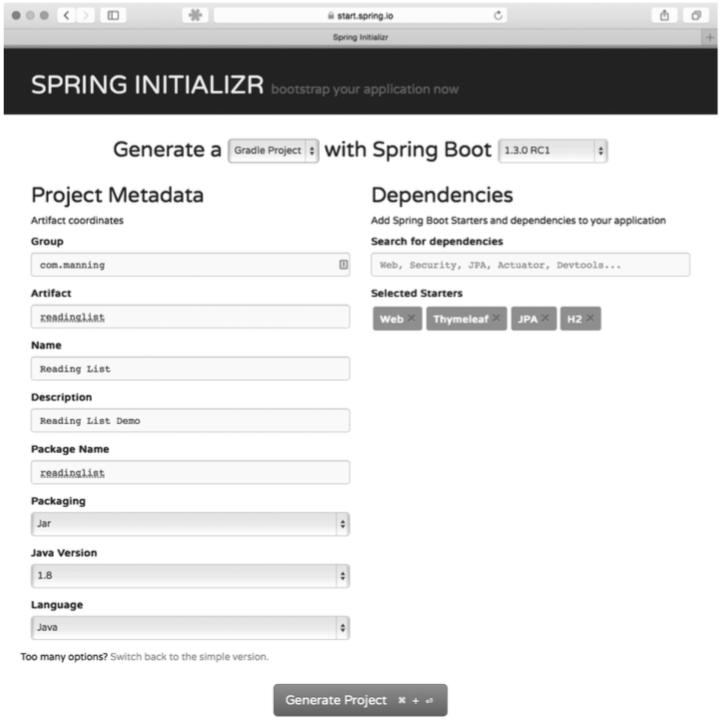
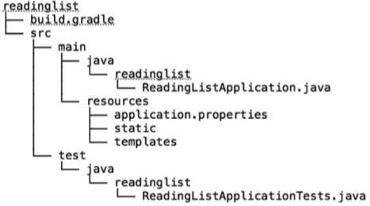

# Developing your first Spring Boot application
# 开发你的第一个Spring Boot应用程序

This chapter covers  
__本章内容涉及__

* Working with Spring Boot starters  
使用Spring Boot起步依赖
* Automatic Spring configuration  
自动进行Spring配置

When’s the last time you went to a supermarket or major retail store and actually had to push the door open? Most large stores have automatic doors that sense your presence and open for you. Any door will enable you to enter a building, but automatic doors don’t require that you push or pull them open.  
当你去超市或大型零售店，最后一次自己推开门是什么时候？大多数大型商店都安装了带感应功能的自动门，虽然所有门都能让你进入建筑物内，但自动门不用你去推开或者拉开它。

Similarly, many public facilities have restrooms with automatic water faucets and towel dispensers. Although not quite as prevalent as automatic supermarket doors, these devices don’t ask much of you and instead are happy to dispense water and towels.  
类似的，很多公共场所的卫生间里都装有自动水龙头和纸巾售卖机。虽然没有超市自动门这么普遍，但这些设施对你没有太多要求，能很方便地出水和纸巾。

And I honestly don’t remember the last time I even saw an ice tray, much less filled it with water or cracked it to get ice for a glass of water. My refrigerator/freezer somehow magically always has ice for me and is at the ready to fill a glass for me.  
说实话，我已经不记得上次看到制冰盒是什么时候了，更记不得往里面倒水制冰或者取冰了。我的冰箱就是这么神奇，总是有冰够我喝上一杯。

I bet you can think of countless ways that modern life is automated with devices that work for you, not the other way around. With all of this automation everywhere, you’d think that we’d see more of it in our development tasks. Strangely, that hasn’t been so.  
我敢打赌你也能想出无数例子，说明设备让现代化生活更自动化，而不是增加障碍。有了这些自动化的便利设施，你一定会想我们的开发任务里也应该看到更多类似的东西。但是很奇怪，事实并非如此。

Up until recently, creating an application with Spring required you to do a lot of work for the framework. Sure, Spring has long had fantastic features for developing amazing applications. But it was up to you to add all of the library dependencies to the project’s build specification. And it was your job to write configuration to tell Spring what to do.  
直到最近，用Spring创建应用程序还要求你为框架做很多事情。当然，Spring提供了很多优秀的特性，用于开发令人惊讶的应用程序。但是，你需要自己往项目的构建说明文件里添加各种库依赖；你还要自己写配置文件，告诉Spring做什么。

In this chapter, we’re going to look at two ways that Spring Boot has added a level of automation to Spring development: starter dependencies and automatic configuration. You’ll see how these essential Spring Boot features free you from the tedium and distraction of enabling Spring in your projects and let you focus on actually developing your applications. Along the way, you’ll write a small but complete Spring application that puts Spring Boot to work for you.  
Spring Boot将Spring开发的自动化程度提升到了一个新的高度，本章中我们会看到两种新方法：起步依赖和自动配置。在项目中启用Spring不仅枯燥乏味，还让人抓狂，你将看到这些基础的Spring Boot特性是如何将你解放出来的，它能让你集中精力开发自己的应用程序。与此同时，你会写一个很小的Spring应用程序，麻雀虽小，五脏俱全，其中会用上Spring Boot。

## 2.1 Putting Spring Boot to work

The fact that you’re reading this tells me that you are a reader. Maybe you’re quite the bookworm, reading everything you can. Or maybe you only read on an as-needed basis, perhaps picking up this book only because you need to know how to develop applications with Spring.

Whatever the case may be, you’re a reader. And readers tend to maintain a reading list of books that they want (or need) to read. Even if it’s not a physical list, you probably have a mental list of things you’d like to read.1

Throughout this book, we’re going to build a simple reading-list application. With it, users can enter information about books they want to read, view the list, and remove books once they’ve been read. We’ll use Spring Boot to help us develop it quickly and with as little ceremony as possible.

To start, we’ll need to initialize the project. In chapter 1, we looked at a handful of ways to use the Spring Initializr to kickstart Spring Boot development. Any of those choices will work fine here, so pick the one that suits you best and get ready to put Spring Boot to work.

From a technical standpoint, we’re going to use Spring MVC to handle web requests, Thymeleaf to define web views, and Spring Data JPA to persist the reading selections to a database. For now, that database will be an embedded H2 database. Although Groovy is an option, we’ll write the application code in Java for now. And we’ll use Gradle as our build tool of choice.

If you’re using the Initializr, either via its web application or through Spring Tool Suite or IntelliJ IDEA, you’ll want to be sure to select the check boxes for Web, Thymeleaf, and JPA. And also remember to check the H2 check box so that you’ll have an embedded database to use while developing the application.

As for the project metadata, you’re welcome to choose whatever you like. For the purposes of the reading list example, however, I created the project with the information shown in figure 2.1.

[1]: # "If you’re not a reader, feel free to apply this to movies to watch, restaurants to try, or whatever suits you."



__Figure 2.1 Initializing the reading list app via Initializr’s web interface__

If you’re using Spring Tool Suite or IntelliJ IDEA to create the project, adapt the details in figure 2.1 for your IDE of choice.

On the other hand, if you’re using the Spring Boot CLI to initialize the application, you can enter the following at the command line:

```
$ spring init -dweb,data-jpa,h2,thymeleaf --build gradle readinglist
```

Remember that the CLI’s init command doesn’t let you specify the project’s root package or the project name. The package name will default to “demo” and the project name will default to “Demo”. After the project has been created, you’ll probably want to open it up and rename the “demo” package to “readinglist” and rename “DemoApplication .java” to “ReadingListApplication.java”.



__Figure 2.2 The structure of the initialized readinglist project__

Once the project has been created, you should have a project structure similar to that shown in figure 2.2.

This is essentially the same project structure as what the Initializr gave you in chapter 1. But now that you’re going to actually develop an application, let’s slow down and take a closer look at what’s contained in the initial project.
