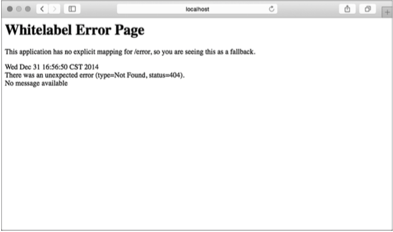

# Customizing configuration
# 自定义配置

__This chapter covers__  
__本章内容涉及__

* Overriding auto-configured beans  
覆盖自动配置的Bean
* Configuring with external properties  
用外置属性进行配置
* Customizing error pages  
自定义错误页

Freedom of choice is an awesome thing. If you’ve ever ordered a pizza (who hasn’t?) then you know that you have full control over what toppings are placed on the pie. If you ask for sausage, pepperoni, green peppers, and extra cheese, then you’re essentially configuring the pizza to your precise specifications.  
能自由选择真是太棒了，如果你曾订过披萨（有没订过的么？）就会知道自己能完全掌控薄饼上放哪些辅料。如果你要加腊肠、意大利辣香肠、青辣椒和额外的芝士，那么你就是在配置披萨，把它变成针对你个人喜好的披萨。

On the other hand, most pizza places also offer a form of auto-configuration. You can ask for the meat-lover’s pizza, the vegetarian pizza, the spicy Italian pizza, or the ultimate example of pizza auto-configuration, the supreme pizza. When ordering one of these pizzas, you don’t have to explicitly specify the toppings. The type of pizza ordered implies what toppings are used.  
另一方面，大部分披萨店也提供某种形式的自动配置，你可以点肉食者的披萨、素食者的披萨、香辣意大利披萨，或者是自动配置披萨中的极品——至尊披萨（supreme pizza）。在下单时，你并没有指定具体的辅料，你所点的披萨种类决定了所用的辅料。

But what if you like all of the toppings of the supreme pizza, but also want jalapenos and would rather not have mushrooms? Does your taste for spicy food and aversion to fungus mean that auto-configuration isn’t applicable and that you must explicitly configure your pizza? Absolutely not. Most pizzerias will let you customize your pizza, even if you started with a preconfigured option from the menu.  
但如果你想要至尊披萨上的全部辅料，还想要加墨西哥胡椒，但又不想放蘑菇该怎么办？你偏爱辣食又不喜欢吃菌类，也就是说自动配置不适合你的口味，你就只能自己搭配披萨了么？当然不是，大部分披萨店会让你做些定制，以菜单上已有的选项作为基础。

Working with traditional Spring configuration is much like ordering a pizza and explicitly specifying all of the toppings. You have full control over what goes into your Spring configuration, but explicitly declaring all of the beans in the application is non-optimal. On the other hand, Spring Boot auto-configuration is like ordering a specialty pizza from the menu. It’s easier to let Spring Boot handle the details than to declare each and every bean in the application context.  
使用传统Spring配置的过程和订披萨很像，你要自己指定全部的辅料。你可以完全掌控Spring配置的内容，可是显式声明应用程序里全部的Bean并不是明智之举。而Spring Boot自动配置就像是从菜单上选份特定的披萨，让Spring Boot处理各种细节要比自己声明上下文里全部的Bean要容易很多。

Fortunately, Spring Boot auto-configuration is flexible. Like the pizzeria that will leave off the mushrooms and add jalapenos to your pizza, Spring Boot will let you step in and influence how it applies auto-configuration.  
幸运的是Spring Boot自动配置非常灵活，就像披萨厨师在你的披萨里不放蘑菇加墨西哥胡椒一样，Spring Boot能让你介入进来，影响自动配置的实施。

In this chapter, we’re going to look at two ways to influence auto-configuration: explicit configuration overrides and fine-grained configuration with properties. We’ll also look at how Spring Boot has provided hooks for you to plug in a custom error page.  
本章我们将看到两种影响自动配置的方式——使用显式配置进行覆盖和使用属性进行精细化配置，还会看到如何使用Spring Boot提供的钩子引入自定义的错误页。

## 3.1 Overriding Spring Boot auto-configuration
## 3.1 覆盖Spring Boot自动配置

Generally speaking, if you can get the same results with no configuration as you would with explicit configuration, no configuration is the no-brainer choice. Why would you do extra work, writing and maintaining extra configuration code, if you can get what you need without it?  
一般来说，如果不用配置就能得到和显式配置一样的结果，那么不写配置是最直接的选择。既然如此，那干嘛还要多做额外的工作呢？如果不用编写和维护额外的配置代码也行，那何必还要它们呢。

Most of the time, the auto-configured beans are exactly what you want and there’s no need to override them. But there are some cases where the best guess that Spring Boot can make during auto-configuration probably isn’t going to be good enough.  
大多数情况下，自动配置的Bean刚好能满足你的需要，不需要去覆盖它们。但也有些情况，Spring Boot在自动配置时的推断还不够好。

A prime example of a case where auto-configuration isn’t good enough is when you’re applying security to your application. Security is not one-size-fits-all, and there are decisions around application security that Spring Boot has no business making for you. Although Spring Boot provides some basic auto-configuration for security, you’ll certainly want to override it to meet your specific security requirements.  
这里有个好例子，当你在应用程序里添加安全特性时自动配置做的还不够好。安全配置并不是放之四海而皆准的，围绕应用程序安全有很多决策要做，Spring Boot不能替你做决定。虽然Spring Boot为安全提供了一些基本的自动配置，但是你还是需要自己覆盖一些配置以满足自己的特定安全要求。

To see how to override auto-configuration with explicit configuration, we’ll start by adding Spring Security to the reading-list example. After seeing what you get for free with auto-configuration, we’ll then override the basic security configuration to fit a particular situation.  
想知道如何用显式的配置来覆盖自动配置，我们先从为阅读列表应用程序添加Spring Security入手。在了解了自动配置提供了什么之后，我们再来覆盖基础的安全配置，以满足特定的场景需求。

### 3.1.1 Securing the application
### 3.1.1 保护应用程序

Spring Boot auto-configuration makes securing an application a piece of cake. All you need to do is add the security starter to the build. For Gradle, the following dependency will do:  
Spring Boot自动配置让应用程序的安全工作变得易如反掌，你要做的只是添加security起步依赖。以Gradle为例，添加如下依赖：

```
compile("org.springframework.boot:spring-boot-starter-security")
```

Or, if you’re using Maven, add this <dependency> to your build’s <dependencies> block:  
如果你使用的是Maven，在项目的`<dependencies>`块中加入如下`<dependency>`：

```
<dependency>
  <groupId>org.springframework.boot</groupId>
  <artifactId>spring-boot-starter-security</artifactId>
</dependency>
```

That’s it! Rebuild your application and run it. It’s now a secure web application! The security starter adds Spring Security (among other things) to the application’s classpath. With Spring Security on the classpath, auto-configuration kicks in and a very basic Spring Security setup is created.  
这样就搞定了！重新构建应用程序后运行即可，现在这就是一个安全的Web应用程序了！security起步依赖在应用程序的Classpath里添加了Spring Secuirty（和其他一些东西）。Classpath里有Spring Security后，自动配置就能介入其中创建一个基本的Spring Security配置。

If you try to open the application in your browser, you’ll be immediately met with an HTTP Basic authentication dialog box. The username you’ll need to enter is “user”. As for the password, it’s a bit trickier. The password is randomly generated and written to the logs each time the application is run. You’ll need to look through the logging messages (written to stdout by default) and look for a line that looks something like this:  
如果你试着在浏览器里打开该应用程序，马上就会看到HTTP基础身份验证对话框。此处的用户名是“user”，至于密码，就有点麻烦了。密码是在应用程序每次运行时随机生成后写入日志的，你需要查找日志消息（默认写入STDOUT），找到与以下例子类似的内容：

```
Using default security password: d9d8abe5-42b5-4f20-a32a-76ee3df658d9
```

I can’t say for certain, but I’m guessing that this particular security setup probably isn’t ideal for you. First, HTTP Basic dialog boxes are clunky and not very user-friendly. And I’ll bet that you don’t develop too many applications that have only one user who doesn’t mind looking up their password from a log file. Therefore, you’ll probably want to make a few changes to how Spring Security is configured. At very least, you’ll want to provide a nice-looking login page and specify an authentication service that operates against a database or LDAP-based user store.  
我不能肯定，但我猜这个特定的安全配置并不是你的理想选择。首先，HTTP基础身份验证对话框有点粗糙，对用户并不友好。而且，我敢打赌你不会开发这种只有一个用户的应用程序，他还要从日志文件里找到自己的密码。因此，你会希望修改一些Spring Security的配置，至少像要有一个好看一些的登录页，还要有一个基于数据库或LDAP的身份验证服务。

Let’s see how to do that by writing some explicit Spring Security configuration to override the auto-configured security scheme.  
让我们看看如何写一些Spring Secuirty配置来覆盖自动配置的安全设置吧。

### 3.1.2 Creating a custom security configuration
### 3.1.2 创建自定义的安全配置

Overriding auto-configuration is a simple matter of explicitly writing the configuration as if auto-configuration didn’t exist. This explicit configuration can take any form that Spring supports, including XML configuration and Groovy-based configuration.  
覆盖自动配置很简单，就当自动配置不存在，直接显式地写一段配置。这段显式配置的形式不限，Spring支持的XML和Groovy形式配置都可以。

For our purposes, we’re going to focus on Java configuration when writing explicit configuration. In the case of Spring Security, this means writing a configuration class that extends WebSecurityConfigurerAdapter. SecurityConfig in listing 3.1 is the configuration class we’ll use.  
在编写配置时，我们会专注于Java形式的配置。在Spring Security的场景下，这意味着写一个扩展了`WebSecurityConfigurerAdapter`的配置类。代码3.1里的`SecurityConfig`就是我们需要的东西。

__Listing 3.1 Explicit configuration to override auto-configured security__  
__代码3.1 覆盖自动配置的显式安全配置__

```
package readinglist;

import org.springframework.beans.factory.annotation.Autowired;
import org.springframework.context.annotation.Configuration;
import org.springframework.security.config.annotation.authentication.
                                    builders.AuthenticationManagerBuilder;
import org.springframework.security.config.annotation.web.builders.
                                                        HttpSecurity;
import org.springframework.security.config.annotation.web.configuration.
                                                        EnableWebSecurity;
import org.springframework.security.config.annotation.web.configuration.
                                            WebSecurityConfigurerAdapter;
import org.springframework.security.core.userdetails.UserDetails;
import org.springframework.security.core.userdetails.UserDetailsService;
import org.springframework.security.core.userdetails.UsernameNotFoundException;

@Configuration
@EnableWebSecurity
public class SecurityConfig extends WebSecurityConfigurerAdapter {

    @Autowired
    private ReaderRepository readerRepository;

    @Override
    protected void configure(HttpSecurity http) throws Exception {
        http
            .authorizeRequests()
                .antMatchers("/").access("hasRole('READER')")
                .antMatchers("/**").permitAll()
            .and()
            .formLogin()
                .loginPage("/login")
                .failureUrl("/login?error=true");
    }

    @Override
    protected void configure(
                              AuthenticationManagerBuilder auth) throws Exception {
        auth
            .userDetailsService(new UserDetailsService() {
                @Override
                public UserDetails loadUserByUsername(String username)
                        throws UsernameNotFoundException {
                    return readerRepository.findOne(username);
                }
            });
    }
}
```

Require READER access  
要求登录者有READER角色

Set login form path  
设置登录表单的路径

Define custom UserDetailsService  
定义自定义`UserDetailsService`

SecurityConfig is a very basic Spring Security configuration. Even so, it does a lot of what we need to customize security of the reading-list application. By providing this custom security configuration class, we’re asking Spring Boot to skip security auto-configuration and to use our security configuration instead.  
`SecurityConfig`是个非常基础的Spring Security配置，尽管如此，它还是完成了不少安全定制工作。通过这个自定义的安全配置类，我们让Spring Boot跳过了安全自动配置，转而使用我们的安全配置。

Configuration classes that extend WebSecurityConfigurerAdapter can override two different configure() methods. In SecurityConfig, the first configure() method specifies that requests for “/” (which ReadingListController’s methods are mapped to) require an authenticated user with the READER role. All other request paths are configured for open access to all users. It also designates /login as the path for the login page as well as the login failure page (along with an error attribute).  
扩展了`WebSecurityConfigurerAdapter`的配置类可以覆盖两个不同的`configure()`方法，在`SecurityConfig`里，第一个`configure()`方法指明“/”（`ReadingListController`的方法映射到了该路径）的请求只有经过身份认证且拥有READER角色的用户才能访问。其他的所有请求路径向所有用户开放了访问权限。这里还将登录页和登录失败页（带有一个`error`属性）指定到了/login。

Spring Security offers several options for authentication, including authentication against JDBC-backed user stores, LDAP-backed user stores, and in-memory user stores. For our application, we’re going to authenticate users against the database via JPA. The second configure() method sets this up by setting a custom user details service. This service can be any class that implements UsersDetailsService and is used to look up user details given a username. The following listing has given it an anonymous inner-class implementation that simply calls the findOne() method on an injected ReaderRepository (which is a Spring Data JPA repository interface).  
Spring Security为身份认证提供了众多选项，后端可以是JDBC、LDAP和内存用户存储。我们的应用程序中，我们会通过JPA是用数据库来存储用户信息。第二个`configure()`方法设置了一个自定义的`UserDetailsService`，这个服务可以是任意实现了`UserDetailsService`的类，用于查找指定用户名的用户。如下代码提供了一个匿名内部类实现，简单地调用了注入的`ReaderRepository`（这是一个Spring Data JPA仓库接口）的`findOne()`方法。

__Listing 3.2 A repository interface for persisting readers__  
__代码3.2 用来持久化读者信息的仓库接口__

```
package readinglist;
import org.springframework.data.jpa.repository.JpaRepository;

public interface ReaderRepository
                     extends JpaRepository<Reader, String> {
}
```

Persist readers via JPA  
通过JPA持久化读者

As with BookRepository, there’s no need to write an implementation of ReaderRepository. Because it extends JpaRepository, Spring Data JPA will automatically
create an implementation of it at runtime. This affords you 18 methods for working with Reader entities.  
和`BookRepository`类似，无需自己实现`ReaderRepository`，因为它扩展了`JpaRepository`，Spring Data JPA会在运行时自动创建它的实现，这为你提供了18个操作`Reader`实体的方法。

Speaking of Reader entities, the Reader class (shown in listing 3.3) is the final piece of the puzzle. It’s a simple JPA entity type with a few fields to capture the username, password, and full name of the user.  
说到`Reader`实体，`Reader`类（如代码3.3所示）就是最后一块拼图了，它就是一个简单的JPA实体，其中有几个字段用来存储用户名、密码和用户全名。

__Listing 3.3 A JPA entity that defines a Reader__
__代码3.3 定义Reader的JPA实体__

```
package readinglist;

import java.util.Arrays;
import java.util.Collection;
import javax.persistence.Entity;
import javax.persistence.Id;
import org.springframework.security.core.GrantedAuthority;
import org.springframework.security.core.authority.SimpleGrantedAuthority;
import org.springframework.security.core.userdetails.UserDetails;

@Entity
public class Reader implements UserDetails {

  private static final long serialVersionUID = 1L;

  @Id
  private String username;
  private String fullname;
  private String password;

  public String getUsername() {
    return username;
  }

  public void setUsername(String username) {
    this.username = username;
  }

  public String getFullname() {
    return fullname;
  }

  public void setFullname(String fullname) {
    this.fullname = fullname;
  }

  public String getPassword() {
    return password;
  }

  public void setPassword(String password) {
    this.password = password;
  }

  // UserDetails methods
  @Override
  public Collection<? extends GrantedAuthority> getAuthorities() {
    return Arrays.asList(new SimpleGrantedAuthority("READER"));
  }

  @Override
  public boolean isAccountNonExpired() {
    return true;
  }

  @Override
  public boolean isAccountNonLocked() {
    return true;
  }

  @Override
  public boolean isCredentialsNonExpired() {
    return true;
  }

  @Override
  public boolean isEnabled() {
    return true;
  }
}
```

Reader fields  
Reader字段

Grant READER privilege  
授予READER权限

Do not expire, lock, or disable  
不过期，不加锁，不禁用

As you can see, Reader is annotated with @Entity to make it a JPA entity. In addition, its username field is annotated with @Id to designate it as the entity’s ID. This seemed like a natural choice, as the username should uniquely identify the Reader.  
如你所见，`Reader`用了`@Entity`注解，所以这是一个JPA实体。此外，它的`username`字段上有`@Id`注解，表明这是实体的ID。这个选择无可厚非，因为`username`应该能唯一标识一个`Reader`。

You’ll also notice that Reader implements the UserDetails interface and several of its methods. This makes it possible to use a Reader object to represent a user in Spring Security. The getAuthorities() method is overridden to always grant users READER authority. The isAccountNonExpired(), isAccountNonLocked(), isCredentialsNonExpired(), and isEnabled() methods are all implemented to return true so that the reader account is never expired, locked, or revoked.  
你应该还注意到`Reader`实现了`UserDetails`接口中的方法，这样`Reader`就能代表Spring Security里的用户了。`getAuthorities()`方法被覆盖过了，始终会为用户授予READER权限。`isAccountNonExpired()`、 `isAccountNonLocked()`、`isCredentialsNonExpired()`和`isEnabled()`方法都返回`true`
，这样读者账户就不会过期，不会被锁定，也不会被撤销。

Rebuild and restart the application and you should be able to log in to the application as one of the readers.  
重新构建并重启应用程序后，你应该就能以读者身份登录应用程序了。

> KEEPING IT SIMPLE In a larger application, the authorities granted to a user might themselves be entities and be maintained in a separate database table. Likewise, the boolean values indicating whether an account is non-expired, non-locked, and enabled might be fields drawn from the database. For our purposes, however, I’ve decided to keep these details simple so as not to distract from what it is we’re really discussing ... namely, overriding Spring Boot auto-configuration.  
__保持简单__ 在一个大型应用程序里，赋予用户的授权本身也可能是实体，它们被维护在独立的数据表里。同样的，表示一个账户是否是非过期、非锁定且可用的`boolean`值也是数据库里的字段。但是，出于演示考虑，我决定让这些细节保持简单，不至于转移注意力——我说的是覆盖Spring Boot自动配置。

There’s a lot more we could do with regard to security configuration,1 but this is all we need here, and it does demonstrate how to override the security auto-configuration provided by Spring Boot.  
在安全配置方面，我们还能做更多事情，<sup>[1][]</sup>但此刻这样就足够了，上面的例子足以演示如何覆盖Spring Boot提供的安全自动配置了。

Again, all you need to do to override Spring Boot auto-configuration is to write explicit configuration. Spring Boot will see your configuration, step back, and let your configuration take precedence. To understand how this works, let’s take a look under the covers of Spring Boot auto-configuration to see how it works and how it allows itself to be overridden.  
再重申一次，想要覆盖Spring Boot的自动配置，你所要做的就是编写一个显式的配置而已。Spring Boot会发现你的配置，随后降低自动配置的优先级，以你的配置为准。想弄明白这是如何实现的，让我们揭开Spring Boot自动配置的神秘面纱，看看它是如何运作的，它是怎么允许自己被覆盖的。

[1]: # "For a deeper dive into Spring Security, have a look at chapters 9 and 14 of my Spring in Action, Fourth Edition (Manning, 2014).想要深入了解Spring Security，可以参考《Spring in Action》第四版（Manning，2014）中的第9章和第14章。"

### 3.1.3 Taking another peek under the covers of auto-configuration
### 3.1.3 掀开自动配置的神秘面纱

As we discussed in section 2.3.3, Spring Boot auto-configuration comes with several configuration classes, any of which can be applied in your application. All of this configuration uses Spring 4.0’s conditional configuration support to make runtime decisions as to whether or not Spring Boot’s configuration should be used or ignored.  
正如我们在2.3.3节里讨论的那样，Spring Boot自动配置自带了很多配置类，每一个都能运用在你的应用程序里。它们都使用了Spring 4.0的条件化配置，可以在运行时判断这个配置是该被运用，还是该被忽略。

For the most part, the @ConditionalOnMissingBean annotation described in table 2.1 is what makes it possible to override auto-configuration. The JdbcTemplate bean defined in Spring Boot’s DataSourceAutoConfiguration is a very simple example of how @ConditionalOnMissingBean works:  
大部分情况下，表2.1里的`@ConditionalOnMissingBean`注解是覆盖自动配置的关键。Spring Boot的`DataSourceAutoConfiguration`中定义的`JdbcTemplate` Bean就是一个非常简单的例子，演示了`@ConditionalOnMissingBean`是如何工作的：

```
@Bean
@ConditionalOnMissingBean(JdbcOperations.class)
public JdbcTemplate jdbcTemplate() {
  return new JdbcTemplate(this.dataSource);
}
```

The jdbcTemplate() method is annotated with @Bean and is ready to configure a JdbcTemplate bean if needed. But it’s also annotated with @ConditionalOnMissingBean, which requires that there not already be a bean of type JdbcOperations (the interface that JdbcTemplate implements). If there’s already a JdbcOperations bean, then the condition will fail and the jdbcTemplate() bean method will not be used.  
`jdbcTemplate()`方法上添加了`@Bean`注解，在需要时可以配置出一个`JdbcTemplate` Bean。但它上面还加了`@ConditionalOnMissingBean`注解，要求当前不存在`JdbcOperations`类型（`JdbcTemplate`实现了该接口）的Bean时才生效。如果当前已经有一个`JdbcOperations` Bean了，条件即不满足，不会执行`jdbcTemplate()`方法。

What circumstances would result in there already being a JdbcOperation bean? Spring Boot is designed to load application-level configuration before considering its auto-configuration classes. Therefore, if you’ve already configured a JdbcTemplate bean, then there will be a bean of type JdbcOperations by the time that auto-configuration takes place, and the auto-configured JdbcTemplate bean will be ignored.  
什么情况下会存在一个`JdbcOperations` Bean呢？Spring Boot的设计是加载应用级配置在线，随后再考虑自动配置类。因此，如果你已经配置了一个`JdbcTemplate` Bean，那么在执行自动配置时就已经存在一个`JdbcOperations`类型的Bean了，于是忽略自动配置的`JdbcTemplate` Bean。

As it pertains to Spring Security, there are several configuration classes considered during auto-configuration. It would be impractical to go over each of them in detail here, but the one that’s most significant in allowing us to override Spring Boot’s auto- configured security configuration is SpringBootWebSecurityConfiguration. Here’s an excerpt from that configuration class:  
关于Spring Security，自动配置时会考虑几个配置类。在这里讨论每个配置类的细节是不切实际的，但覆盖Spring Boot自动配置的安全配置时最重要的一个类是`SpringBootWebSecurityConfiguration`。以下是其中的一个代码片段：

```
@Configuration
@EnableConfigurationProperties
@ConditionalOnClass({ EnableWebSecurity.class })
@ConditionalOnMissingBean(WebSecurityConfiguration.class)
@ConditionalOnWebApplication
public class SpringBootWebSecurityConfiguration {

  ...

}
```

As you can see, SpringBootWebSecurityConfiguration is annotated with a few conditional annotations. Per the @ConditionalOnClass annotation, the @EnableWebSecurity annotation must be available on the classpath. And per @ConditionalOnWebApplication, the application must be a web application. But it’s the @ConditionalOnMissingBean annotation that makes it possible for our security configuration class to be used instead of SpringBootWebSecurityConfiguration.  
如你所见，`SpringBootWebSecurityConfiguration`上加了好几个注解。看到`@ConditionalOnClass`注解后，你就应该知道Classpath里必须要有`@EnableWebSecurity`注解。`@ConditionalOnWebApplication`说明这必须是个Web应用程序。`@ConditionalOnMissingBean`注解才是我们的安全配置类代替`SpringBootWebSecurityConfiguration`的关键所在。

The @ConditionalOnMissingBean requires that there not already be a bean of type WebSecurityConfiguration. Although it may not be apparent on the surface, by annotating our SecurityConfig class with @EnableWebSecurity, we’re indirectly creating a bean of type WebSecurityConfiguration. Therefore, by the time auto-configuration takes place, there will already be a bean of type WebSecurityConfiguration, the @ConditionalOnMissingBean condition will fail, and any configuration offered by SpringBootWebSecurityConfiguration will be skipped over.  
`@ConditionalOnMissingBean`注解要求当下没有`WebSecurityConfiguration`类型的Bean。虽然表面上我们并没有这么一个Bean，但通过在`SecurityConfig`上添加`@EnableWebSecurity`注解，我们实际上间接创建了一个`WebSecurityConfiguration` Bean。所以在自动配置时，就已经存在这么一个Bean了，`@ConditionalOnMissingBean`条件不成立，`SpringBootWebSecurityConfiguration`提供的配置就被跳过了。

Although Spring Boot’s auto-configuration and @ConditionalOnMissingBean make it possible for you to explicitly override any of the beans that would otherwise be auto-configured, it’s not always necessary to go to that extreme. Let’s see how you can set a few simple configuration properties to tweak the auto-configured components.  
虽然Spring Boot的自动配置和`@ConditionalOnMissingBean`让你能显式地覆盖那些可以自动配置的Bean，但并不是每次都要做到这种程度的。让我们来看看怎么通过设置几个简单的配置就能调整自动配置组件吧。

## 3.2 Externalizing configuration with properties
## 3.2 通过属性文件外置配置

When dealing with application security, you’ll almost certainly want to take full charge of the configuration. But it would be a shame to give up on auto-configuration just to tweak a small detail such as a server port number or a logging level. If you need to set a database URL, wouldn’t it be easier to set a property somewhere than to completely declare a data source bean?  
在处理应用安全时，你当然会希望完全掌控所有配置。但也不必放弃自动配置，只微调一些细节也不是什么害羞的事，比如改改端口号和日志级别。要设置数据库URL时，是在哪里配置一个属性
简单，还是完整地声明一个数据源的Bean简单，答案不言而喻？

As it turns out, the beans that are automatically configured by Spring Boot offer well over 300 properties for fine-tuning. When you need to adjust the settings, you can specify these properties via environment variables, Java system properties, JNDI, command-line arguments, or property files.  
事实上，Spring Boot自动配置的Bean提供了超过300个用于微调的属性。当你要调整设置时，只要再环境变量、Java系统属性、JNDI、命令行参数或者属性文件里进行指定就好了。

To get started with these properties, let’s look at a very simple example. You may have noticed that Spring Boot emits an ascii-art banner when you run the reading-list application from the command line. If you’d like to disable the banner, you can do so by setting a property named spring.main.show-banner to false. One way of doing that is to specify the property as a command-line parameter when you run the app:  
要了解这些属性，让我们来看个非常简单的例子。你也许已经注意到了，在命令行里运行阅读列表应用程序时，Spring Boot有一个ascii-art Banner。如果你想禁用这个Banner，可以将`spring.main.show-banner`这个属性设置为`false`，有几种实现方式，其中之一就是在运行应用程序的命令行参数里指定：

```
$ java -jar readinglist-0.0.1-SNAPSHOT.jar --spring.main.show-banner=false
```

Another way is to create a file named application.properties that includes the following line:  
另一种方式是创建一个名为application.properties的文件，包含如下内容：

```
spring.main.show-banner=false
```

Or, if you’d prefer, create a YAML file named application.yml that looks like this:  
或者，如果你喜欢的话，也可以创建名为application.yml的YAML文件，内容如下：

```
spring:
  main:
  show-banner: false
```

You could also set the property as an environment variable. For example, if you’re using the bash or zsh shell, you can set it with the export command:  
还可以将属性设置为环境变量。举例来说，如果你用的是bash或者zsh，可以用`export`命令：

```
$ export spring_main_show_banner=false
```

Note the use of underscores instead of periods and dashes, as required for environment variable names.  
请注意，这里用的还下划线而不是点和横杠，这是对环境变量名称的要求。

There are, in fact, several ways to set properties for a Spring Boot application. Spring Boot will draw properties from several property sources, including the following:  
实际上有好几种设置Spring Boot应用程序的途径，Spring Boot能从多种属性源获得属性，包括：

1. Command-line arguments  
命令行参数
2. JNDI attributes from java:comp/env  
java:comp/env里的JNDI属性
3. JVM system properties  
JVM系统属性
4. Operating system environment variables  
操作系统环境变量
5. Randomly generated values for properties prefixed with random.* (referenced when setting other properties, such as `${random.long}`)  
随机生成的带random.* 前缀的属性（在设置其他属性时，可以引用它们，比如`${random.long}`）
6. An application.properties or application.yml file outside of the application  
应用程序以外的application.properties或者appliaction.yml文件
7. An application.properties or application.yml file packaged inside of the application  
打包在应用程序内的application.properties或者appliaction.yml文件
8. Property sources specified by @PropertySource  
通过`@PropertySource`标注的属性源
9. Default properties  
默认属性

This list is in order of precedence. That is, any property set from a source higher in the list will override the same property set on a source lower in the list. Command-line arguments, for instance, override properties from any other property source.  
这个列表的按照优先级排序，也就是说，任何在高优先级属性源里设置的属性都会覆盖低优先级的相同属性。例如，命令行参数会覆盖其他属性源。

As for the application.properties and application.yml files, they can reside in any of four locations:  
对application.properties和application.yml文件而言，它们能放在以下四个位置：

1. Externally, in a /config subdirectory of the directory from which the application is run  
外置，在/config子目录，相对于应用程序运行的目录
2. Externally, in the directory from which the application is run  
外置，在应用程序运行的目录里
3. Internally, in a package named “config”  
内置，在“config”包内
4. Internally, at the root of the classpath  
内置，在Classpath根目录

Again, this list is in order of precedence. That is, an application.properties file in a /config subdirectory will override the same properties set in an application.properties file in the application’s classpath.  
同样的，这个列表按照优先级排序。也就是说/config子目录里的application.properties会覆盖应用程序Classpath里的application.properties中的相同属性。

Also, I’ve found that if you have both application.properties and application.yml side by side at the same level of precedence, properties in application.yml will override those in application.properties.  
此外，如果你在同一优先级位置同时有application.properties和application.yml，那么application.yml里的属性会覆盖application.properties里的。

Disabling an ascii-art banner is just a small example of how to use properties. Let’s look at a few more common ways to tweak the auto-configured beans.  
禁用ascii-art Banner只是个小例子，再让我们看几个例子，如何通过常用途径微调自动配置的Bean。

### 3.2.1 Fine-tuning auto-configuration
### 3.2.1 自动配置微调

As I said, there are well over 300 properties that you can set to tweak and adjust the beans in a Spring Boot application. Appendix C gives an exhaustive list of these properties, but it’d be impossible to go over each and every one of them here. Instead, let’s examine a few of the more commonly useful properties exposed by Spring Boot.  
如我所说，有超过300个属性可以用来微调Spring Boot应用程序里的Bean。附录C有一个详尽的列表，此处无法逐一描述它们的细节，因此我们就通过几个例子来了解一些Spring Boot暴露的有用的属性。

#### DISABLING TEMPLATE CACHING
#### 禁用模板缓存

If you’ve been tinkering around much with the reading-list application, you may have noticed that changes to any of the Thymeleaf templates aren’t applied unless you restart the application. That’s because Thymeleaf templates are cached by default. This improves application performance because you only compile the templates once, but it’s difficult to make changes on the fly during development.  
如果你的阅读列表应用程序已经经过几番修改，一定已经注意到了，除非重启应用程序，否则对Thymeleaf模板的变更是不会生效的。这是因为Thymeleaf模板默认是被缓存的。这有助于改善应用程序的性能，因为模板只需编译一次，但在开发过程中就不能实时看到变更的效果。

You can disable Thymeleaf template caching by setting spring.thymeleaf.cache to false. You can do this when you run the application from the command line by setting it as a command-line argument:  
将`spring.thymeleaf.cache`设置为`false`就能禁用Thymeleaf模板缓存。在命令行里运行应用程序时，将其设置为命令行参数即可：

```
$ java -jar readinglist-0.0.1-SNAPSHOT.jar --spring.thymeleaf.cache=false
```

Or, if you’d rather have caching turned off every time you run the application, you might create an application.yml file with the following lines:  
或者，如果你希望每次运行时都禁用缓存，可以创建一个application.yml，包含以下内容：

```
spring:
  thymeleaf:
    cache: false
```

You’ll want to make sure that this application.yml file doesn’t follow the application into production, or else your production application won’t realize the performance benefits of template caching.  
你一定要确保这个文件不会被发布到生产环境，否则生产环境里的应用程序就无法享受模板缓存带来的福利了。

As a developer, you may find it convenient to have template caching turned off all of the time while you make changes to the templates. In that case, you can turn off Thymeleaf caching via an environment variable:  
作为开发者，在修改模板时始终关闭缓存实在太方便了。为此，可以通过环境变量来禁用Thymeleaf缓存：

```
$ export spring_thymeleaf_cache=false
```

Even though we’re using Thymeleaf for our application’s views, template caching can be turned off for Spring Boot’s other supported template options by setting these properties:  
我们使用Thymeleaf作为应用程序的视图，Spring Boot支持的其他模板也能关闭模板缓存，设置这些属性就好了：

* spring.freemarker.cache (Freemarker)
* spring.groovy.template.cache (Groovy templates)
* spring.velocity.cache (Velocity)

* spring.freemarker.cache（Freemarker）
* spring.groovy.template.cache（Groovy模板）
* spring.velocity.cache（Velocity）

By default, all of these properties are true, meaning that the templates are cached. Setting them to false disables caching.  
默认情况下，这些属性都为`true`，也就是开启缓存，将它们设置为`false`即可禁用缓存。

#### CONFIGURING THE EMBEDDED SERVER
#### 配置嵌入式服务器

When you run a Spring Boot application from the command line (or via Spring Tool Suite), the application starts an embedded server (Tomcat, by default) listening on port 8080. This is fine for most cases, but it can become problematic if you find yourself needing to run multiple applications simultaneously. If all of the applications try to start a Tomcat server on the same port, there’ll be port collisions starting with the second application.  
从命令行（或者Spring Tool Suite）运行Spring Boot应用程序时，应用程序会启动一个嵌入式的服务器（默认是Tomcat），监听8080端口。大部分情况下这挺好的，但如果你要同时运行多个应用程序可能就会有问题了。要是所有应用程序都试着让Tomcat服务器监听同一个端口，在启动第二个应用程序时就会有冲突。

If, for any reason, you’d rather the server listen on a different port, then all you need to do is set the server.port property. If this is a one-time change, it’s easy enough to do this as a command-line argument:  
出于各种原因，你想让服务器监听不同的端口，你所要做的就是设置`server.port`属性。要是只改一次，可以用命令行参数：

```
$ java -jar readinglist-0.0.1-SNAPSHOT.jar --server.port=8000
```

But if you want the port change to be more permanent, you could set server.port in one of the other supported locations. For instance, you might set it in an application.yml file at the root of the application’s classpath:  
但如果希望端口变更时间更长一点，可以在其他支持的配置位置上设置`server.port`。例如，把它放在应用程序Classpath根目录的application.yml文件里：

```
server:
  port: 8000
```

Aside from adjusting the server’s port, you might also need to enable the server to serve securely over HTTPS. The first thing you’ll need to do is create a keystore using the JDK’s keytool utility:  
除了服务器的端口，你还可能希望服务器能提供HTTPS服务。为此，第一步就是用JDK的`keytool`工具来创建一个密钥存储（keystore）：

```
$ keytool -keystore mykeys.jks -genkey -alias tomcat -keyalg RSA
```

You’ll be asked several questions about your name and organization, most of which are irrelevant. But when asked for a password, be sure to remember what you choose. For the sake of this example, I chose “letmein” as the password.  
该工具会询问几个与名字和组织相关的问题，大部分都无关紧要。但在询问密码时，一定要记住你的选择。在本例中，我选择“letmein”作为密码。

Now you just need to set a few properties to enable HTTPS in the embedded server. You could specify them all at the command line, but that would be terribly inconvenient. Instead, you’ll probably set them in application.properties or application.yml. In application.yml, they might look like this:  
现在只需要设置几个属性就能开启嵌入式服务器的HTTPS服务了。可以把它们都配置在命令行里，但这样太不方便了，可以把它们放在application.properties或application.yml里。在application.yml中，它们可能是这样的：

```
server:
  port: 8443
  ssl:
    key-store: file:///path/to/mykeys.jks
    key-store-password: letmein
    key-password: letmein
```

Here the server.port property is being set to 8443, a common choice for development HTTPS servers. The server.ssl.key-store property should be set to the path where the keystore file was created. Here it’s shown with a file:// URL to load it from the filesystem, but if you package it within the application JAR file, you should use a classpath: URL to reference it. And both the server.ssl.key-store-password and server.ssl.key-password properties are set to the password that was given when creating the keystore.  
此处的`server.port`设置为8443，开发环境的HTTPS服务器大多会选这个端口。`server.ssl.key-store`属性指向密钥存储文件的存放路径，这里用了一个file://开头的URL，从文件系统里加载该文件。你也可以把它打在应用程序的JAR文件里，用classpath: URL来引用它。`server.ssl.key-store-password`和`server.ssl.key-password`设置为创建该文件时给定的密码。

With these properties in place, your application should be listening for HTTPS requests on port 8443. (Depending on which browser you’re using, you may encounter a warning about the server not being able to verify its identity. This is nothing to worry about when serving from localhost during development.)  
有了这些属性，应用程序就能在8443端口上监听HTTPS请求了。（根据你所用的浏览器，可能会出现警告框提示该服务器无法验证其身份。在开发时，访问的是localhost，这没什么好担心的。）

#### CONFIGURING LOGGING
#### 配置日志

Most applications provide some form of logging. And even if your application doesn’t log anything directly, the libraries that your application uses will certainly log their activity.  
大部分应用程序都会提供某种形式的日志，就算你的应用程序不会直接打日志，你所用的库也会记录它们的活动。

By default, Spring Boot configures logging via Logback (http://logback.qos.ch) to log to the console at INFO level. You’ve probably already seen plenty of INFO-level logging as you’ve run the application and other examples.  
默认情况下，Spring Boot会用Logback（[http://logback.qos.ch](http://logback.qos.ch)）来打日志，并用INFO级别输出到控制台。在运行应用程序和其他例子时，你应该已经看到很多INFO级别的日志了。

>__Swapping out Logback for another logging implementation__  
__用其他日志实现替换Logback__

>Generally speaking, you should never need to switch logging implementations; Log- back should suit you fine. However, if you decide that you’d rather use Log4j or Log4j2, you’ll need to change your dependencies to include the appropriate starter for the logging implementation you want to use and to exclude Logback.  
一般来说，你不不需要切换日志实现；Logback能很好地满足你的需要。但是，如果你决定使用Log4j或者Log4j2，只需要修改依赖，引入对应该日志实现的起步依赖，同时排除掉Logback。

>For Maven builds, you can exclude Logback by excluding the default logging starter transitively resolved by the root starter dependency:  
以Maven为例，排除掉根起步依赖传递引入的默认日志起步依赖，这样就能排除Logback了：

>```
<dependency>
  <groupId>org.springframework.boot</groupId>
  <artifactId>spring-boot-starter</artifactId>
  <exclusions>
    <exclusion>
      <groupId>org.springframework.boot</groupId>
      <artifactId>spring-boot-starter-logging</artifactId>
    </exclusion>
  </exclusions>
</dependency>
```

>In Gradle, it’s easiest to place the exclusion under the configurations section:  
Gradle里，在`configurations`下排除该起步依赖是最简单的办法：

>```
configurations {
  all*.exclude group:'org.springframework.boot',
               module:'spring-boot-starter-logging'
}
```

>With the default logging starter excluded, you can now include the starter for the log- ging implementation you’d rather use. With a Maven build you can add Log4j like this:  
排除默认日志的起步依赖后，就可以引入你想用的日志实现的起步依赖了。在Maven里可以这样添加Log4j：

>```
<dependency>
  <groupId>org.springframework.boot</groupId>
  <artifactId>spring-boot-starter-log4j</artifactId>
</dependency>
```

>In a Gradle build you can add Log4j like this:  
在Gradle里可以这样添加Log4j：

>```
compile("org.springframework.boot:spring-boot-starter-log4j")
```

>If you’d rather use Log4j2, change the artifact from “spring-boot-starter-log4j” to “spring-boot-starter-log4j2”.  
如果你想用Log4j2，把“spring-boot-starter-log4j”改成“spring-boot-starter-log4j2”。

For full control over the logging configuration, you can create a logback.xml file at the root of the classpath (in src/main/resources). Here’s an example of a simple log- back.xml file you might use:  
要完全掌握日志配置，可以在Classpath的根目录（src/main/resources）里创建logback.xml文件，下面是一个简单的logback.xml的例子：

```
<configuration>
  <appender name="STDOUT" class="ch.qos.logback.core.ConsoleAppender">
    <encoder>
      <pattern>
        %d{HH:mm:ss.SSS} [%thread] %-5level %logger{36} - %msg%n
      </pattern>
    </encoder>
  </appender>

  <logger name="root" level="INFO"/>

  <root level="INFO">
    <appender-ref ref="STDOUT" />
  </root>
</configuration>
```

Aside from the pattern used for logging, this Logback configuration is more or less equivalent to the default you’ll get if you have no logback.xml file. But by editing logback.xml you can gain full control over your application’s log files. The specifics of what can go into logback.xml are outside the scope of this book, so refer to Logback’s documentation for more information.  
除了日志格式之外，这个Logback配置和不加logback.xml文件的默认配置差不多。但是，通过编辑logback.xml你可以完全掌控应用程序的日志文件。哪些配置应该放进logback.xml这个话题不在本书的讨论范围内，请参考Logback的文档以了解更多信息。

Even so, the most common changes you’ll make to a logging configuration are to change the logging levels and perhaps to specify a file where the logs should be written. With Spring Boot configuration properties, you can make those changes without having to create a logback.xml file.  
即使如此，你最常改动的日志配置一般是修改日志级别和指定日志输出的文件。使用了Spring Boot的配置属性后，你可以在不创建logback.xml文件的情况下修改那些配置。

To set the logging levels, you create properties that are prefixed with logging.level, followed by the name of the logger for which you want to set the logging level. For instance, suppose you’d like to set the root logging level to WARN, but log Spring Security logs at DEBUG level. The following entries in application.yml will take care of it for you:  
要设置日志级别，你可以创建`logging.level`开头的属性，后面是你想设置日志级别的日志名称。举例来说，假设你要把根日志级别设置为`WARN`，但Spring Security的日志要用`DEBUG`级别。在application.yml里加入以下内容就行了：

```
logging:
  level:
    root: WARN
    org:
      springframework:
        security: DEBUG
```

Optionally, you can collapse the Spring Security package name to a single line:
另外，你也可以把Spring Security的包名写成一行：

```
logging:
  level:
    root: WARN
    org.springframework.security: DEBUG
```

Now suppose that you want to write the log entries to a file named BookWorm.log at /var/logs/. The logging.path and logging.file properties can help with that:  
现在，假设你想把日志写到位于/var/logs/目录里的BookWorm.log文件里。使用`logging.path`和`loggin.file`属性就行了：

```
logging:
  path: /var/logs/
  file: BookWorm.log
  level:
    root: WARN
    org:
      springframework:
        security: DEBUG
```

Assuming that the application has write permissions to /var/logs/, the log entries will be written to /var/logs/BookWorm.log. By default, the log files will rotate once they hit 10 megabytes in size.  
假设应用程序有/var/logs/的写权限，日志就能被写入/var/logs/BookWorm.log了。默认情况下，日志文件的大小达到10MB时会切分一次。

Similarly, all of these properties can be set in application.properties like this:  
类似的，这些属性也能在application.properties里设置：

```
logging.path=/var/logs/
logging.file=BookWorm.log
logging.level.root=WARN
logging.level.root.org.springframework.security=DEBUG
```

If you still need full control of the logging configuration, but would rather name the Logback configuration file something other than logback.xml, you can specify a custom name by setting the logging.config property:  
如果你还是想要完全掌控日志配置，但是又不想用logback.xml作为Logback配置的名字，可以通过`logging.config`属性指定自定义的名字：

```
logging:
  config:
    classpath:logging-config.xml
```

Although you usually won’t need to change the configuration file’s name, it can come in handy if you want to use two different logging configurations for different runtime profiles (see section 3.2.3).  
虽然一般并不需要改变配置文件的名字，但是如果你想针对不同运行时Profile使用不同的日志配置时（见3.2.3节），这个功能会很有用。

#### CONFIGURING A DATA SOURCE
#### 配置数据源

At this point, we’re still developing our reading-list application. As such, the embedded H2 database we’re using is perfect for our needs. But once we take the application into production, we may want to consider a more permanent database solution.  
此时，你还在开发我们的阅读列表应用程序，嵌入式的H2数据库能很好地满足我们的需要。可是一旦要投放到生产环境，我们可能要考虑更持久的数据库解决方案。

Although you could explicitly configure your own DataSource bean, it’s usually not necessary. Instead, simply configure the URL and credentials for your database via properties. For example, if you’re using a MySQL database, your application.yml file might look like this:  
虽然你可以显式配置自己的`DataSource` Bean，但通常并不用这么做，只需简单地通过属性配置数据库的URL和身份信息就可以了。举例来说，如果你用的是MySQL数据库，你的application.yml文件看起来可能是这样的：

```
spring:
  datasource:
    url: jdbc:mysql://localhost/readinglist
    username: dbuser
    password: dbpass
```

You usually won’t need to specify the JDBC driver; Spring Boot can figure it out from the database URL. But if there is a problem, you can try setting the spring.datasource.driver-class-name property:  
通常你都无需指定JDBC驱动，Spring Boot会根据数据库URL识别出需要的驱动，但如果识别出问题了，你还可以设置`spring.datasource.driver-class-name`属性：

```
spring:
  datasource:
    url: jdbc:mysql://localhost/readinglist
    username: dbuser
    password: dbpass
    driver-class-name: com.mysql.jdbc.Driver
```

Spring Boot will use this connection data when auto-configuring the DataSource bean. The DataSource bean will be pooled, using Tomcat’s pooling DataSource if it’s available on the classpath. If not, it will look for and use one of these other connection pool implementations on the classpath:  
在自动配置`DataSource` Bean的时候Spring Boot会使用这里的连接数据。`DataSource` Bean是一个连接池，如果Classpath里有Tomcat的连接池`DataSource`，那么就会使用这个连接池；否则的话，Spring Boot会在Classpath里查找以下连接池：

* HikariCP
* Commons DBCP
* Commons DBCP 2

Although these are the only connection pool options available through auto-configuration, you are always welcome to explicitly configure a DataSource bean to use whatever connection pool implementation you’d like.  
这里列出的只是自动配置支持的连接池，你还可以自己配置`DataSource` Bean，使用你喜欢的各种连接池。

You may also choose to look up the DataSource from JNDI by setting the spring.datasource.jndi-name property:  
你也可以设置`spring.datasource.jndi-name`属性，从JNDI里查找`DataSource`：

```
spring:
  datasource:
    jndi-name: java:/comp/env/jdbc/readingListDS
```

If you set the spring.datasource.jndi-name property, the other datasource connection properties (if set) will be ignored.  
一旦设置了`spring.datasource.jndi-name`属性，就会忽略其他数据源连接属性（如果设置了的话）。

There are many ways to influence the components that Spring Boot auto-configures by just setting a property or two. But this style of externalized configuration is not limited to the beans configured by Spring Boot. Let’s look at how you can use the very same property configuration mechanism to fine-tune your own application components.  
有很多影响Spring Boot自动配置组件的方法，只需设置一两个属性即可。但这种配置外置的方法并不局限于Spring Boot配置的Bean，让我们看看如何使用这种属性配置机制来微调自己的应用程序组件。

### 3.2.2 Externally configuring application beans
### 3.2.2 应用程序Bean的配置外置

Suppose that we wanted to show not just the title of a book on someone’s reading list, but also provide a link to the book on Amazon.com. And, not only do we want to provide a link to the book, but we also want to tag the book to take advantage of Amazon’s associate program so that if anyone purchases a book through one of the links in our application, we’d receive a small payment for the referral.  
假设我们在某人的阅读列表里不止想要展示图书标题，还要提供该书的Amazon.com的链接。不仅是提供该书的链接，还要标记该书，利用好Amazon的Associate Program，这样如果有人用我们应用程序里的链接买了书，我们还能收到一笔推荐费。

This is simple enough to do by changing the Thymeleaf template to render the title of each book as a link:  
这很简单，只需修改Thymeleaf模板，以链接的形式来呈现每本书的标题就可以了：

```
<a th:href="'http://www.amazon.com/gp/product/'
            + ${book.isbn}
            + '/tag=habuma-20'"
   th:text="${book.title}">Title</a>
```

This will work perfectly. Now if anyone clicks on the link and buys the book, I will get credit for the referral. That’s because “habuma-20” is my Amazon Associate ID. If you’d rather receive credit, you can easily change the value of the tag attribute to your Amazon Associate ID in the Thymeleaf template.  
这样就好了。现在如果有人点击该链接并购买了本书，我就能得到推荐费了。因为“habuma-20”是我的Amazon Associate ID。如果你也想收到推荐费，可以把Thymeleaf模板中tag的值改成你的Amazon Associate ID。

Even though it’s easy enough to change the Amazon Associate ID in the template, it’s still hard-coded. We’re only linking to Amazon from this one template, but we may later add features to the application where we link to Amazon from several pages. In that case, changes to the Amazon Associate ID would require changes to several places in the application code. That’s why details like this are often better kept out of the code so that they can be managed in a single place.  
虽然在模板里修改这个值很简单，但毕竟这也算是硬编码。我们现在只在这一个模板里链接到Amazon，但后续可能在为应用程序添加功能时会有更多页面要链接到Amazon。那样的话修改Amazon Associate ID就要改动好几个地方的代码。这就是为什么说类似这种细节的东西最好不要放在代码里，要把它们维护在一个地方。

Rather than hard-code the Amazon Associate ID in the template, we can refer to it as a value in the model:  
比起在模板里硬编码Amazon Associate ID，我们可以把它变成模型中的一个值：

```
<a th:href="'http://www.amazon.com/gp/product/'
            + ${book.isbn}
            + '/tag=' + ${amazonID}"
   th:text="${book.title}">Title</a>
```

In addition, ReadingListController will need to populate the model at the key “amazonID” to contain the Amazon Associate ID. Again, we shouldn’t hard-code it, but instead refer to an instance variable. And that instance variable should be populated from the property configuration. Listing 3.4 shows the new ReadingListController, which populates the model from an injected Amazon Associate ID.  
此外，`ReadingListController`需要在模型里包含“amazonID”这个键，其中的内容是Amazon Associate ID。同样的道理，我们不应该硬编码这个值，而是引用一个实例变量，这个变量的值应该来自属性配置。代码3.4就是新的`ReadingListController`，它会返回注入的Amazon Associate ID。

__Listing3.4 ReadingListController modified to accept an AmazonID__
__代码3.4 修改后的ReadingListController，能接受AmazonID__

```
package readinglist;

import java.util.List;

import org.springframework.beans.factory.annotation.Autowired;
import org.springframework.boot.context.properties.ConfigurationProperties;
import org.springframework.stereotype.Controller;
import org.springframework.ui.Model;
import org.springframework.web.bind.annotation.RequestMapping;
import org.springframework.web.bind.annotation.RequestMethod;

@Controller
@RequestMapping("/")
@ConfigurationProperties(prefix="amazon")
public class ReadingListController {

  private String associateId;

  private ReadingListRepository readingListRepository;

  @Autowired
  public ReadingListController(
        ReadingListRepository readingListRepository) {
    this.readingListRepository = readingListRepository;
  }

  public void setAssociateId(String associateId) {
    this.associateId = associateId;
  }

  @RequestMapping(method=RequestMethod.GET)
  public String readersBooks(Reader reader, Model model) {
    List<Book> readingList =
               readingListRepository.findByReader(reader);
    if (readingList != null) {
      model.addAttribute("books", readingList);
      model.addAttribute("reader", reader);
      model.addAttribute("amazonID", associateId);
    }
    return "readingList";
  }

  @RequestMapping(method=RequestMethod.POST)
  public String addToReadingList(Reader reader, Book book) {
    book.setReader(reader);
    readingListRepository.save(book);
    return "redirect:/";
  }

}
```

Inject with properties  
属性注入

Setter method for associateId  
`associateId`的Setter方法

Put associateId into model  
将`associateId`放入模型

As you can see, the ReadingListController now has an associateId property and a corresponding setAssociateId() method through which the property can be set. And readersBooks() now adds the value of associateId to the model under the key “amazonID”.  
如你所见，`ReadingListController`现在有了一个`associateId`属性，还有对应的`setAssociateId()`方法，用它可以设置该属性。`readersBooks()`现在能通过“amazonID”这个键把`associateId`放入模型。

Perfect! Now the only question is where associateId gets its value.  
棒极了！现在就剩一个问题——从哪里能取到`associateId`的值。

Notice that ReadingListController is now annotated with @ConfigurationProperties. This specifies that this bean should have its properties injected (via setter methods) with values from configuration properties. More specifically, the prefix attribute specifies that the ReadingListController bean will be injected with properties with an “amazon” prefix.  
请注意，`ReadingListController`上加了`@ConfigurationProperties`注解，这说明该Bean的属性应该是（通过Setter方法）从配置属性值注入的。更具体一点，`prefix`属性说明`ReadingListController`应该注入带“amazon”前缀的属性。

Putting this all together, we’ve specified that ReadingListController should have its properties injected from “amazon”-prefixed configuration properties. ReadingListController has only one property with a setter method—the associateId property. Therefore, all we need to do to specify the Amazon Associate ID is to add an amazon.associateId property in one of the supported property source locations.  
综合起来，我们指定了`ReadingListController`的属性应该从“amazon”前缀的配置属性中进行注入。`ReadingListController`只有一个Setter方法——设置`associateId`属性用的。因此，设置Amazon Associate ID唯一要做的就是添加`amazon.associateId`属性，把它加入支持的任意属性源位置里即可。

For example, we could set that property in application.properties:  
例如，我们可以在application.properties里设置该属性：

```
amazon.associateId=habuma-20
```

Or in application.yml:  
或者在application.yml里：

```
amazon:
  associateId: habuma-20
```

Or we could set it as an environment variable, specify it as a command-line argument, or add it in any of the other places where configuration properties can be set.  
或者，我们可以将其设置为环境变量，把它作为命令行参数，把它加到任意能够设置配置属性的地方都可以。

>__ENABLING CONFIGURATION PROPERTIES__ Technically, the @ConfigurationProperties annotation won’t work unless you’ve enabled it by adding @EnableConfigurationProperties in one of your Spring configuration classes. This is often unnecessary, however, because all of the configuration classes behind Spring Boot auto-configuration are already annotated with @EnableConfigurationProperties. Therefore, unless you aren’t taking advantage of auto-configuration at all (and why would that ever happen?), you shouldn’t need to explicitly use @EnableConfigurationProperties.  
__开启配置属性__ 从技术上来说，在向任意Spring配置类添加`@EnableConfigurationProperties`注解前，`@ConfigurationProperties`注解都不会生效。但通常都无需这么做，因为Spring Boot自动配置后面的全部配置类都已经加上了`@EnableConfigurationProperties`注解。因此，无论你是否使用自动配置（那怎么可能？），你都无需显式地添加`@EnableConfigurationProperties`。

It’s also worth noting that Spring Boot’s property resolver is clever enough to treat camel-cased properties as interchangeable with similarly named properties with hyphens or underscores. In other words, a property named amazon.associateId is equivalent to both amazon.associate_id and amazon.associate-id. Feel free to use the naming convention that suits you best.  
还有一点需要注意，Spring Boot的属性解析器非常聪明，它会自动把驼峰规则的属性和使用连字符或下划线的同名属性关联起来。换句话说，`amazon.associateId`这个属性和`amazon.associate_id`以及`amazon.associate-id`都是等价的。随便去用你习惯的命名规则就好。

#### COLLECTING PROPERTIES IN ONE CLASS
#### 在一个类里收集属性

Although annotating ReadingListController with @ConfigurationProperties works fine, it may not be ideal. Doesn’t it seem a little odd that the property prefix is “amazon” when, in fact, ReadingListController has little to do with Amazon? Moreover, future enhancements might present the need to configure properties unrelated to Amazon in ReadingListController.  
虽然在`ReadingListController`上加上`@ConfigurationProperties`注解跑起来没问题，但这并不是一个理想的方案。`ReadingListController`和Amazon没什么关系，但属性的前缀却是“amazon”，看起来难道不奇怪么？再说了，后续的各种功能可能需要在`ReadingListController`里新增配置属性，而它们则和Amazon无关。

Instead of capturing the configuration properties in ReadingListController, it may be better to annotate a separate bean with @ConfigurationProperties and let that bean collect all of the configuration properties. AmazonProperties in listing 3.5, for example, captures the Amazon-specific configuration properties.  
与其在`ReadingListController`里加载配置属性，还不如弄一个单独的Bean，为它加上`@ConfigurationProperties`属性，让这个Bean收集所有配置属性。代码3.5里的`AmazonProperties`就是一个例子，用来加载Amazon相关的配置属性。

__Listing 3.5 Capturing configuration properties in a bean__
__代码3.5 在一个Bean里加载配置属性__

```
package readinglist;

import org.springframework.boot.context.properties.
                                   ConfigurationProperties;
import org.springframework.stereotype.Component;

@Component
@ConfigurationProperties("amazon")
public class AmazonProperties {

  private String associateId;

  public void setAssociateId(String associateId) {
    this.associateId = associateId;
  }

  public String getAssociateId() {
    return associateId;
  }

}
```

Inject with “amazon”-prefixed properties  
注入带“amazon”前缀的属性

associateId setter method  
`associateId`的Setter方法

With AmazonProperties capturing the amazon.associateId configuration property, we can change ReadingListController (as shown in listing 3.6) to pull the Amazon Associate ID from an injected AmazonProperties.  
有了加载`amazon.associateId`配置属性的`AmazonProperties`后，我们可以调整`ReadingListController`（如代码3.6所示），让它从注入的`AmazonProperties`中获取Amazon Associate ID。

__Listing3.6 ReadingListController injected with AmazonProperties__  
__代码3.6 注入了`AmazonProperties`的`ReadingListController`__

```
package readinglist;

import java.util.List;

import org.springframework.beans.factory.annotation.Autowired;
import org.springframework.stereotype.Controller;
import org.springframework.ui.Model;
import org.springframework.web.bind.annotation.RequestMapping;
import org.springframework.web.bind.annotation.RequestMethod;

@Controller
@RequestMapping("/")
public class ReadingListController {

  private ReadingListRepository readingListRepository;
  private AmazonProperties amazonProperties;

  @Autowired
  public ReadingListController(
      ReadingListRepository readingListRepository,
      AmazonProperties amazonProperties) {
    this.readingListRepository = readingListRepository;
    this.amazonProperties = amazonProperties;
  }

  @RequestMapping(method=RequestMethod.GET)
  public String readersBooks(Reader reader, Model model) {
    List<Book> readingList =
        readingListRepository.findByReader(reader);
    if (readingList != null) {
      model.addAttribute("books", readingList); model.addAttribute("reader", reader); model.addAttribute("amazonID", amazonProperties.getAssociateId());
    }
    return "readingList";
  }

  @RequestMapping(method=RequestMethod.POST)
  public String addToReadingList(Reader reader, Book book) {
    book.setReader(reader);
    readingListRepository.save(book);
    return "redirect:/";
  }
}
```

Inject AmazonProperties  
注入`AmazonProperties`

Add Associate ID to model  
向模型中添加Associate ID

ReadingListController is no longer the direct recipient of configuration properties. Instead, it obtains the information it needs from the injected AmazonProperties bean.  
`ReadingListController`不再直接加载配置属性，转而通过注入其中的`AmazonProperties` Bean来获取所需的信息。

As we’ve seen, configuration properties are useful for tweaking both auto-configured components as well as the details injected into our own application beans. But what if we need to configure different properties for different deployment environments? Let’s take a look at how to use Spring profiles to set up environment-specific configuration.  
如你所见，配置属性在调优方面十分有用，不仅是自动配置的组件，还有注入自有应用程序Bean的细节。但如果我们想为不同的部署环境配置不同的属性又该怎么办？让我们看看如何使用Spring的Profile来设置环境特定的配置。

### 3.2.3 Configuring with profiles
### 3.2.3 使用Profile进行配置

When applications are deployed to different runtime environments, there are usually some configuration details that will differ. The details of a database connection, for instance, are likely different in a development environment than in a quality assurance environment, and different still in a production environment. The Spring Framework introduced support for profile-based configuration in Spring 3.1. Profiles are a type of conditional configuration where different beans or configuration classes are used or ignored based on what profiles are active at runtime.  
当应用程序需要被部署到不同的运行环境时，一些配置细节通常会有所不同。比如，数据库连接的细节在开发环境和测试环境就会不一样，和生产环境也不一样。Spring Framework在Spring 3.1里开始支持基于Profile的配置。Profile是一种条件化配置，基于运行时激活的Profile，会使用或者忽略不同的Bean或配置类。

For instance, suppose that the security configuration we created in listing 3.1 is for production purposes, but the auto-configured security configuration is fine for development. In that case, we can annotate SecurityConfig with @Profile like this:  
举例来说，假设我们在代码3.1里创建的安全配置是针对生产环境的，而自动配置的安全配置用在开发环境就刚刚好。在这个例子中，我们就能为`SecurityConfig`加上`@Profile`注解：

```
@Profile("production")
@Configuration
@EnableWebSecurity
public class SecurityConfig extends WebSecurityConfigurerAdapter {

...

}
```

The @Profile annotation used here requires that the “production” profile be active at runtime for this configuration to be applied. If the “production” profile isn’t active, this configuration will be ignored and, for lack of another overriding security configuration, the auto-configured security configuration will be applied.  
这里用的`@Profile`注解要求运行时激活“production” Profile，这样才能应用该配置。如果“production” Profile没有激活，就会忽略该配置，此时缺少其他用于覆盖的安全配置，就会应用自动配置的安全配置。

Profiles can be activated by setting the spring.profiles.active property using any of the means available for setting any other configuration property. For example, you could activate the “production” profile by running the application at the command line like this:  
通过设置`spring.profiles.active`属性就能激活Profile，任意设置配置属性的方式都能用于设置这个值。例如，在命令行里运行应用程序时，可以像这样来激活“production” Profile：

```
$ java -jar readinglist-0.0.1-SNAPSHOT.jar --
     spring.profiles.active=production
```

Or you can add the spring.profiles.active property to application.yml:  
也可以向application.yml里添加`spring.profiles.active`属性：

```
spring:
  profiles:
    active: production
```

Or you could set an environment variable and put it in application.properties or use any of the other options mentioned at the beginning of section 3.2.  
还可以设置环境变量，将其放入application.properties，3.2节开头时提到的各种方法都管用。

But because Spring Boot auto-configures so much for you, it would be very inconvenient to write explicit configuration just so that you can have a place to put @Profile.  
但因为Spring Boot的自动配置替你做了太多的事情，要找到一个能给你放`@Profile`的地方还真是不怎么方便。

Fortunately, Spring Boot supports profiles for properties set in application.properties and application.yml.  
幸运的是，Spring Boot支持为application.properties和application.yml里的属性配置Profile。

To demonstrate profiled properties, suppose that you want a different logging configuration in production than in development. In production, you’re only interested in log entries at WARN level or higher, and you want to write the log entries to a log file. In development, however, you only want things logged to the console and at DEBUG level or higher.  
为了演示区分Profile的属性，假设你希望针对生产环境和开发环境能有不同的日志配置。在生产环境中，你只关心WARN或更高级别的日志项，想把日志写到日志文件里。在开发环境中，你只想把日志打到控制台，记录DEBUG或更高级别。

All you need to do is create separate configurations for each environment. How you do that, however, depends on whether you’re using a properties file configuration or YAML configuration.  
而你所要做的就是为每个环境分别创建配置。那要怎么做呢？这取决于你是否在用属性文件配置或YAML配置。

#### WORKING WITH PROFILE-SPECIFIC PROPERTIES FILES
#### 使用特定于Profile的属性文件

If you’re using application.properties to express configuration properties, you can provide profile-specific properties by creating additional properties files named with the pattern “application-{profile}.properties”.  
如果你正在使用application.properties，可以创建额外的属性文件，遵循“application-{profile}.properties”这种命名格式，这样就能提供特定于Profile的属性了。

For the logging scenario, the development configuration would be in a file named application-development.properties and contain properties for verbose, console-written logging:  
在日志这个例子里，开发环境的配置可以放在名为application-development.properties的文件里，配置包含日志级别和输出到控制台：

```
logging.level.root=DEBUG
```

But for production, application-production.properties would configure logging to be at WARN level and higher and to write to a log file:  
对于生产环境，application-production.properties会将日志级别设置为WARN或更高级别，并将日志写入日志文件：

```
logging.path=/var/logs/
logging.file=BookWorm.log
logging.level.root=WARN
```

Meanwhile, any properties that aren’t specific to any profile or that serve as defaults (in case a profile-specific configuration doesn’t specify otherwise) can continue to be expressed in application.properties:  
与此同时，那些并不特定于哪个Profile或者保持默认值（万一有哪个特定于Profile的配置不指定这个值）的属性可以继续放在application.properties里：

```
amazon.associateId=habuma-20
logging.level.root=INFO
```

#### CONFIGURING WITH MULTI-PROFILE YAML FILES
#### 使用多Profile YAML文件进行配置

If you’re using YAML for configuration properties, you can follow a similar naming convention as for properties files. That is, you can create YAML files whose names follow a pattern of “application-{profile}.yml” and continue to put non-profiled properties in application.yml.  
如果你使用YAML来配置属性，可以遵循与配置文件相同的命名规范。即创建“application-{profile}.yml”这样的YAML文件，并将与Profile无关的属性继续放在application.yml里。

But with YAML, you also have the option of expressing configuration properties for all profiles in a single application.yml file. For example, the logging configuration we want can be declared in application.yml like this:  
但既然用了YAML，你就可以把所有Profile的配置属性都放在一个application.yml文件里。举例来说，我们可以像下面这样来声明日志配置：

```
logging:
  level:
    root: INFO

---

spring:
  profiles: development

logging:
  level:
    root: DEBUG

---

spring:
  profiles: production

logging:
  path: /tmp/
  file: BookWorm.log
  level:
    root: WARN
```

As you can see, this application.yml file is divided into three sections by a set of triple hyphens (---). The second and third sections each specify a value for spring.profiles. This property indicates which profile each section’s properties apply to. The properties defined in the middle section apply to development because it sets spring.profiles to “development”. Similarly, the last section has spring.profiles set to “production”, making it applicable when the “production” profile is active.  
如你所见，这个application.yml文件被分为三个部分，使用一组三个的连字符（---）作为分隔符。第二段和第三段分别为`spring.profiles`指定了一个值，这个值表示该部分配置应该被应用在哪个Profile里。当中定义的属性应用于开发环境，因为`spring.profiles`设置为“development”。类似的，最后一段的`spring.profile`设置为“production”，在“production” Profile被激活时生效。

The first section, on the other hand, doesn’t specify a value for spring.profiles. Therefore, its properties are common to all profiles or are defaults if the active profile doesn’t otherwise have the properties set.  
另一方面，第一段并未指定`spring.profiles`，因此这里的属性对全部Profile都生效，或者是对那些未设置该属性的激活Profile生效。

Aside from auto-configuration and external configuration properties, Spring Boot has one other trick up its sleeve to simplify a common development task: it automatically configures a page to be displayed when an application encounters any errors. To wrap up this chapter, we’ll take a look at Spring Boot’s error page and see how to customize it to fit our application.  
除了自动配置和外置配置属性，Spring Boot还有其他简化常用开发任务的绝招：当应用程序遇到错误时，它自动配置了一个错误页面。在结束本章内容之前，我们会看到Spring Boot的错误页，以及如何定制这个错误页来适应我们的应用程序。

## 3.3 Customizing application error pages

Errors happen. Even some of the most robust applications running in production occasionally run into trouble. Although it’s important to reduce the chance that a user will encounter an error, it’s also important that your application still present itself well when displaying an error page.

In recent years, creative error pages have become an art form. If you’ve ever seen the Star Wars–inspired error page at GitHub.com or DropBox.com’s Escher-like error page, you have an idea of what I’m talking about.

I don’t know if you’ve encountered any errors while trying out the reading-list appli- cation, but if so you’ve probably seen an error page much like the one in figure 3.1.



__Figure 3.1 Spring Boot’s default whitelabel error page.__

Spring Boot offers this “whitelabel” error page by default as part of auto-configuration. Even though it’s slightly more attractive than a stack trace, it doesn’t compare with some of the great works of error art available on the internet. In the interest of presenting your application failures as masterpieces, you’ll probably want to create a custom error page for your applications.

The default error handler that’s auto-configured by Spring Boot looks for a view whose name is “error”. If it can’t find one, it uses its default whitelabel error view shown in figure 3.1. Therefore, the easiest way to customize the error page is to create a custom view that will resolve for a view named “error”.

Ultimately this depends on the view resolvers in place when the error view is being resolved. This includes

* Any bean that implements Spring’s View interface and has a bean ID of “error” (resolved by Spring’s BeanNameViewResolver)
* A Thymeleaf template named “error.html” if Thymeleaf is configured
* A FreeMarker template named “error.ftl” if FreeMarker is configured
* A Velocity template named “error.vm” if Velocity is configured
* A JSP template named “error.jsp” if using JSP views

Because we’re using Thymeleaf for the reading-list application, all we must do to customize the error page is create a file named “error.html” and place it in the templates folder along with our other application templates. Listing 3.7 shows a simple, yet effective replacement for the default whitelabel error page.

__Listing 3.7 Custom error page for the reading-list application__

```
<html>
  <head>
    <title>Oops!</title>
    <link rel="stylesheet" th:href="@{/style.css}"></link>
  </head>

  <html>
    <div class="errorPage">
      <span class="oops">Oops!</span><br/>
      </img>
      <p>There seems to be a problem with the page you requested
         (<span th:text="${path}"></span>).</p>

      <p th:text="${'Details: ' + message}"></p>
    </div>
  </html>

</html>
```

Show requested path

Show error details

This custom error template should be named “error.html” and placed in the templates directory for the Thymeleaf template resolver to find. For a typical Maven or Gradle build, that means putting it in src/main/resources/templates so that it’s at the root of the classpath during runtime.

For the most part, this is a simple Thymeleaf template that displays an image and some error text. There are two specific pieces of information that it also renders: the request path of the error and the exception message. These aren’t the only details available to an error page, however. By default, Spring Boot makes the following error attributes available to the error view:

* timestamp—The time that the error occurred
* status—The HTTP status code
* error—The error reason
* exception—The class name of the exception
* message—The exception message (if the error was caused by an exception)
* errors—Any errors from a BindingResult exception (if the error was caused by an exception)
* trace—The exception stack trace (if the error was caused by an exception)
* path—The URL path requested when the error occurred

Some of these attributes, such as path, are useful when communicating the problem to the user. Others, such as trace, should be used sparingly, be hidden, or be used cleverly on the error page to keep the error page as user-friendly as possible.

You’ll also notice that the template references an image named MissingPage.png. The actual content of the image is unimportant, so feel free to flex your graphic design muscles and come up with an image that suits you. But be sure to put it in src/ main/resources/static or src/main/resources/public so that it can be served when the application is running.


__Figure 3.2 A custom error page exhibits style in the face of failure__

Figure 3.2 shows what the user will see when an error occurs. It may not quite be a work of art, but I think it raises the aesthetics of the application’s error page a notch or two.
