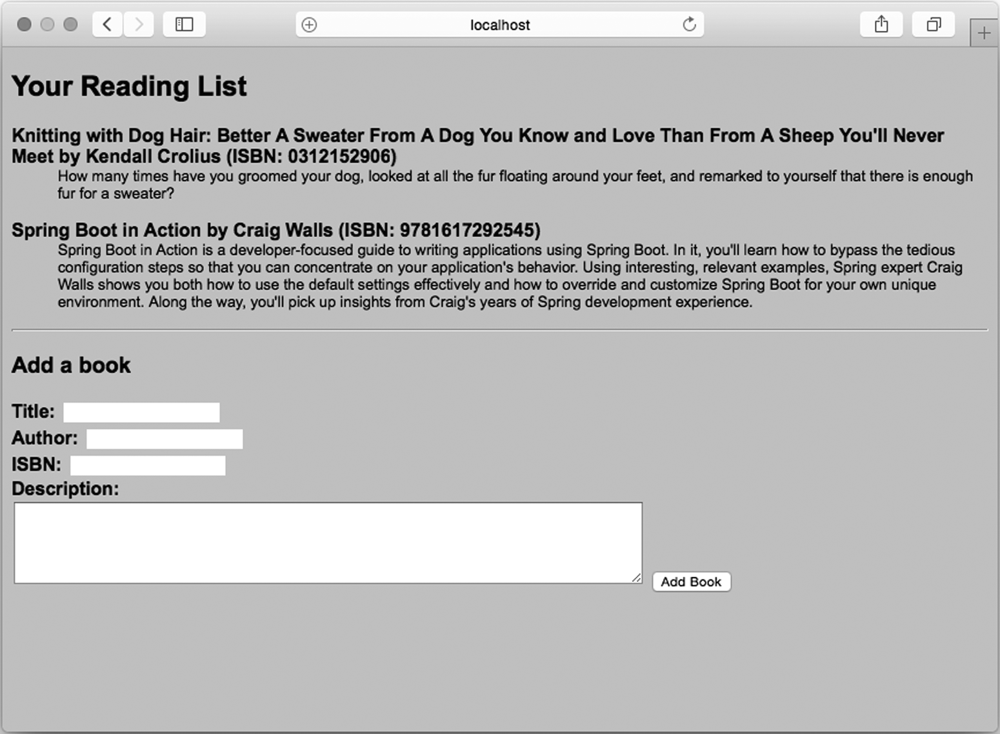
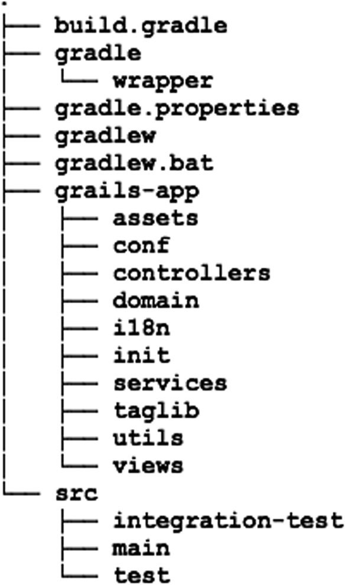

# Applying Grails in Spring Boot
# 在Spring Boot中使用Grails

__This chapter covers__
__本章内容涉及__

* Persisting data with GORM
* Defining GSP views
* An introduction to Grails 3 and Spring Boot
* 使用GORM持久化数据
* 定义GSP视图
* Grails 3和Spring Boot入门

When I was growing up, there was a series of television advertisements involving two people, one enjoying a chocolate bar and another eating peanut butter out of a jar. By way of some sort of comedic mishap, the two would collide, resulting in the peanut butter and chocolate getting mixed.  
我小时候，有一系列的电视广告，当中有两个人，一个在吃巧克力条，另一个在吃罐里的花生酱。经由一些富有喜剧效果的小事故，两个人撞到一起，最后花生酱和巧克力结合到了一起。

One would proclaim, “You got your chocolate in my peanut butter!” The other would respond, “You got peanut butter on my chocolate!”  
一个人会说，“你把巧克力弄到我的花生酱里了！”另一个回答，“是你把花生酱弄到我的巧克力上了！”

After initially being angry with their circumstances, the two would conclude that the combination of peanut butter and chocolate is a good thing. Then a voice-over would suggest that the viewer should eat a Reese’s Peanut Butter Cup.  
在一开始的尴尬气氛后，两个人都认同花生酱和巧克力结合在一起是件好事，接着旁白会建议观众试试Reese的Peanut Butter Cup。

From the moment that Spring Boot was announced, I’ve been frequently asked how to choose between Spring Boot and Grails. Both are built upon the Spring Framework and both help ease application development. Indeed, they’re very much like peanut butter and chocolate. Both are great, but the choice is largely a personal one.  
在Spring Boot刚发布时，经常有人问我在Spring Boot和Grails之间该如何选择。两者都构建于Spring Framework之上，都旨在简化应用程序的开发。实际上，它们就像花生酱和巧克力。两个都很好，这个选择取决于个人爱好。

As it turns out, there’s no reason to choose one or the other. Just like the chocolate vs. peanut butter debate, Spring Boot and Grails are two great choices that work great together.  
后来发现并没理由从中选一个出来，就像之前巧克力和花生酱的争论一样，Spring Boot和Grails两个都很好，完全可以结合到一起。

In this chapter, we’re going to look at the connection between Grails and Spring Boot. We’ll start by looking at a few Grails features like GORM and Groovy Server Pages (GSP) that are available in Spring Boot. Then we’ll flip it around and see how Grails 3 has been reinvented by being built upon Spring Boot.  
在本章中，我们会看到Grails和Spring Boot之前的联系。首先是在Spring Boot里能用到的GORM和Groovy Server Pages（GSP）这样的Grails特性，接下来再看看Grails 3是如何基于Spring Boot被重写的。

## 6.1 Using GORM for data persistence
## 6.1 使用GORM进行数据持久化

Probably one of the most intriguing pieces of Grails is GORM (Grails object-relational mapping). GORM makes database work as simple as declaring the entities that will be persisted. For example, listing 6.1 shows how the Book entity from the reading-list example could be written in Groovy as a GORM entity.  
Grails里最让人着迷的恐怕就是GORM了（Grails的对象关系映射）。GORM能简化数据库相关的工作，就和声明要持久化的实体一样容易。例如，代码6.1演示了阅读列表里的`Book`该如何用Groovy写成GORM实体。

__Listing 6.1 A GORM Book entity__  
__代码6.1 GORM `Book`实体__

```
package readinglist

import grails.persistence.*

@Entity
class Book {

  Reader reader
  String isbn
  String title
  String author
  String description

}
```

This is a GORM entity  
这是一个GORM实体

Just like its Java equivalent, this Book class has a handful of properties that describe a book. Unlike the Java version, however, it’s not littered with semicolons, public or private modifiers, setter and getter methods, or any of the other noise that’s common in Java. But what makes it a GORM entity is that it’s annotated with the @Entity annotation from Grails. This simple entity does a lot, including mapping the object to the database and enabling Book with persistence methods through which it can be saved and retrieved.  
就和`Book`的Java版本一样，这个类里有很多描述图书的属性。但又与Java版本不一样，没有分号、`public`或`private`修饰符、setter和getter方法或其他Java中常见的代码噪声。是Grails的`@Entity`注解让这个类变成了GORM实例。这个简单的实体可干了不少事，包括将对象映射到数据库，为`Book`添加持久化方法，通过这些方法可以存取图书。

To use GORM with a Spring Boot project, all you must do is add the GORM dependency to your build. In Maven, the <dependency> looks like this:  
要在Spring Boot项目里使用GORM，必须在项目里添加GORM依赖。在Maven中，`<dependency>`看起来是这样的：

```
<dependency>
  <groupId>org.grails</groupId>
  <artifactId>gorm-hibernate4-spring-boot</artifactId>
  <version>1.1.0.RELEASE</version>
</dependency>
```

The same dependency can be expressed in a Gradle build like this:  
一样的依赖，在Gradle里是这样的：

```
compile("org.grails:gorm-hibernate4-spring-boot:1.1.0.RELEASE")
```

This library carries some Spring Boot auto-configuration with it that will automatically configure all of the necessary beans to support working with GORM. All you need to do is start writing the code.  
这个库自带了一些Spring Boot自动配置，会自动配置所有支持GORM所需的Bean。你只管写代码就好了。

> __Another GORM option for Spring Boot__  
__GORM在Spring Boot里的另一个选择__

> As its name suggests, the gorm-hibernate4-spring-boot dependency enables GORM for data persistence via Hibernate. For many projects, this will be fine. If, however, you’re interested in working with the MongoDB document database, you’ll be pleased to know that GORM for MongoDB is also available for Spring Boot.  
正如其名，`gorm-hibernate4-spring-boot`是通过Hibernate开启GORM数据持久化的。对很多项目而言，这挺好的。但如果你想用MongoDB，那会Spring Boot里的MongoDB GORM支持很感兴趣。

> The Maven dependency looks like this:  
它的Maven依赖是这样的：

>
```
<dependency>
  <groupId>org.grails</groupId>
  <artifactId>gorm-mongodb-spring-boot</artifactId>
  <version>1.1.0.RELEASE</version>
</dependency>
```

> Likewise, the Gradle dependency is as follows:  
同样的，下面是Gradle依赖：
```
compile("org.grails:gorm-mongodb-spring-boot:1.1.0.RELEASE")
```

Due to the nature of how GORM works, it requires that at least the entity class be written in Groovy. We’ve already written the Book entity in listing 6.1. As for the Reader entity, it’s shown in the following listing.  
鉴于GORM的本质，它要求实体类必须用Groovy来编写。我们已经在代码6.1里写了一个`Book`实体，下面再写一个`Reader`实体。

__Listing 6.2 A GORM Reader entity__  
__代码6.2 GORM `Reader`实体__

```
package readinglist

import grails.persistence.*

import org.springframework.security.core.GrantedAuthority
import
    org.springframework.security.core.authority.SimpleGrantedAuthority
import org.springframework.security.core.userdetails.UserDetails

@Entity
class Reader implements UserDetails {

  String username
  String fullname
  String password

  Collection<? extends GrantedAuthority> getAuthorities() {
    Arrays.asList(new SimpleGrantedAuthority("READER"))
  }

  boolean isAccountNonExpired() {
    true
  }

  boolean isAccountNonLocked() {
    true
  }

  boolean isCredentialsNonExpired() {
    true
  }

  boolean isEnabled() {
    true
  }
}
```

This is an entity  
这是一个实体

Implement UserDetails  
实现了`UserDetails`

Now that we’ve written the two GORM entities for the reading-list application, we’ll need to rewrite the rest of the app to use them. Because working with Groovy is such a pleasant experience (and very Grails-like), we’ll continue writing the other classes in Groovy as well.  
现在，我们的阅读列表应用程序里有了两个GORM实体，我们需要重写剩下的应用程序来使用这两个实体。因为使用Groovy是如此的令人愉悦（和Grails很像），所以其他类我们也会用Groovy来编写。

First up is ReadingListController, as shown next.  
首先是`ReadingListController`，就像下面这样。

__Listing 6.3 A Groovy reading-list controller__  
__代码6.3 Groovy的`ReadingListController`__

```
package readinglist

import org.springframework.beans.factory.annotation.Autowired
import
    org.springframework.boot.context.properties.ConfigurationProperties
import org.springframework.http.HttpStatus
import org.springframework.stereotype.Controller
import org.springframework.ui.Model
import org.springframework.web.bind.annotation.ExceptionHandler
import org.springframework.web.bind.annotation.RequestMapping
import org.springframework.web.bind.annotation.RequestMethod
import org.springframework.web.bind.annotation.ResponseStatus

@Controller
@RequestMapping("/")
@ConfigurationProperties("amazon")
class ReadingListController {
  @Autowired
  AmazonProperties amazonProperties

  @ExceptionHandler(value=RuntimeException.class)
  @ResponseStatus(value=HttpStatus.BANDWIDTH_LIMIT_EXCEEDED)
  def error() {
    "error"
  }

  @RequestMapping(method=RequestMethod.GET)
  def readersBooks(Reader reader, Model model) {
    List<Book> readingList = Book.findAllByReader(reader)
    model.addAttribute("reader", reader)
    if (readingList) {
      model.addAttribute("books", readingList)
      model.addAttribute("amazonID", amazonProperties.getAssociateId())
    }
    "readingList"
  }

  @RequestMapping(method=RequestMethod.POST)
  def addToReadingList(Reader reader, Book book) {
    Book.withTransaction {
      book.setReader(reader)
      book.save()
    }
    "redirect:/"
  }

}  
```

Find all reader books  
查找读者的全部图书

Save a book  
保存一本书


The most obvious difference between this version of ReadingListController and the one from chapter 3 is that it’s written in Groovy and lacks much of the code noise from Java. But the most significant difference is that it doesn’t work with an injected ReadingListRepository anymore. Instead, it works directly with the Book type for persistence.  
这个版本的`ReadingListController`和第3章里的相比，最明显的区别在于它是用Groovy写的，没有Java的那些代码噪声。但最重要的不同还是无需再注入`ReadingListRepository`了，它直接通过`Book`类型做持久化。

In the readersBooks() method, it calls the static findAllByReader() method on Book to fetch all books for the given reader. Although we didn’t write a findAllByReader() method in listing 6.1, this will work because GORM will implement it for us.  
在`readersBooks()`方法里，它调用了`Book`的`findAllByReader()`静态方法，传入了指定的读者信息。虽然在代码6.1里没有提供`findAllByReader()`方法，但这段代码仍然可以执行，因为GORM会为我们实现这个方法的。

Likewise, the addToReadingList() method uses the static withTransaction() and the instance save() methods, both provided by GORM, to save a Book to the database.  
类似的，`addToReadingList()`方法使用了静态方法`withTransaction()`和实例方法`save()`，这两个方法也是GORM提供的，用于将`Book`保存到数据库里。

And all we had to do was declare a few properties and annotate Book with @Entity. A pretty good payoff, if you ask me.  
我们所要做的就是声明一些属性，在`Book`上添加`@Entity`注解。如果你问我，我觉得这笔买卖很划算。

A similar change must be made to SecurityConfig to fetch a Reader via GORM rather than using ReadingListRepository. The following listing shows the new Groovy SecurityConfig.  
`SecurityConfig`也要做类似的修改，通过GORM而非`ReadingListRepository`来获取`Reader`。下面的代码就是新的`SecurityConfig`。

__Listing 6.4 SecurityConfig in Groovy__  
__代码6.4 Groovy版本的`SecurityConfig`__

```
package readinglist

import org.springframework.context.annotation.Configuration
import org.springframework.security.config.annotation.authentication.
                                  builders.AuthenticationManagerBuilder
import org.springframework.security.config.annotation.web.
                                                  builders.HttpSecurity
import org.springframework.security.config.annotation.web.
                             configuration.WebSecurityConfigurerAdapter
import org.springframework.security.core.userdetails.UserDetailsService

@Configuration
class SecurityConfig extends WebSecurityConfigurerAdapter {

  void configure(HttpSecurity http) throws Exception {
    http
      .authorizeRequests()
      .antMatchers("/").access("hasRole('READER')")
      .antMatchers("/**").permitAll()
      .and()
      .formLogin()
      .loginPage("/login")
      .failureUrl("/login?error=true")
  }

  void configure(AuthenticationManagerBuilder auth) throws Exception {
    auth
      .userDetailsService(
        { username -> Reader.findByUsername(username) }
        as UserDetailsService)
  }

}
```

Find a reader by username  
根据用户名查找读者

Aside from being rewritten in Groovy, the most significant change in SecurityConfig is the second configure() method. As you can see, it uses a closure (as the implementation of UserDetailsService) that looks up a Reader by calling the static findByUsername() method, which is provided by GORM.  
除了用Groovy重写，`SecurityConfig`里最明显的变化无疑就是第二个`configure()`方法了。如你所见，它用了一个闭包（`UserDetailsService`的实现类），其中调用静态方法`findByUsername()`来查找`Reader`，这个功能是GORM提供的。

You may be wondering what becomes of ReadingListRepository in this GORMenabled application. With GORM handling all of the persistence for us, ReadingListRepository is no longer needed. Neither are any of its implementations. I think you’ll agree that less code is a good thing.  
你也许会好奇，在这个GORM版本的应用程序里，`ReadingListRepository`变成什么了。GORM替我们处理了所有的持久化工作，已经不再需要`ReadingListRepository`了，什么实现都不需要了。我想你会同意代码越烧越好这个观点的。

As for the remaining code in the application, it should also be rewritten in Groovy to match the classes we’ve changed thus far. But none of it deals with GORM and is therefore out of scope for this chapter. The complete Groovy application is available in the example code download.  
应用程序中剩余的代码也应该要用Groovy重写，这样才能和我们的变更相匹配。但它们和GORM没什么关系，也不在本章的讨论范围内。如果想要完整的代码，可以到示范代码页面里去下载。

At this point, you can fire up the reading-list application using any of the ways we’ve already discussed for running Spring Boot applications. Once it starts, the application should work as it always has. Only you and I know that the persistence mechanism has been changed.  
此刻，你可以通过各种运行Spring Boot应用程序的方法来启动阅读列表应用程序。启动后，应用程序应该能一如既往地工作。只有你我知道持久化机制已经被改变了。

In addition to GORM, Grails apps usually use Groovy Server Pages to render model data as HTML served to the browser. The Grails-ification of our application continues in the next section, where we’ll replace the Thymeleaf templates with equivalent GSP.  
除了GORM，Grails应用程序通常还会用Groovy Server Pages将模型数据以HTML的方式呈现给浏览器。下一节里我们应用程序的Grails化还会继续，我们会把Thymeleaf替换为等价的GSP。

## 6.2 Defining views with Groovy Server Pages
## 6.2 使用Groovy Server Pages来定义视图

Up until now, we’ve been using Thymeleaf templates to define the view for the readinglist application. In addition to Thymeleaf, Spring Boot also offers Freemarker, Velocity, and Groovy-based templates. For any of those choices, all you must do is add the appropriate starter to your build and start writing templates in the templates/ directory at the root of the classpath. Auto-configuration takes care of the rest.  
到目前为止，我们都在用Thymeleaf模板来定义阅读列表应用程序的视图。除了Thymeleaf，Spring Boot还支持Freemarker、Velocity和基于Groovy的模板。无论选择哪种模板，你要做的就是添加合适的起步依赖，在Classpath根部的templates/目录里编写模板。自动配置会处理剩下的事情的。

The Grails project also offers auto-configuration for Groovy Server Pages (GSP). If you want to use GSP in your Spring Boot application, all you must do is add the GSP for Spring Boot library to your build:  
Grails项目也提供Groovy Server Pages（GSP）的自动配置，如果你想在Spring Boot应用程序里使用GSP，必须向项目里添加Spring Boot的GSP库：

```
compile("org.grails:grails-gsp-spring-boot:1.0.0")
```

Just like the other view template options offered by Spring Boot, simply having this library in your classpath triggers auto-configuration that sets up the view resolvers necessary for GSP to work as the view layer of Spring MVC.  
就和Spring Boot提供的其他视图模板一样，只要把库放在Classpath里就会触发自动配置，设置所需的视图解析器，以便能在Spring MVC的视图层里使用GSP。

All that’s left is to write the GSP templates for your application. For the reading-list application, we’ll need to rewrite the Thymeleaf readingList.html file in GSP form as readingList.gsp (in src/main/resources/templates). The following listing shows the new GSP-enabled reading-list template.  
剩下的就是为应用程序编写GSP模板了。在阅读列表应用程序里，我们要把Thymeleaf的readingList.html文件用GSP的形式重写，放在readingList.gsp文件（位于src/main/resources/templates）里。下面就是新的GSP模板的代码。

__Listing 6.5 The reading-list app’s main view written in GSP__  
__代码6.5 GSP编写的阅读列表应用程序主视图__

```
<!DOCTYPE html>
<html>
  <head>
    <title>Reading List</title>
    <link rel="stylesheet" href="/style.css"></link>
  </head>

  <body>
    <h2>Your Reading List</h2>

    <g:if test="${books}">
      <g:each in="${books}" var="book">
        <dl>
          <dt class="bookHeadline">
            ${book.title} by ${book.author}
            (ISBN: ${book.isbn}")
          </dt>
          <dd class="bookDescription">
            <g:if test="book.description">
              ${book.description}
            </g:if>
            <g:else>
              No description available
            </g:else>
          </dd>
        </dl>
      </g:each>
    </g:if>
    <g:else>
      <p>You have no books in your book list</p>
    </g:else>

    <hr/>

    <h3>Add a book</h3>

    <form method="POST">
      <label for="title">Title:</label>
      <input type="text" name="title"
                         value="${book?.title}"/><br/>
      <label for="author">Author:</label>
      <input type="text" name="author"
                         value="${book?.author}"/><br/>
      <label for="isbn">ISBN:</label>
      <input type="text" name="isbn"
                         value="${book?.isbn}"/><br/>
      <label for="description">Description:</label><br/>
      <textarea name="description" rows="5" cols="80">
        ${book?.description}
      </textarea>
      <input type="hidden" name="${_csrf.parameterName}"
           value="${_csrf.token}" />
      <input type="submit" value="Add Book" />
    </form>
  </body>
</html>
```

List the books  
罗列图书

The book form  
图书表单

The CSRF token  
CSRF令牌

As you can see, the GSP template is sprinkled with expression language references (the parts wrapped in ${}) and tags from the GSP tag library such as <g:if> and <g:each>. It’s not quite pure HTML as is the case with Thymeleaf, but it’s a familiar and comfortable option if you’re used to working with JSP.  
如你所见，GSP模板中使用了表达式语言引用（用`${}`包围的部分）以及GSP标签库（例如`<g:if>`和`<g:each>`）。并不是像Thymeleaf这样的纯HTML，但如果你用过JSP，会很熟悉这种方式。

For the most part, it’s rather straightforward to map the elements on this GSP template with the corresponding Thymeleaf templates from chapters 2 and 3. One thing to note, however, is that you have to put in a hidden field to carry the CSRF (Cross-Site Request Forgery) token. Spring Security requires this token on POST requests, and Thymeleaf is able to automatically include it in the rendered HTML. With GSP, however, you must explicitly include the CSRF token in a hidden field.  
代码里的绝大部分内容和第2章与第3章的Thymeleaf模板类似，映射GSP模板上的元素。但是有一点要注意，你必须要放一个隐藏域，其中包含CSRF（Cross-Site Request Forgery）令牌。Spring Security在提交POST请求时要求带有这个令牌，Thymeleaf在呈现HTML时会自动包含这个令牌，但在GSP里你必须显式地包含它。

Figure 6.1 shows the results of the GSP rendered as HTML in the browser after a few books have been entered.  
图6.1是GSP模板的显示效果，其中添加了一些图书。

Although Grails features like GORM and GSP are appealing and go a long way toward making a Spring Boot application even simpler, it’s not quite the complete Grails experience. We’ve seen how to put a little Grails chocolate in the Spring Boot peanut butter. Now we’ll turn it around and see how Grails 3 gives you the best of both worlds: a development experience that’s both fully Spring Boot and fully Grails.  
虽然GORM和GSP这样的Grails特性很吸引人，让Spring Boot应用程序更简单了，但这种Grails的体验并不完整。让我们再往Spring Boot的花生酱里放一点Grails巧克力。现在让我们来看看Grails 3是如何将两者合二为一的：带来了完整的Spring Boot和Grails开发体验。




__Figure 6.1 The reading list rendered from a GSP template__  
__图6.1 使用了GSP模板的阅读列表__

## 6.3 Mixing Spring Boot with Grails 3
## 6.3 结合Spring Boot与Grails 3

Grails has always been a higher-level framework built upon the giants of Spring, Groovy, Hibernate, and others. With Grails 3, Grails is now built upon Spring Boot, enabling a very compelling developer experience that makes both Grails developers and Spring Boot developers feel at home.  
Grails一直都是构建于Spring、Groovy、Hibernate和其他巨人肩膀之上的高阶框架。到了Grails 3，Grails已经基于Spring Boot了，带来了令人愉悦的开发体验，让Grails开发者和Spring Boot开发者都能驾轻就熟。

The first step toward working with Grails 3 is to install it. On Mac OS X and most Unix systems, the easiest way to install Grails is to use SDKMAN at the command line:  
要使用Grails 3，首先就是安装。再Mac OS X和大部分Unix系统上，最简单的安装方法是在命令行里使用SDKMAN：

```
$ sdk install grails
```

If you’re using Windows or otherwise can’t use SDKMAN, you’ll need to download the binary distribution, unzip it, and add the bin directory to your system path.  
如果你用的是Windows，或者无法使用SDKMAN，就需要下载二进制发布包，解压后将bin目录添加到系统路径里去。

Whichever installation choice you use, you can verify the installation by checking the Grails version at the command line:  
无论用哪种安装方式，都可以通过在命令行中查看Grails的版本来验证安装是否成功：

```
$ grails -version
```

Assuming the installation went well, you’re now ready to start creating a Grails project.  
假定安装成功，现在就可以创建Grails项目了。

### 6.3.1 Creating a new Grails project  
### 6.3.1 创建新的Grails项目

The grails command-line tool is what you’ll use to perform many tasks with a Grails project, including the initial creation of the project. To kick off the reading-list application project, use grails like this:  
在Grails项目中你会使用`grails`命令行工具来执行很多任务，包括创建项目。要创建阅读列表项目，可以像这样来使用`grails`命令：

```
$ grails create-app readinglist
```

As its name suggests, the create-app command creates a new application project. In this case, the name of the project is “readinglist”.  
正如这个命令的名字所示，`create-app`命令创建了一个新的应用程序项目。在这个例子里，项目名是“readinglist”。

Once the grails tool has created the application, cd into the readinglist directory and take a look at what was created. Figure 6.2 shows a high-level view of what the project structure should look like.  
一旦`grails`工具创建完应用程序，`cd`到`readinglist`目录里，看看所创建的内容。图6.2应该就是你看到的项目结构的概览。

You should recognize a few familiar entries in the project’s directory structure. There’s a Gradle build specification and configuration (build.gradle and gradle.properties). There’s also a standard Gradle project structure under the src directory. But grails-app is the most interesting directory in the project. If you’ve ever worked with any previous version of Grails, you’ll know what this directory is for. It’s where you’ll write the controllers, domain types, and other code that makes up the Grails project.  
在这个项目目录结构里你应该认出了一些熟悉的东西。其中有一个Gradle的构建说明文件和配置（build.gradle和gradle.properties），src目录里还有一个标准的Gradle项目结构，但是grails-app应该是里面最有趣的目录。如果你用过老版本的Grails，就会知道这个目录的作用，里面放的是你写的控制器、领域类和其他构成Grails项目的代码。



__Figure 6.2 The directory structure of a Grails 3 project__  
__图6.2 Grails 3项目的目录结构__

If you dig a little deeper and open up the build.gradle file, you’ll find a few more familiar items. To start with, the build specification uses the Spring Boot plugin for Gradle:  
如果再深挖一下，打开build.gradle文件，会发现一些更熟悉的东西。首先，构建说明文件里使用了Spring Boot的Gradle插件：

```
apply plugin: "spring-boot"
```

This means that you’ll be able to build and run the Grails application just as you would any other Spring Boot application.  
这意味着你能像使用其他Spring Boot应用程序那样构建并运行这个Grails应用程序。

You’ll also notice that there are a handful of Spring Boot libraries among the other dependencies:  
你还应该注意到在依赖里有不少有用的Spring Boot库：

```
dependencies {
  compile 'org.springframework.boot:spring-boot-starter-logging'
  compile("org.springframework.boot:spring-boot-starter-actuator")
  compile "org.springframework.boot:spring-boot-autoconfigure"
  compile "org.springframework.boot:spring-boot-starter-tomcat"
  ...
}
```

This provides your Grails application with Spring Boot auto-configuration and logging, as well as the Actuator and an embedded Tomcat to serve the application when run as an executable JAR.  
这些库为Grails应用程序提供了Spring Boot的自动配置、日志，还有Actuator及嵌入式Tomcat，在把应用当作可执行JAR运行时，这个Tomcat可以提供服务。

Indeed, this is a Spring Boot project. It’s also a Grails project. As of Grails 3, Grails is built upon a foundation of Spring Boot.  
实际上，这是一个Spring Boot项目，同时也是Grails项目。因为Grails 3就是构建在Spring Boot的基础上的。

#### RUNNING THE APPLICATION

The most straightforward way to run a Grails application is with the run-app command of the grails tool at the command line:

```
$ grails run-app
```

Even though we’ve not written a single line of code, we’re already able to run the application and view it in the browser. Once the application starts up, you can navigate to http://localhost:8080 in your web browser. You should see something similar to what’s shown in figure 6.3.
