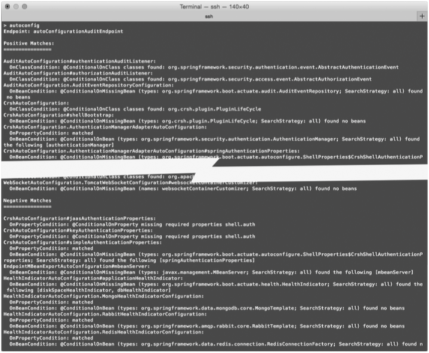
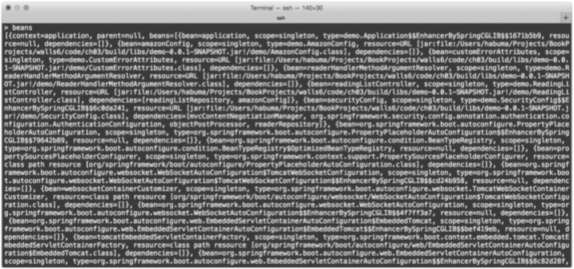
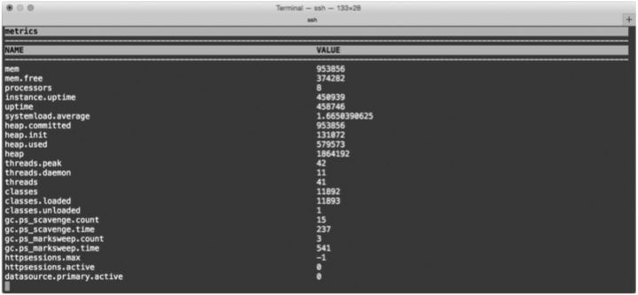
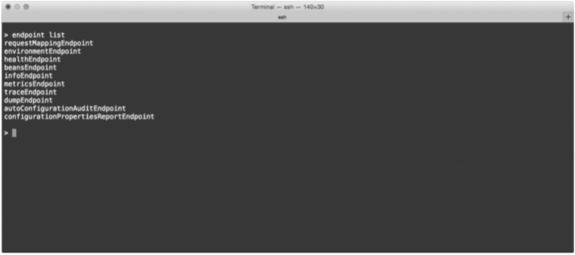
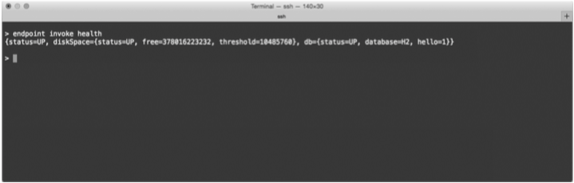
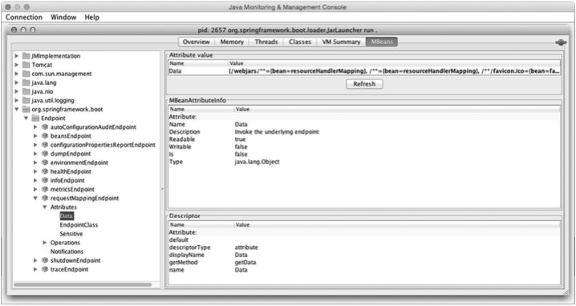
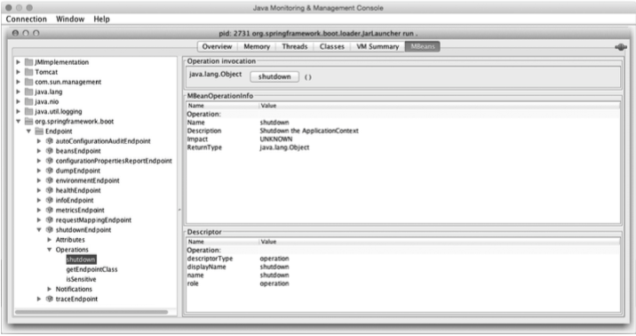
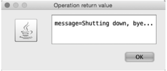

# Taking a peek inside with the Actuator
# 深入Actuator

__This chapter covers__
__本章内容涉及__

* Actuator web endpoints
* Adjusting the Actuator
* Shelling into a running application
* Securing the Actuator
* Actuator Web端点
* 调整Actuator
* 通过Shell连入运行中的应用程序
* 保护Actuator

Have you ever tried to guess what’s inside a wrapped gift? You shake it, weigh it, and measure it. And you might even have a solid idea as to what’s inside. But until you open it up, there’s no way of knowing for sure.  
你有没有猜过包好的礼物盒里装的是什么东西？你会摇一摇，掂一掂，量一量，你甚至会执着于里面到底有什么。但直到打开盒子那一刻前，你是没办法确认里面是什么的。

A running application is kind of like a wrapped gift. You can poke at it and make reasonable guesses as to what’s going on under the covers. But how can you know for sure? If only there were some way that you could peek inside a running application, see how it’s behaving, check on its health, and maybe even trigger operations that influence how it runs?  
运行中的应用程序就像礼物盒。你可以刺探它，作出合理的推测，猜测它的运行情况。但如何了解真实的情况呢？有没有一种办法能让你深入应用程序内部一窥究竟，了解它的行为，检查它的健康状况，甚至触发一些操作来影响应用程序呢？

In this chapter, we’re going to explore Spring Boot’s Actuator. The Actuator offers production-ready features such as monitoring and metrics to Spring Boot applications. The Actuator’s features are provided by way of several REST endpoints, a remote shell, and Java Management Extensions (JMX). We’ll start by looking at the Actuator’s REST endpoints, which offer the most complete and well-known way of working with the Actuator.  
在本章中，我们将了解到Spring Boot的Actuator，它提供了很多生产级的特性，比如监控和度量Spring Boot应用程序。可以通过众多REST端点、远程Shell和Java Management Extensions（JMX）来获得Actuator的这些特性。我们会先来看看Actuator的REST端点，这种最为人所知的使用方式提供的功能也最完整。

## 7.1 Exploring the Actuator’s endpoints
## 7.1 揭秘Actuator的端点

The key feature of Spring Boot’s Actuator is that it provides several web endpoints in your application through which you can view the internals of your running application. Through the Actuator, you can find out how beans are wired together in the Spring application context, determine what environment properties are available to your application, get a snapshot of runtime metrics, and more.  
Spring Boot Actuator的关键特性是在应用程序里提供了众多Web端点，通过它们可以了解应用程序运行时的内部状况。有了Actuator，你可以了解到Bean在Spring应用程序上下文里是如何组装在一起的，掌握应用程序可以获取的环境属性信息，获取运行时度量信息的快照……

The Actuator offers a baker’s dozen of endpoints, as described in table 7.1.  
Actuator提供了13个端点，具体如表7.1所示。

__Table 7.1 Actuator endpoints__
__表7.1 Actuator的端点__

| HTTP method  | Path            | Description                                                                                           |
|--------------|-----------------|-------------------------------------------------------------------------------------------------------|
|GET           | /autoconfig     | Provides an auto-configuration report describing what autoconfiguration conditions passed and failed. |
|GET           | /configprops    | Describes how beans have been injected with configuration properties (including default values).      |
|GET           | /beans          | Describes all beans in the application context and their relationship to each other.                  |
|GET           | /dump           | Retrieves a snapshot dump of thread activity.                                                         |
|GET           | /env            | Retrieves all environment properties.                                                                 |
|GET           | /env/{name}     | Retrieves a specific environment value by name.                                                       |
|GET           | /health         | Reports health metrics for the application, as provided by HealthIndicator implementations.           |
|GET           | /info           | Retrieves custom information about the application, as provided by any properties prefixed with info. |
|GET           | /mappings       | Describes all URI paths and how they’re mapped to controllers (including Actuator endpoints).         |
|GET           | /metrics        | Reports various application metrics such as memory usage and HTTP request counters.                   |
|GET           | /metrics/{name} | Reports an individual application metric by name.                                                     |
|GET           | /shutdown       | Shuts down the application; requires that endpoints.shutdown.enabled be set to true.                  |
|GET           | /trace          | Provides basic trace information (timestamp, headers, and so on) for HTTP requests.                   |

| HTTP方法 | 路径              | 描述                                                           |
|----------|-------------------|---------------------------------------------------------------|
| GET      | `/autoconfig`     | 提供了一份自动配置报告，记录了哪些自动配置条件通过了，哪些没通过。  |
| GET      | `/configprops`    | 描述了配置属性（包含默认值）是如何注入到Bean里的。                |
| GET      | `/beans`          | 描述了应用程序上下文里全部的Bean，以及它们的相互关系。             |
| GET      | `/dump`           | 获取线程活动的快照。                                            |
| GET      | `/env`            | 获取全部环境属性。                                              |
| GET      | `/env/{name}`     | 根据名称获取特定的环境属性值。                                   |
| GET      | `/health`         | 报告应用程序的健康指标，这些值由`HealthIndicator`的实现类提供。    |
| GET      | `/info`           | 获取应用程序的定制信息，这些信息由`info`打头的属性提供。           |
| GET      | `/mappings`       | 描述全部的URI路径，以及它们和控制器的映射关系（包含Actuator端点）。 |
| GET      | `/metrics`        | 报告各种应用程序度量信息，比如内存用量和HTTP请求计数。             |
| GET      | `/metrics/{name}` | 报告指定名称的应用程序度量值。                                    |
| GET      | `/shutdown`       | 关闭应用程序，要求`endpoints.shutdown.enabled`设置为`true`。     |
| GET      | `/trace`          | 提供基本的HTTP请求跟踪信息（时间戳、HTTP头等）。                   |

To enable the Actuator endpoints, all you must do is add the Actuator starter to your build. In a Gradle build specification, that dependency looks like this:  
要启用Actuator的端点，只需在项目中引入Actuator的起步依赖即可。在Gradle构建说明文件里，这个依赖是这样的：

```
compile 'org.springframework.boot:spring-boot-starter-actuator'
```

For a Maven build, the required dependency is as follows:  
对于Maven项目，引入的依赖是这样的：

```
<dependency>
  <groupId>org.springframework.boot</groupId>
  <artifactId>spring-boot-starter-actuator</artifactId>
</dependency>
```

Or, if you’re using the Spring Boot CLI, the following @Grab should do the trick:  
亦或者，如果你在用Spring Boot CLI，可以使用如下`@Grab`注解：

```
@Grab('spring-boot-starter-actuator')
```

No matter which technique you use to add the Actuator to your build, auto-configuration will kick in when the application is running and you enable the Actuator.  
无论你是如何添加Actuator的，在应用程序运行时自动配置都会生效，开启Actuator。

The endpoints in table 7.1 can be organized into three distinct categories: configuration endpoints, metrics endpoints, and miscellaneous endpoints. Let’s take a look at each of these endpoints, starting with the endpoints that provide insight into the configuration of your application.  
表7.1中的端点可以分为三大类：配置端点、度量端点和其他端点。让我们分别了解一下这些端点，从提供应用程序配置信息的端点看起吧。

### 7.1.1 Viewing configuration details
### 7.1.1 查看配置明细

One of the most common complaints lodged against Spring component-scanning and autowiring is that it’s hard to see how all of the components in an application are wired together. Spring Boot auto-configuration makes this problem even worse, as there’s even less Spring configuration. At least with explicit configuration, you could look at the XML file or the configuration class and get an idea of the relationships between the beans in the Spring application context.  
关于Spring组件扫描和自动织入抱怨最多的几点之一就是很难看到应用程序中的组件是如何装配起来的。Spring Boot自动配置让这个问题变得更糟糕了，因为Spring的配置更少了。在有显式配置的情况下，至少你还能看到XML文件或者配置类，对Spring应用程序上下文里的Bean关系有个大概的了解。

Personally, I’ve never had this concern. Maybe it’s because I realize that before Spring came along there wasn’t any map of the components in my applications.  
从个人角度来说，我从不担心这个问题。也许是因为我意识到了在Spring出现之前，根本就没有应用程序组件的映射关系。

Nevertheless, if it concerns you that auto-configuration hides how beans are wired up in the Spring application context, then I have some good news! The Actuator has endpoints that give you that missing application component map as well as some insight into the decisions that auto-configuration made when populating the Spring application context.  
但是，如果你担心自动配置隐藏了Spring应用程序上下文中Bean的装配细节，那么我告诉你一个好消息！Actuator有一些端点不仅可以显示组件映射关系，还可以告诉你自动配置在配置Spring应用程序上下文时做了哪些决策。

#### GETTING A BEAN WIRING REPORT
#### 获得Bean装配报告

The most essential endpoint for exploring an application’s Spring context is the /beans endpoint. This endpoint returns a JSON document describing every single bean in the application context, its Java type, and any of the other beans it’s injected with. By performing a GET request to /beans (http://localhost:8080/beans when running locally), you’ll be given information similar to what’s shown in the following listing.  
要了解应用程序中Spring上下文的情况，最重要的端点就是`/beans`，它会返回一个JSON文档，描述了上下文里每个Bean的情况，它的Java类型以及注入的其他Bean。当向`/beans`（在本地运行时是[http://localhost:8080/beans](http://localhost:8080/beans)）发起GET请求后，你会看到与如下代码示例类似的信息。

__Listing 7.1 The /beans endpoint exposes the beans in the Spring application context__  
__代码7.1 `/beans`端点提供的Spring应用程序上下文Bean信息__

```
[
  {
    "beans": [
      {
        "bean": "application",
        "dependencies": [],
        "resource": "null",
        "scope": "singleton",
        "type": "readinglist.Application$$EnhancerBySpringCGLIB$$f363c202"
      },
      {
        "bean": "amazonProperties",
        "dependencies": [],
        "resource": "URL [jar:file:/../readinglist-0.0.1-SNAPSHOT.jar!
                                      /readinglist/AmazonProperties.class]",
        "scope": "singleton",
        "type": "readinglist.AmazonProperties"
      },
      {
        "bean": "readingListController",
        "dependencies": [
          "readingListRepository",
          "amazonProperties"
        ],
        "resource": "URL [jar:file:/../readinglist-0.0.1-SNAPSHOT.jar!
                               /readinglist/ReadingListController.class]",
        "scope": "singleton",
        "type": "readinglist.ReadingListController"
      },
      {
        "bean": "readerRepository",
        "dependencies": [
          "(inner bean)#219df4f5",
          "(inner bean)#2c0e7419",
          "(inner bean)#7d86037b",
          "jpaMappingContext"
        ],
        "resource": "null",
        "scope": "singleton",
        "type": "readinglist.ReaderRepository"
      },
      {
        "bean": "readingListRepository",
        "dependencies": [
          "(inner bean)#98ce66",
          "(inner bean)#1fd7add0",
          "(inner bean)#59faabb2",
          "jpaMappingContext"
        ],
        "resource": "null",
        "scope": "singleton",
        "type": "readinglist.ReadingListRepository"
      },
      ...
    ],
    "context": "application",
    "parent": null
  }
]
```

Bean ID  
Bean ID

Resource file  
资源文件

Dependencies  
依赖

Bean scope  
Bean作用域

Java type  
Java类型

Listing 7.1 is an abridged listing of the beans from the reading-list application. As you can see, all of the bean entries carry five pieces of information about the bean:  
代码7.1是阅读列表应用程序Bean信息的一个片段，如你所见，所有的Bean条目都由五类信息：

* bean—The name or ID of the bean in the Spring application context
* resource—The location of the physical .class file (often a URL into the built JAR file, but this might vary depending on how the application is built and run)
* dependencies—A list of bean IDs that this bean is injected with
* scope—The bean’s scope (usually singleton, as that is the default scope)
* type—The bean’s Java type
* `bean`——Spring应用程序上下文中的Bean名称或ID
* `resource`——.class文件的物理位置（通常是一个URL，指向构建出的JAR文件，这会随着应用程序的构建和运行方式发生变化）
* `dependencies`——当前Bean注入的Bean ID列表
* `scope`——Bean的作用域（通常是单例，这也是默认作用域）
* `type`——Bean的Java类型

Although the beans report doesn’t draw a specific picture of how the beans are wired together (for example, via properties or constructor arguments), it does help you visualize the relationships of the beans in the application context. Indeed, it would be reasonably easy to write a utility that processes the beans report and produces a graphical representation of the bean relationships. Be aware, however, that the full bean report includes many beans, including many auto-configured beans, so such a graphic could be quite busy.  
虽然Bean报告不会用图告诉你Bean是如何装配的（例如，通过属性或构造方法），但它帮你直观地了解了应用程序上下文中的Bean关系。实际上，很容易就能写出一个工具，把Bean报告处理一下，用图形化的方式来展现Bean关系。请注意，完整的Bean报告会包含很多Bean，还有很多自动配置的Bean，自动画出来的图会非常复杂。

#### EXPLAINING AUTO-CONFIGURATION
#### 详解自动配置

Whereas the /beans endpoint produces a report telling you what beans are in the Spring application context, the /autoconfig endpoint might help you figure out why they’re there—or not there.  
`/beans`端点产生的报告告诉你Spring应用程序上下文里都有哪些Bean，`/autoconfig`端点能告诉你为什么会有这个Bean，或者为什么没有这个Bean。

As mentioned in chapter 2, Spring Boot auto-configuration is built upon Spring conditional configuration. It provides several configuration classes with @Conditional annotations referencing conditions that decide whether or not beans should be automatically configured. The /autoconfig endpoint provides a report of all the conditions that are evaluated, grouping them by which conditions passed and which failed.  
正如第2章里说的，Spring Boot自动配置构建于Spring的条件化配置之上，它提供了众多带有`@Conditional`注解的配置类，根据条件决定是否要自动配置这些Bean。`/autoconfig`端点提供了一个报告，列出了计算过的所有条件，根据是否通过条件进行分组。

Listing 7.2 shows an excerpt from the auto-configuration report produced for the reading-list application with one passing and one failing condition.  
代码7.2是阅读列表应用程序的自动配置报告里的一个片段，里面有一个通过的条件，还有一个没通过的条件。

__Listing 7.2 An auto-configuration report for the reading-list app__  
__代码7.2 阅读列表应用程序的自动配置报告__

```
{
  "positiveMatches": {
    ...
    "DataSourceAutoConfiguration.JdbcTemplateConfiguration
                                                    #jdbcTemplate": [
      {
        "condition": "OnBeanCondition",
        "message": "@ConditionalOnMissingBean (types:
            org.springframework.jdbc.core.JdbcOperations;
            SearchStrategy: all) found no beans"
      }
    ],
    ...
  },
  "negativeMatches": {
    "ActiveMQAutoConfiguration": [
      {
        "condition": "OnClassCondition",
        "message": "required @ConditionalOnClass classes not found:
           javax.jms.ConnectionFactory,org.apache.activemq
           .ActiveMQConnectionFactory"
      }
    ],
    ...
  }
}
```

Successful conditions  
成功条件

Failed conditions  
失败条件

In the positiveMatches section, you’ll find a condition used to decide whether or not Spring Boot should auto-configure a JdbcTemplate bean. The match is named DataSourceAutoConfiguration.JdbcTemplateConfiguration#jdbcTemplate, which indicates the specific configuration class where this condition is applied. The type of condition is an OnBeanCondition, which means that the condition’s outcome is determined by the presence or absence of a bean. In this case, the message property makes it clear that the condition checks for the absence of a bean of type JdbcOperations (the interface that JbdcTemplate implements). If no such bean has already been configured, then this condition passes and a JdbcTemplate bean will be created.  
在`positiveMatches`里，你会看到一个条件，决定了Spring Boot是否自动配置`JdbcTemplate` Bean。匹配到的名字是`DataSourceAutoConfiguration.JdbcTemplateConfiguration#jdbcTemplate`，这是运用了条件的具体配置类。条件类型是`OnBeanCondition`，意味着条件的输出是由某个Bean的存在与否来决定的。在本例中，`message`属性已经清晰地表明了该条件是检查是否有`JdbcOperations`类型（`JbdcTemplate`实现了该接口）的Bean存在。如果没有配置这种Bean，条件即成立，会创建一个`JdbcTemplate` Bean。

Similarly, under negativeMatches, there’s a condition that decides whether or not to configure an ActiveMQ. This decision is an OnClassCondition, and it hinges on the presence of ActiveMQConnectionFactory in the classpath. Because ActiveMQConnectionFactory isn’t in the classpath, the condition fails and ActiveMQ will not be auto-configured.  
类似的，在`negativeMatches`里，有一个条件决定了是否要配置ActiveMQ。这是一个`OnClassCondition`，会检查Classpath里是否存在`ActiveMQConnectionFactory`。因为Classpath里没有这个类，条件不成立，不会自动配置ActiveMQ。

#### INSPECTING CONFIGURATION PROPERTIES
#### 查看配置属性

In addition to knowing how your application beans are wired together, you might also be interested in learning what environment properties are available and what configuration properties were injected on the beans.  
除了要知道应用程序的Bean是如何装配的，你可能还对能获取哪些环境属性，哪些配置属性被注入到了Bean里感兴趣。

The /env endpoint produces a list of all of the environment properties available to the application, whether they’re being used or not. This includes environment variables, JVM properties, command-line parameters, and any properties provided in an application.properties or application.yml file.  
`/env`端点会生成所有应用程序可用的环境属性的列表，无论是否被用到。其中包括环境变量、JVM属性、命令行参数，以及applicaition.properties或application.yml文件提供的属性。

The following listing shows an abridged example of what you might get from the /env endpoint.  
下面的示例代码是`/env`端点获取信息的一个片段。

__Listing 7.3 The /env endpoint reports all properties available__  
__代码7.3 `/env`端点会报告所有可用的属性__

```
{
  "applicationConfig: [classpath:/application.yml]": {
    "amazon.associate_id": "habuma-20",
    "error.whitelabel.enabled": false,
    "logging.level.root": "INFO"
  },
  "profiles": [],
  "servletContextInitParams": {},
  "systemEnvironment": {
    "BOOK_HOME": "/Users/habuma/Projects/BookProjects/walls6",
    "GRADLE_HOME": "/Users/habuma/.sdkman/gradle/current",
    "GRAILS_HOME": "/Users/habuma/.sdkman/grails/current",
    "GROOVY_HOME": "/Users/habuma/.sdkman/groovy/current",
    ...
  },
  "systemProperties": {
    "PID": "682",
    "file.encoding": "UTF-8",
    "file.encoding.pkg": "sun.io",
    "file.separator": "/",
    ...
  }
}
```

Application properties  
应用属性

Environment variables  
环境变量

JVM system properties  
JVM系统属性

Essentially, any property source that can provide properties to a Spring Boot application will be listed in the results of the /env endpoint along with the properties provided by that endpoint.  
基本上来说，任何能给Spring Boot应用程序提供属性的属性源都会列在`/env`的结果里，同时会显示具体的属性。

In listing 7.3, properties come from application configuration (application.yml), Spring profiles, servlet context initialization parameters, the system environment, and JVM system properties. (In this case, there are no profiles or servlet context initialization parameters.)  
在代码7.3中的属性来源有很多，包括应用在程序配置（application.yml）、Spring Profile、Servlet上下文初始化参数、系统环境变量和JVM系统属性。（本例中，没有Profile和Servlet上下文初始化参数。）

It’s common to use properties to carry sensitive information such as database or API passwords. To keep that kind of information from being exposed by the /env endpoint, any property named (or whose last segment is) “password”, “secret”, or “key” will be rendered as “” in the response from /env. For example, if there’s a property named “database.password”, it will be rendered in the /env response like this:  
通过属性来提供诸如数据库或API密码之类的敏感信息是种常见的用法。为了避免此类信息暴露到`/env`里，所有名字是“password”、"secret"或“key”（或者名字中最后一段是这些）的属性在`/env`里都会以“”来展现。举个例子，如果有一个属性名字是“database.password”，它的显示效果是这样的：

```
"database.password":"******"
```

The /env endpoint can also be used to request the value of a single property. Just append the property name to /env when making the request. For example, requesting /env/amazon.associate_id will yield a response of “habuma-20” (in plain text) when requested against the reading-list application.  
`/env`端点还能用来获取单个属性的值，只需要在请求时在`/env`后加上属性名即可。举例来说，对阅读列表应用程序发起`/env/amazon.associate_id`请求获得的结果是“habuma-20”（纯文本形式）。

As you’ll recall from chapter 3, these environment properties come in handy when using the @ConfigurationProperties annotation. Beans annotated with @ConfigurationProperties can have their instance properties injected with values from the environment. The /configprops endpoint produces a report of how those properties are set, whether from injection or otherwise. Listing 7.4 shows an excerpt from the configuration properties report for the reading-list application.  
回想第3章，可以很方便地通过`@ConfigurationProperties`注解来使用这些环境属性。这些环境属性会注入到带有`@ConfigurationProperties`注解的Bean的实例属性中。`/configprops`端点会生成一个报告，说明这些属性是如何进行设置的，是注入的还是其他方式。代码7.4是阅读列表应用程序的配置属性报告片段。

__Listing 7.4 A configuration properties report__  
__代码7.4 配置属性报告__

```
{
  "amazonProperties": {
    "prefix": "amazon",
    "properties": {
      "associateId": "habuma-20"
    }
  },
  ...
  "serverProperties": {
    "prefix": "server",
    "properties": {
      "address": null,
      "contextPath": null,
      "port": null,
      "servletPath": "/",
      "sessionTimeout": null,
      "ssl": null,
      "tomcat": {
        "accessLogEnabled": false,
        "accessLogPattern": null,
        "backgroundProcessorDelay": 30,
        "basedir": null,
        "compressableMimeTypes": "text/html,text/xml,text/plain",
        "compression": "off",
        "maxHttpHeaderSize": 0,
        "maxThreads": 0,
        "portHeader": null,
        "protocolHeader": null,
        "remoteIpHeader": null,
        "uriEncoding": null
      },
      ...
    }
  },
  ...
}
```

Amazon configuration  
Amazon配置

Server configuration  
服务器配置

The first item in this excerpt is the amazonProperties bean we created in chapter 3. This report tells us that it’s annotated with @ConfigurationProperties to have a prefix of “amazon”. And it shows that the associateId property is set to “habuma-20”. This is because in application.yml, we set the amazon.associateId property to “habuma-20”.  
片段中的第一个内容是我们在第3章里创建的`amazonProperties` Bean。报告显示它添加了`@ConfigurationProperties`注解，前缀为“amazon”。`associateId`属性被设置为“habuma-20”。这是因为在application.yml里，我们把`amazon.associateId`属性设置成了“habuma-20”。

You can also see an entry for serverProperties—it has a prefix of “server” and several properties that we can work with. Here they all have default values, but you can change any of them by setting a property prefixed with “server”. For example, you could change the port that the server listens on by setting the server.port property.  
你还会看到一个`serverProperties`条目——它的前缀是“server”，还有一些属性。它们都有默认值，你也可以通过设置“server”前缀的属性来改变这些值。举例来说，你可以通过设置`server.port`属性来修改服务器监听的端口。

Aside from giving insight into how configuration properties are set in the running application, this report is also useful as a quick reference showing all of the properties that you could set. For example, if you weren’t sure how to set the maximum number of threads in the embedded Tomcat server, a quick look at the configuration properties report would give you a clue that server.tomcat.maxThreads is the property you’re looking to set.  
除了能了解运行中应用程序的配置属性是如何设置的，这个报告也能作为一个快速参考指南，告诉你有哪些属性可以设置。例如，如果你不清楚怎么设置嵌入式Tomcat服务器的最大线程数，可以看一下配置属性报告，里面会有一条`server.tomcat.maxThreads`，这就是你要找的属性。

#### PRODUCING ENDPOINT-TO-CONTROLLER MAP
#### 生成端点到控制器的映射

When an application is relatively small, it’s usually easy to know how all of its controllers are mapped to endpoints. But once the web interface exceeds more than a handful of controllers and request-handling methods, it might be helpful to have a list of all of the endpoints exposed by the application.  
在应用程序相对较小的时候，很容易就能搞清楚控制器都映射到了哪些端点上。一旦Web界面的控制器和请求处理方法数量多了，最好就能有一个列表，罗列出应用程序发布的全部端点。

The /mappings endpoint provides such a list. Listing 7.5 shows an excerpt of the mappings report from the reading-list application.  
`/mappings`端点就提供了这么一个列表。代码7.5是阅读列表应用程序的映射报告片段。

__Listing 7.5 The controller/endpoint mappings for the reading-list app__  
__代码7.5 阅读列表应用程序的控制器/端点映射__

```
{
  ...

  "{[/],methods=[GET],params=[],headers=[],consumes=[],produces=[],
                                                       custom=[]}": {
    "bean": "requestMappingHandlerMapping",
    "method": "public java.lang.String readinglist.ReadingListController.
              readersBooks(readinglist.Reader,org.springframework.ui.Model)"
  },
  "{[/],methods=[POST],params=[],headers=[],consumes=[],produces=[],
                                                        custom=[]}": {
    "bean": "requestMappingHandlerMapping",
    "method": "public java.lang.String readinglist.ReadingListController
                            .addToReadingList(readinglist.Reader,readinglist.
     Book)"
  },
  "{[/autoconfig],methods=[GET],params=[],headers=[],consumes=[]
                                          ,produces=[],custom=[]}": {
    "bean": "endpointHandlerMapping",
    "method": "public java.lang.Object org.springframework.boot
                   .actuate.endpoint.mvc.EndpointMvcAdapter.invoke()"
  },
  ...
}
```

ReadingListController mappings
`ReadingListController`映射

Auto-configuration report mapping  
自动配置报告的映射

Here we see a handful of endpoint mappings. The key for each mapping is a string containing what appears to be the attributes of Spring MVC’s @RequestMapping annotation. Indeed, this string gives you a good idea of how the controller is mapped, even if you haven’t seen the source code. The value of each mapping has two properties: bean and method. The bean property identifies the name of the Spring bean that the mapping comes from. The method property gives the fully qualified method signature of the method for which the mapping is being reported.  
这里我们可以看到一堆端点的映射。每个映射的键是一个字符串，其内容就是Spring MVC的`@RequestMapping`注解上设置的属性。实际上，这个字符串能让你清晰地了解到控制器是如何映射的，哪怕不看源代码都能知道。每个映射的值都有两个属性：`bean`和`method`。`bean`属性标识了Spring Bean的名字，映射源自这个Bean。`method`属性是映射对应方法的全限定方法签名。

The first two mappings are for the request-handing methods in our application’s ReadingListController. The first shows that an HTTP GET request for the root path (“/”) will be handled by the readersBooks() method. The second shows that a POST request is mapped to the addToReadingList() method.  
头两个映射是应用程序的`ReadingListController`的请求处理方法。第一个是处理根路径（“/”）的HTTP GET请求的，该请求由`readersBooks()`方法来处理。第二个POST请求映射到了`addToReadingList()`方法上。

The next mapping is for an Actuator-provided endpoint. An HTTP GET request for the /autoconfig endpoint will be handled by the invoke() method of Spring Boot’s EndpointMvcAdapter class. There are, of course, many other Actuator endpoints that aren’t shown in listing 7.5, but those were omitted from the listing for brevity’s sake.  
接下来的映射是Actuator提供的端点。`/autoconfig`端点的HTTP GET请求由Spring Boot的`EndpointMvcAdapter`类的`invoke()`方法来处理。当然，还有很多其他Actuator的端点没有列在代码7.5里，这种省略完全是为了简化代码示例。

The Actuator’s configuration endpoints are great for seeing how your application is configured. But it’s also interesting and useful to see what’s actually happening within your application while it’s running. The metrics endpoints help give a snapshot into an application’s runtime internals.  
Actuator的配置端点能很方便地让你了解应用程序是如何配置的。能看到应用程序在运行时究竟发生了什么同样也是一件很有趣的事，度量端点能展示应用程序运行时内部状况的快照。

### 7.1.2 Tapping runtime metrics
### 7.1.2 运行时度量

When you go to the doctor for a physical exam, the doctor performs a battery of tests to see how your body is performing. Some of them, such as determining your blood type, are important but will not change over time. These kinds of tests give the doctor insight into how your body is configured. Other tests give the doctor a snapshot into how your body is performing during the visit. Your heart rate, blood pressure, and cholesterol level are useful in helping the doctor evaluate your health. These metrics are temporal and likely to change over time, but they’re still helpful runtime metrics.  
当你到医生那里做体检时，医生会做一系列检查来了解你的身体状况。其中有一些很重要，但却永远不会变，比如确定血型。这类测试让医生了解你身体的构成。其他测试让医生掌握你检查时的身体状况。你的心律、血压和胆固醇水平对医生评估你的健康情况很有帮助。这些指标都是临时的，很可能随着时间而发生变化，但它们同样是很有帮助的运行时指标。

Similarly, taking a snapshot of the runtime metrics is helpful in evaluating the health of an application. The Actuator offers a handful of endpoints that enable you to perform a quick checkup on your application while it’s running. Let’s take a look at them, starting with the /metrics endpoint.  
类似的，对运行时度量情况做一个快照，这对评估应用程序的健康情况很有帮助。Actuator提供了一系列端点让你能在运行时快速检查应用程序。让我们来了解一下这些端点，从`/metrics`开始。

#### VIEWING APPLICATION METRICS  
#### 查看应用程序的度量值

There are a lot of interesting and useful bits of information about any running application. Knowing the application’s memory circumstances (available vs. free), for instance, might help you decide if you need to give the JVM more or less memory to work with. For a web application, it can be helpful knowing at a glance, without scouring web server log files, if there are any requests that are failing or taking too long to serve.  
关于运行中的应用程序，有很多有趣而且有用的信息。举个例子，了解应用程序的内存情况（可用 vs. 空闲）有助于帮你决定多给JVM一些内存，还是少分配一些。对Web应用程序而言，不用查看Web服务器日志，如果有请求失败或者是耗时太长，就可以大概知道内存的大概情况了。

The /metrics endpoint provides a snapshot of various counters and gauges in a running application. The following listing shows a sample of what the /metrics endpoint might give you.  
运行中的应用程序有诸多计数器和度量器，`/metrics`端点提供了这些东西的快照。下面的代码是`/metrics`端点输出内容的示例。

__Listing 7.6 The metrics endpoint provides several useful pieces of runtime data__  
__代码7.6 `/metrics`端点提供了很多有用的运行时数据__

```
{
  mem: 198144,
  mem.free: 144029,
  processors: 8,
  uptime: 1887794,
  instance.uptime: 1871237,
  systemload.average: 1.33251953125,
  heap.committed: 198144,
  heap.init: 131072,
  heap.used: 54114,
  heap: 1864192,
  threads.peak: 21,
  threads.daemon: 19,
  threads: 21,
  classes: 9749,
  classes.loaded: 9749,
  classes.unloaded: 0,
  gc.ps_scavenge.count: 22,
  gc.ps_scavenge.time: 122,
  gc.ps_marksweep.count: 2,
  gc.ps_marksweep.time: 156,
  httpsessions.max: -1,
  httpsessions.active: 1,
  datasource.primary.active: 0,
  datasource.primary.usage: 0,
  counter.status.200.beans: 1,
  counter.status.200.env: 1,
  counter.status.200.login: 3,
  counter.status.200.metrics: 2,
  counter.status.200.root: 6,
  counter.status.200.star-star: 9,
  counter.status.302.login: 3,
  counter.status.302.logout: 1,
  counter.status.302.root: 5,
  gauge.response.beans: 169,
  gauge.response.env: 165,
  gauge.response.login: 3,
  gauge.response.logout: 0,
  gauge.response.metrics: 2,
  gauge.response.root: 11,
  gauge.response.star-star: 2
}
```

As you can see, a lot of information is provided by the /metrics endpoint. Rather than examine these metrics line by line, which would be tedious, table 7.2 groups them into categories by the type of information they offer.  
如你所见，`/metrics`端点了很多信息，逐行查看这些度量值太麻烦了，表7.2根据所提供信息的类型对它们做了个分类。

__Table 7.2 Gauges and counters reported by the /metrics endpoint__  
__表7.2 `/metrics`端点报告的度量值和计数器__

| Category | Prefix            | What it reports                                   |
|----------|-------------------|---------------------------------------------------|
| Garbage collector | gc.* | The count of garbage collections that have occurred and the elapsed garbage collection time for both the mark-sweep and scavenge garbage collectors (from java.lang .management.GarbageCollectorMXBean) |
| Memory | mem.* | The amount of memory allotted to the application and the amount of memory that is free (from java.lang.Runtime) |
| Heap | heap.* | The current memory usage (from java.lang .management.MemoryUsage) |
| Class loader | classes.* | The number of classes that have been loaded and unloaded by the JVM class loader (from java.lang.management .ClassLoadingMXBean) |
| System | processors  uptime  instance.uptime  systemload.average | System information such as the number of processors (from java.lang.Runtime), uptime (from java.lang .management.RuntimeMXBean), and average system load (from java.lang.management .OperatingSystemMXBean) |
| Thread pool | threads.* | The number of threads, daemon threads, and the peak count of threads since the JVM started (from java.lang .management.ThreadMXBean) |
| Data source | datasource.* | The number of data source connections (from the data source’s metadata and only available if there are one or more DataSource beans in the Spring application context) |
| Tomcat sessions | httpsessions.* | The active and maximum number of sessions in Tomcat (from the embedded Tomcat bean and only available if the application is served via an embedded Tomcat server) |
| HTTP | counter.status.*  gauge.response.* | Various gauges and counters for HTTP requests that the application has served |

| 分类      | 前缀              | 报告内容                                            |
|----------|-------------------|---------------------------------------------------|
| 垃圾收集器 | `gc.*` | 已经发生过的垃圾收集次数，以及垃圾收集所耗费的时间，适用于标记-清理垃圾收集器和并行垃圾收集器（数据源自`java.lang.management.GarbageCollectorMXBean`） |
| 内存 | `mem.*` | 分配给应用程序的内存数量和空闲的内存数量（数据源自`java.lang.Runtime`） |
| 堆 | `heap.*` | 当前内存用量（数据源自`java.lang.management.MemoryUsage`） |
| 类加载器 | `classes.*` | JVM类加载器加载与卸载的类的数量（数据源自`java.lang.management.ClassLoadingMXBean`） |
| 系统 | `processors`  `uptime`  `instance.uptime`  `systemload.average` | 系统信息，例如处理器数量（数据源自`java.lang.Runtime`）、运行时间（数据源自`java.lang.management.RuntimeMXBean`）、平均负载（数据源自`java.lang.management.OperatingSystemMXBean`） |
| 线程池 | `threads.*` | 线程、守护线程的数量，以及JVM启动后的线程数量峰值（数据源自`java.lang .management.ThreadMXBean`） |
| 数据源 | `datasource.*` | 数据源连接的数量（数据源自数据源的元数据，仅当Spring应用程序上下文里存在`DataSource` Bean的时候才会有这个信息） |
| Tomcat会话 | `httpsessions.*` | Tomcat的活跃会话数和最大会话数（数据源自嵌入式Tomcat的Bean，仅在使用嵌入式Tomcat服务器运行应用程序时才有这个信息） |
| HTTP | `counter.status.*`  `gauge.response.*` | 多种应用程序服务的HTTP请求的度量值与计数器 |

Notice that some of these metrics, such as the data source and Tomcat session metrics, are only available if the necessary components are in play in the running application. You can also register your own custom application metrics, as you’ll see in section 7.4.3.  
请注意，这里的一些度量值，比如数据源和Tomcat会话，仅在应用程序中存在特定组件时才有数据。你还可以注册自己的度量信息，7.4.3节里会提到的。

The HTTP counters and gauges demand a bit more explanation. The number following the counter.status prefix is the HTTP status code. What follows that is the path requested. For instance, the metric named counter.status.200.metrics indicates the number of times that the /metrics endpoint was served with an HTTP status of 200 (OK).  
HTTP的计数器和度量值需要做一点说明。`counter.status`后的值是HTTP状态码，随后是所请求的路径。举个例子，`counter.status.200.metrics`表明了`/metrics`端点返回200（OK）状态码的次数。

The HTTP gauges are similarly structured but report a different kind of metrics. They’re all prefixed with gauge.response, indicating that they are gauges for HTTP responses. Following that prefix is the path that the gauge refers to. The value of the metric indicates the time in milliseconds that it took to serve that path the most recent time it was served. For instance, the gauge.response.beans metric in table 7.6 indicates that it took 169 milliseconds to serve that request the last time it was served.  
HTTP的度量值在结构上也差不多，但是却在报告另一类信息。它们全部用`gauge.response`开头，表明这是HTTP响应的度量信息。前缀后是对应的路径，度量值是以毫秒为单位的时间，反映了最近处理该路径请求的耗时。举个例子，代码7.6里的`gauge.response.beans`说明上一次请求耗时169毫秒。

You’ll notice that there are a few special cases for the counter and gauge paths. The root path refers to the root path or /. And star-star is a catchall that refers to any path that Spring determines is a static resource, including images, JavaScript, and stylesheets. It also includes any resource that can’t be found, which is why you’ll often see a counter.status.404.star-star metric indicating the count of requests that were met with HTTP 404 (NOT FOUND) status.  
这里还有几个特殊的值需要注意。`root`路径指向的是根路径或`/`。`star-star`代表了那些Spring认为是静态资源的路径，包括图片、JavaScript和样式表，其中还包含了那些找不到的资源，这就是为什么你经常会看到`counter.status.404.star-star`，这是返回了HTTP 404（NOT FOUND）状态的请求数。

Whereas the /metrics endpoint fetches a full set of all available metrics, you may only be interested in a single metric. To fetch only one metric value, append the metric’s key to the URL path when making the request. For example, to fetch only the amount of free memory, perform a GET request for /metrics/mem.free:  
`/metrics`端点会返回所有的可用度量值，但你也可能只对某个值感兴趣。要获取单个值，可以在URL后加上对应的键名。例如，要查看空闲内存大小，可以向`/metrics/mem.free`发一个GET请求：

```
$ curl localhost:8080/metrics/mem.free
144029
```

It may be useful to know that even though the result from /metrics/{name} appears to be plain text, the Content-Type header in the response is set to “application/json;charset=UTF-8”. Therefore, it can be processed as JSON if you need to do so.  
虽然响应里的`Content-Type`头设置为“application/json;charset=UTF-8”，但实际`/metrics/{name}`的结果是文本格式的。因此，如果需要的话，你也可以把它视为JSON来处理。

#### TRACING WEB REQUESTS
#### 追踪Web请求

Although the /metrics endpoint gives you some basic counters and timers for web requests, those metrics lack any details. Sometimes it can be helpful, especially when debugging, to know more about the requests that were handled. That’s where the /trace endpoint can be handy.  
尽管`/metrics`端点提供了一些针对Web请求的基本计数器和计时器，但那些度量值缺少详细信息。知道所处理的请求的更多信息是很有帮助的，尤其是在调试时，所以就有了`/trace`这个端点。

The /trace endpoint reports details of all web requests, including details such as the request method, path, timestamp, and request and response headers. Listing 7.7 shows an excerpt of the /trace endpoint’s output containing a single request trace entry.  
`/trace`端点能报告所有Web请求的详细信息，包含请求方法、路径、时间戳以及请求和响应的头信息。代码7.7是`/trace`输出的一个片段，其中包含了一整个请求跟踪项。

__Listing 7.7 The /trace endpoint records web request details__  
__代码7.7 `/trace`端点会记录下Web请求的细节__

```
[
  ...
  {
    "timestamp": 1426378239775,
    "info": {
      "method": "GET",
      "path": "/metrics",
      "headers": {
        "request": {
          "accept": "*/*",
          "host": "localhost:8080",
          "user-agent": "curl/7.37.1"
        },
        "response": {
          "X-Content-Type-Options": "nosniff",
          "X-XSS-Protection": "1; mode=block",
          "Cache-Control":
                    "no-cache, no-store, max-age=0, must-revalidate",
          "Pragma": "no-cache",
          "Expires": "0",
          "X-Frame-Options": "DENY",
          "X-Application-Context": "application",
          "Content-Type": "application/json;charset=UTF-8",
          "Transfer-Encoding": "chunked",
          "Date": "Sun, 15 Mar 2015 00:10:39 GMT",
          "status": "200"
        }
      }
    }
  }
]
```

As indicated by the method and path properties, you can see that this trace entry is for a /metrics request. The timestamp property (as well as the Date header in the response) tells you when the request was handled. The headers property carries header details for both the request and the response.  
正如`method`和`path`属性所示，你可以看到这个跟踪项是一个针对`/metrics`的请求。`timestamp`属性（以及响应中的`Date`头）告诉了你请求的处理时间。`headers`属性的内容是请求和响应中所携带的头信息。

Although listing 7.7 only shows a single trace entry, the /trace endpoint will report trace details for the 100 most recent requests, including requests for the /trace endpoint itself. It maintains the trace data in an in-memory trace repository. Later, in section 7.4.4, you’ll see how to create a custom trace repository implementation for a more permanent tracing of requests.  
虽然代码7.7里只显示了一条跟踪项，但`/trace`端点实际能显示最近100个请求的信息，包含对`/trace`自己的请求，它在内存里维护了一个跟踪库。稍后在7.4.4节里，你会看到如何创建一个自定义的跟踪库实现，以便持久化请求的跟踪信息。

#### DUMPING THREAD ACTIVITY
#### 导出线程活动

In addition to request tracing, thread activity can also be useful in determining what’s going on in a running application. The /dump endpoint produces a snapshot of current thread activity.  
在确认应用程序运行情况时，除了跟踪请求，了解线程活动也会很有帮助。`/dump`端点会生成当前线程活动的快照。

__Listing 7.8 The /dump endpoint provides a snapshot of an application’s threads__  
__代码7.8 `/dump`端点提供了应用程序线程的快照__

```
[
  {
    "threadName": "container-0",
    "threadId": 19,
    "blockedTime": -1,
    "blockedCount": 0,
    "waitedTime": -1,
    "waitedCount": 64,
    "lockName": null,
    "lockOwnerId": -1,
    "lockOwnerName": null,
    "inNative": false,
    "suspended": false,
    "threadState": "TIMED_WAITING",
    "stackTrace": [
      {
        "className": "java.lang.Thread",
        "fileName": "Thread.java",
        "lineNumber": -2,
        "methodName": "sleep",
        "nativeMethod": true
      },
      {
        "nativeMethod": false
      },
      {
        "className": "org.springframework.boot.context.embedded.
                            tomcat.TomcatEmbeddedServletContainer$1",
        "fileName": "TomcatEmbeddedServletContainer.java",
        "lineNumber": 139,
        "methodName": "run",
        "nativeMethod": false
      }
    ],
    "lockedMonitors": [],
    "lockedSynchronizers": [],
    "lockInfo": null
  },
  ...
]
```

The complete thread dump report includes every thread in the running application. To save space, listing 7.8 shows an abridged entry for a single thread. As you can see, it includes details regarding the blocking and locking status of the thread, among other thread specifics. There’s also a stack trace that, in this case, indicates the thread is a Tomcat container thread.  
完整的线程导出报告里会包含应用程序的每个线程，为了节省空间，代码7.8里只放了一个线程的内容片段。如你所见，其中包含了很多线程的特定信息，还有线程相关的阻塞和锁状态。本例中，还有一个跟踪栈（stack trace），表明这是一个Tomcat容器线程。

#### MONITORING APPLICATION HEALTH
#### 监控应用程序健康情况

If you’re ever wondering if your application is up and running or not, you can easily find out by requesting the /health endpoint. In the simplest case, the /health endpoint reports a simple JSON structure like this:  
如果你想知道自己的应用程序是否在运行，可以直接访问`/health`端点。在最简单的情况下，该端点会显示一个简单的JSON，内容如下：

```
{"status":"UP"}
```

The status property reports that the application is up. Of course it is. It doesn’t really matter what the response is; any response at all is an indication that the application is running. But the /health endpoint has more information than a simple “UP” status.  
`status`属性显示了应用程序在运行中。当然，它的确在运行，此处的响应无关紧要，任何输出都说明这个应用程序在运行。但`/health`端点可以输出的信息远远不止简单的“UP”状态。

Some of the information offered by the /health endpoint can be sensitive, so unauthenticated requests are only given the simple health status response. If the request is authenticated (for example, if you’re logged in), more health information is exposed. Here’s some sample health information reported for the reading-list application:  
`/health`端点输出的某些信息可能涉及内容，因此未经授权的请求只能提供简单的健康状态。如果是经过身份验证的（比如你已经登录了），则可以提供更多信息。下面是一些阅读列表应用程序的健康信息示例：

```
{
  "status":"UP",
  "diskSpace": {
    "status":"UP",
    "free":377423302656,
    "threshold":10485760
  },
  "db":{
    "status":"UP",
    "database":"H2",
    "hello":1
  }
}
```

Along with the basic health status, you’re also given information regarding the amount of available disk space and the status of the database that the application is using.  
除了基本的健康状态，还可以看到可用的磁盘空间以及应用程序正在使用的数据库状态。

All of the information reported by the /health endpoints is provided by one or more health indicators, including those listed in table 7.3, that come with Spring Boot.  
`/health`端点所提供的所有信息都是由一个或多个健康指示器提供的，表7.3列出了Spring Boot自带的健康指示器。

__Table 7.3 Spring Boot’s out-of-the-box health indicators__  
__表7.3 Spring Boot自带的健康指示器__

| Health indicator | Key | Reports |
|------------------|-----|---------|
| `ApplicationHealthIndicator` | none | Always “UP” |
| `DataSourceHealthIndicator` | db | “UP” and database type if the database can be contacted; “DOWN” status otherwise |
| `DiskSpaceHealthIndicator` | diskSpace | “UP” and available disk space, and “UP” if avail- able space is above a threshold; “DOWN” if there isn’t enough disk space |
| `JmsHealthIndicator` | jms | “UP” and JMS provider name if the message bro- ker can be contacted; “DOWN” otherwise |
| `MailHealthIndicator` | mail | “UP” and the mail server host and port if the mail server can be contacted; “DOWN” otherwise |
| `MongoHealthIndicator` | mongo | “UP” and the MongoDB server version; “DOWN” otherwise |
| `RabbitHealthIndicator` | rabbit | “UP” and the RabbitMQ broker version; “DOWN” otherwise |
| `RedisHealthIndicator` | redis | “UP” and the Redis server version; “DOWN” otherwise |
| `SolrHealthIndicator` | solr | “UP” if the Solr server can be contacted; “DOWN” otherwise |

| 健康指示器 | 键名 | 报告内容 |
|----------|-----|---------|
| ApplicationHealthIndicator | `status` | 永远是“UP” |
| DataSourceHealthIndicator | `db` | 如果数据库能连上，则内容是“UP”和数据库类型；否则是“DOWN” |
| DiskSpaceHealthIndicator | `diskSpace` | 如果可用空间大于阈值，则内容为“UP”和可用磁盘空间；如果空间不足则为“DOWN” |
| JmsHealthIndicator | `jms` | 如果能连上消息代理，则内容为“UP”和JMS提供方的名称；否则为“DOWN” |
| MailHealthIndicator | `mail` | 如果能连上邮件服务器，则内容为“UP”和邮件服务器主机和端口；否则为“DOWN” |
| MongoHealthIndicator | `mongo` | 如果能连上MongoDB服务器，则内容为“UP”和MongoDB服务器版本；否则为“DOWN” |
| RabbitHealthIndicator | `rabbit` | 如果能连上RabbitMQ服务器，则内容为“UP”和版本号；否则为“DOWN” |
| RedisHealthIndicator | `redis` | 如果能连上服务器，则内容为“UP”和Redis服务器版本；否则为“DOWN” |
| SolrHealthIndicator | `solr` | 如果能连上Solr服务器，则内容为“UP”；否则为“DOWN” |

These health indicators will be automatically configured as needed. For example, DataSourceHealthIndicator will be automatically configured if javax.sql.DataSource is available in the classpath. ApplicationHealthIndicator and DiskSpaceHealthIndicator will always be configured.  
这些健康指示器会按需自动配置。举例来说，如果Classpath里有`javax.sql.DataSource`则会自动配置`DataSourceHealthIndicator`。`ApplicationHealthIndicator`和`DiskSpaceHealthIndicator`则一直会被配置。

In addition to these out-of-the-box health indicators, you’ll see how to create custom health indicators in section 7.4.5.  
除了这些自带的健康指示器，在7.4.5节里你还会看到如何创建自定义健康指示器。

### 7.1.3 Shutting down the application
### 7.1.3 关闭应用程序

Suppose you need to kill your running application. In a microservice architecture, for instance, you might have multiple instances of a microservice application running in the cloud. If one of those instances starts misbehaving, you might decide to shut it down and let the cloud provider restart the failed application for you. In that scenario, the Actuator’s /shutdown endpoint will prove useful.  
假设你要关闭运行中的应用程序。比方说，在微服务架构中，你有多个微服务应用的实例运行在云上，其中某个实例有问题了，你决定关闭该实例并让云服务提供商为你重启这个有问题的应用程序。在这个场景中，Actuator的`/shutdown`端点就很有用了。

In order to shut down your application, you can send a POST request to /shutdown. For example, you can shut down your application using the curl command-line tool like this:  
为了关闭应用程序，你要往`/shutdown`发送一个POST请求。例如，可以用命令行工具curl来关闭应用程序：

```
$ curl -X POST http://localhost:8080/shutdown
```

Obviously, the ability to shut down a running application is a dangerous thing, so it’s disabled by default. Unless you’ve explicitly enabled it, you’ll get the following response from the POST request:  
很显然，关闭运行中的应用程序是件危险的事情，因此这个端点默认是关闭的。如果没有显式地开启这个功能，那么POST请求的结果是这样的：

```
{"message":"This endpoint is disabled"}
```

To enable the /shutdown endpoint, configure the endpoints.shutdown.enabled property to true. For example, add the following lines to application.yml to enable the /shutdown endpoint:  
要开启该端点，可以将`endpoints.shutdown.enabled`设置为`true`。举例来说，可以把如下内容加入application.yml里，藉此开启`/shutdown`端点：

```
endpoints:
  shutdown:
    enabled: true
```

Once the /shutdown endpoint is enabled, you want to make sure that not just anybody can kill your application. You should secure the /shutdown endpoint, requiring that only authorized users are allowed to bring the application down. You’ll see how to secure Actuator endpoints in section 7.5.  
打开`/shutdown`端点后，你不会希望谁都能关闭应用程序的，这时就应该要保护`/shutdown`端点，只有经过授权的用户能关闭应用程序。在7.5节里你将看到如何保护Actuator端点。

### 7.1.4 Fetching application information
### 7.1.4 获取应用信息

Spring Boot’s Actuator has one more endpoint you might find useful. The /info endpoint reports any information about your application that you might want to expose to callers. The default response to a GET request to /info looks like this:  
Spring Boot Actuator还有一个有用的端点，`/info`端点能展示各种你希望发布的应用信息。针对该端点的GET请求的默认响应是这样的：

```
{}
```

Obviously, an empty JSON object isn’t very useful. But you can add any information to the /info endpoint’s response by simply configuring properties prefixed with info. For example, suppose you want to provide a contact email in the /info endpoint response. You could set a property named info.contactEmail like this in application.yml:  
很显然，一个空的JSON对象没什么用。但你可以通过配置带有`info`前缀的属性向`/info`端点的响应中添加内容。例如，你希望在响应中添加联系邮箱。可以在application.yml里设置名为`info.contactEmail`的属性：

```
info:
  contactEmail: support@myreadinglist.com
```

Now if you request the /info endpoint, you’ll get the following response:  
现在再访问`/info`端点，就能得到如下响应：

```
{
  "contactEmail":"support@myreadinglist.com"
}
```

Properties in the /info response can also be nested. For example, suppose that you want to provide both a support email and a support phone number. In application.yml, you might configure the following properties:  
这里的属性也能是嵌套的。例如，假设你希望提供联系邮箱和电话。在application.yml里可以配置如下属性：

```
info:
  contact:
    email: support@myreadinglist.com
    phone: 1-888-555-1971
```

The JSON returned from the /info endpoint will include a contact property that itself has email and phone properties:  
`/info`端点返回的JSON会包含一个`contact`属性，其中有`email`和`phone`属性：

```
{
  "contact":{
    "email":"support@myreadinglist.com",
    "phone":"1-888-555-1971"
  }
}
```

Adding properties to the /info endpoint is just one of many ways you can customize Actuator behavior. Later in section 7.4, we’ll look at other ways that you can configure and extend the Actuator. But first, let’s see how to secure the Actuator’s endpoints.  
向`/info`端点添加属性只是众多定制Actuator行为的方式里的一种。稍后在7.4节里，我们还会看到其他配置与扩展Actuator的方式。但现在，先让我们来看看如何保护Actuator的端点。

## 7.2 Connecting to the Actuator remote shell
## 7.2 连接Actuator的远程Shell

You’ve seen how the Actuator provides some very useful information over REST endpoints. An optional way to dig into the internals of a running application is by way of a remote shell. Spring Boot integrates with CRaSH, a shell that can be embedded into any Java application. Spring Boot also extends CRaSH with a handful of Spring Boot-specific commands that offer much of the same functionality as the Actuator’s endpoints.  
Actuator通过REST端点提供了不少非常有用的信息。另一个深入运行中应用程序内部的方式是使用远程Shell。Spring Boot集成了CRaSH，一种能嵌入任意Java应用程序的Shell。Spring Boot还扩展了CRaSH，添加了不少Spring Boot特有的命令，提供了与Actuator端点类似的功能。

In order to use the remote shell, you’ll need to add the remote shell starter as a dependency. The Gradle dependency you’ll need looks like this:  
要使用远程Shell，只需加入远程Shell的起步依赖即可。

```
compile("org.springframework.boot:spring-boot-starter-remote-shell")
```

If you’re building your project with Maven, you’ll need the following dependency in your pom.xml file:  
如果你是用Maven来构建项目的，需要在pom.xml文件里添加如下依赖：

```
<dependency>
  <groupId>org.springframework.boot</groupId>
  <artifactId>spring-boot-starter-remote-shell</artifactId>
</dependency>
```

And if you’re developing an application to run with the Spring Boot CLI, the following @Grab is what you’ll need:  
如果你要用Spring Boot CLI来运行你所开发的应用程序，则需要如下的`@Grab`注解：

```
@Grab("spring-boot-starter-remote-shell")
```

With the remote shell added as a dependency, you can now build and run the application. As it’s starting up, watch for the password to be written to the log in a line that looks something like this:  
添加了远程Shell依赖后，就可以构建并运行应用程序了。在启动的时候，可以看到日志里有一行密码，大概是这样的：

```
Using default security password: efe30c70-5bf0-43b1-9d50-c7a02dda7d79
```

The username that goes with that password is “user”. The password itself is randomly generated and will be different each time you run the application.  
与这个密码搭配使用的用户名是“user”，密码本身是随机生成的，每次运行应用程序时都会有所变化。

Now you can use an SSH utility to connect to the shell, which is listening for connections on port 2000. If you use the UNIX ssh command to connect to the shell, it might look something like this:  
现在你可以通过SSH工具连接Shell了，它监听的端口号是2000。如果你用的是UNIX的ssh命令，看起来大概是这样的：

```
~% ssh user@localhost -p 2000
Password authentication
Password:
. ____ _ ____ /\\/___'_____(_)___ ___\\\\ ( ( )\___ | '_ | '_| | '_ \/ _` | \ \ \ \
\\/ ___)||_)|||||||(_|| )))) ' |____| .__|_| |_|_| |_\__, | / / / /
 =========|_|==============|___/=/_/_/_/
 :: Spring Boot ::  (v1.3.0.RELEASE) on habuma.local
>
```

Great! You’re connected to the shell. Now what?  
太棒了！你已经连上Shell了。现在该干什么？

The remote shell offers almost two dozen commands that you can execute within the context of the running application. Most of those commands come out of the box with CRaSH, but Spring Boot adds a handful of commands. These Spring Boot-specific commands are listed in table 7.4.  
远程Shell提供了二十四个可以在应用程序上下文中执行的命令，其中的大部分命令都是CRaSH自带的，但Spring Boot也添加了一些。表7.4列出了这些Spring Boot特有的命令。

__Table 7.4 CRaSH shell commands provided by Spring Boot__  
__表7.4 Spring Boot提供的CRaSH Shell命令__

| Command | Description |
|---------|-------------|
| autoconfig | Produces an auto-configuration explanation report. Similar to the /autoconfig end- point, except that the results are plain text instead of JSON. |
| beans | Displays the beans in the Spring application context. Similar to the /beans endpoint. |
| endpoint | Invokes an Actuator endpoint. |
| metrics | Displays Spring Boot metrics. Similar to the /metrics endpoint, except presented as a live list of metrics that’s updated as the values change. |

| 命令 | 描述 |
|-----|-----|
| `autoconfig` | 生成自动配置说明报告，和`/autoconfig`端点输出的内容类似，只是把JSON换成了纯文本。 |
| `beans` | 列出Spring应用程序上下文里的Bean。与`/beans`端点输出的内容类似。 |
| `endpoint` | 调用Actuator端点。 |
| `metrics` | 显示Spring Boot的度量信息。与`/metrics`端点类似，但显示的是实时更新的数据。 |

Let’s take a look at how to use each of the shell commands added by Spring Boot.  
让我们看看如何使用这些Spring Boot添加的Shell命令。

### 7.2.1 Viewing the autoconfig report
### 7.2.1 查看`autoconfig`报告

The autoconfig command produces a report that’s very similar to the report produced by the Actuator’s /autoconfig endpoint. Figure 7.1 shows an abridged screenshot of the output produced by the autoconfig command.  
`autoconfig`命令生成了一个与Actuator `/autoconfig`端点类似的报告。图7.1是`autoconfig`命令输出的内容截屏片段。

As you can see, the results are split into two groups—positive matches and negative matches—just like the results from the /autoconfig endpoint. In fact, the only significant difference is that the autoconfig command produces a textual report whereas the /autoconfig endpoint produces JSON output. Otherwise, they are the same.  
如你所见，结果被分成两组——匹配和不匹配，就和`/autoconfig`端点的结果一样。实际上，唯一的显著区别就是`autoconfig`命令输出的是文本，而`/autoconfig`端点输出的是JSON，其他都是一样的。



__Figure 7.1 Output of autoconfig command__
__图7.1 `autoconfig`命令的输出__

We’re not going to dwell on any of the shell commands provided natively by CRaSH, but you might want to consider piping the results of the autoconfig command to CRaSH’s less command:  
我不打算去讲那些CRaSH自己提供的Shell命令，但你可能会想把`autoconfig`命令的输出和CRaSH的`less`命令用管道串起来：

```
> autoconfig | less
```

The less command is much like the same-named command in Unix shells; it enables you to page back and forth through a file. The autoconfig output is lengthy, but piping it to less will make it easier to read and navigate.  
`less`命令和Unix Shell里的同名命令很像；能让你穿梭于文件中。`autoconfig`的输出很长，但通过`less`命令会让它更容易查阅。

### 7.2.2 Listing application beans

The output from the autoconfig shell command and the /autoconfig endpoint were similar but different. In contrast, you’ll find that the results from the beans command are exactly the same as those from the /beans endpoint, as the screenshot in figure 7.2 shows.



__Figure 7.2 Output of beans command__

Just like the /beans endpoint, the beans command produces a list of all beans in the
Spring application context, along with any dependency beans, in JSON format.

### 7.2.3 Watching application metrics

The metrics shell command produces the same information as the Actuator /metrics endpoint. But unlike the /metrics endpoint, which produces a snapshot of the current metrics in JSON format, the metrics command takes over the shell and displays its results in a live dashboard. Figure 7.3 shows what the metrics dashboard looks like.



__Figure 7.3 The metrics dashboard__

It’s difficult to demonstrate the live dashboard behavior of the metrics command with a static figure in a book. But try to imagine that as memory, heap, and threads are consumed and released and as classes are loaded, the numbers shown in the dashboard will change to reflect the current values.

Once you’re finished looking at the metrics offered by the metrics command, press Ctrl-C to return to the shell.

### 7.2.4 Invoking Actuator endpoints

You’ve probably realized by now that not all of the Actuator’s endpoints have corresponding commands in the shell. Does that mean that the shell can’t be a full replacement for the Actuator endpoints? Will you still have to query the endpoints directly for some of the internals offered by the Actuator? Although the shell doesn’t pair a command up with each of the endpoints, the endpoint command enables you to invoke Actuator endpoints from within the shell.

First, you need to know which endpoint you want to invoke. You can get a list of endpoints by issuing endpoint list at the shell prompt, as shown in figure 7.4. Notice that the endpoints listed are referred to by their bean names, not by their URL paths.



__Figure 7.4 Getting a list of endpoints__

When you want to call one of the endpoints from the shell, you’ll use the endpoint invoke command, giving it the endpoint’s bean name without the “Endpoint” suffix. For example, to invoke the health endpoint, you’d issue endpoint invoke health at the shell prompt, as shown in figure 7.5.



__Figure 7.5 Invoking the health endpoint__

Notice that the results coming back from the endpoint are in the form of a raw, unformatted JSON document. Although it may be nice to be able to invoke the Actuator’s endpoints from within the shell, the results can be a bit difficult to read. Out of the box, there’s not much that can be done about that. But if you’re feeling adventurous, you can create a custom CRaSH shell command that accepts the unformatted JSON via a pipe and pretty-prints it. And you can always cut and paste it into a tool of your choosing for further review or formatting.

## 7.3 Monitoring your application with JMX

In addition to the endpoints and the remote shell, the Actuator also exposes its end- points as MBeans to be viewed and managed through JMX (Java Management Extensions). JMX is an attractive option for managing your Spring Boot application, especially if you’re already using JMX to manage other MBeans in your applications.

All of the Actuator’s endpoints are exposed under the org.springframework.boot domain. For example, suppose you want to view the request mappings for your application. Figure 7.6 shows the request mapping endpoint as viewed in JConsole.



__Figure 7.6 Request mapping endpoint as viewed in JConsole__

As you can see, the request mapping endpoint is found under requestMappingEndpoint, which is under Endpoint in the org.springframework.boot domain. The Data attribute contains the JSON reported by the endpoint.

As with any MBean, the endpoint MBeans have operations that you can invoke. Most of the endpoint MBeans only have accessor operations that return the value of one of their attributes. But the shutdown endpoint offers a slightly more interesting (and destructive!) operation, as shown in figure 7.7



__Figure 7.7 Shutdown button invokes the endpoint.__

If you ever need to shut down your application (or just like living dangerously), the shutdown endpoint is there for you. As shown in figure 7.7, it’s waiting for you to click the “shutdown” button to invoke the endpoint. Be careful, though—there’s no turn- ing back or “Are you sure?” prompt.

The very next thing you’ll see is shown in figure 7.8.

After that, your application will have been shut down. And because it’s dead, there’s no way it could possibly expose another MBean operation for restarting it. You’ll have to restart it yourself, the same way you started it in the first place.



__Figure 7.8 Application immediately shut__
