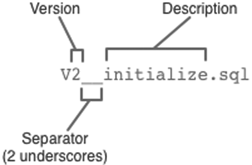

# Deploying Spring Boot applications

__This chapter covers__
__本章内容涉及__

* Deploying WAR files
* Database migration
* Deploying to the cloud
* 部署WAR文件
* 数据库迁移
* 部署到云端

Think of your favorite action movie. Now imagine going to see that movie in the theater and being taken on a thrilling audio-visual ride with high-speed chases, explosions, and battles, only to have it come to a sudden end just before the good guys take down the bad guys. Instead of seeing the movie’s conflict resolved, the theater lights come on and everyone is ushered out the door.  
想一想你喜欢的动作电影，现在假设你要去电影院看这部电影，试听感受震撼，片中有高速追逐、爆炸和激战，最后好人战胜了坏人前一切戛然而止。还没等影片里的冲突得到解决，电影院的灯亮了，大家都被领出门外了。

Although the lead-up was exciting, it’s the climax of the movie that’s important. Without it, it’s action for action’s sake.
虽然前面的铺垫很精彩，但电影的高潮才是最重要的。没有了它，就是为了动作而动作了。

Now imagine developing applications and putting a lot of effort and creativity into solving the business problem, but then never deploying the application for others to use and enjoy. Sure, most applications we write don’t involve car chases or explosions (at least I hope not), but there’s a certain rush we get along the way. Of course, not every line of code we write is destined for production, but it’d be a big letdown if none of it ever was deployed.  
现在，想象你正在开发应用程序，为了解决某个业务问题投入了很多精力和创造力，但最终没能部署应用程序让别人来使用和享受它。我们写的大多数应用程序没有汽车追逐和爆炸（至少我希望是这样的），但一路上我们也会抢时间。当然，也不是每行代码都是为生产环境而写的，但什么都不部署也挺让人失望的。

Up to this point we’ve been focused on using features of Spring Boot that help us develop an application. There have been some exciting steps along the way. But it’s all for nothing if we don’t cross the finish line and deploy the application.  
到目前为止，我们的焦点都集中在使用Spring Boot的特性来帮助大家开发应用程序，其中有不少让人惊喜的地方。但如果我们不越过终点线，没有部署应用程序，这一切都是徒劳的。

In this chapter we’re going to step beyond developing applications with Spring Boot and look at how to deploy those applications. Although this may seem obvious for anyone who has ever deployed a Java-based application, there are some unique features of Spring Boot and related Spring projects we can draw on that make deploying Spring Boot applications unique.  
在本章中，我们会在使用Spring Boot开发应用程序的基础上更进一步，讨论如何部署那些应用程序。虽然这对那些部署过基于Java的应用程序的人来说很普通，但Spring Boot和相关的Spring项目中有些独特的功能，基于这些功能我们可以看让Spring Boot应用程序的部署变得与众不同。

In fact, unlike most Java web applications, which are typically deployed to an application server as WAR files, Spring Boot offers several deployment options. Before we look at how to deploy a Spring Boot application, let’s consider all of the options and choose a few that suit our needs best.  
实际上，大部分Java Web应用程序都是以WAR文件的形式部署到应用服务器上的，Spring Boot提供的部署方式则有所不同。在了解如何部署Spring Boot应用程序之前，让我们先来看看有哪些可选方式能满足我们的需求。

## 8.1 Weighing deployment options
## 8.1 衡量多种部署方式

There are several ways to build and run Spring Boot applications. You’ve already seen a few of them:  
Spring Boot应用程序有多种构建和运行的方式，其中一些你已经用过了：

* Running the application in the IDE (either Spring ToolSuite or IntelliJ IDEA)
* Running from the command line using the Maven spring-boot:run goal or Gradle bootRun task
* Using Maven or Gradle to produce an executable JAR file that can be run at the command line
* Using the Spring Boot CLI to run Groovy scripts at the command line
* Using the Spring Boot CLI to produce an executable JAR file that can be run at the command line
* 在IDE中运行应用程序（Spring ToolSuite或IntelliJ IDEA）
* 使用Maven的`spring-boot:run`或Gradle的`bootRun`在命令行里运行
* 使用Maven或Gradle来生成可运行的JAR文件，随后在命令行中运行
* 使用Spring Boot CLI在命令行中运行Groovy脚本
* 使用Spring Boot CLI来生成可运行的JAR文件，随后在命令行中运行

Any of these choices is suitable for running the application while you’re still developing it. But what about when you’re ready to deploy the application into a production or other non-development environment?  
这些选项中的每一种都适合用来运行正在开发的应用程序。但在要将应用程序部署到生产环境或其他非开发环境中时又该怎么办呢？

Although none of the choices listed seems fitting for deploying an application beyond development, the truth is that all but one of them is a valid choice. Running an application within the IDE is certainly ill-suited for a production deployment. Executable JAR files and the Spring Boot CLI, however, are still on the table and are great choices when deploying to a cloud environment.  
虽然这些选项里没有一个看起来能用在部署非开发环境，但事实上，它们之中除了在IDE中运行之外的那些选项都是适用于生产环境的。可运行的JAR文件和Spring Boot CLI还可用于将应用程序部署到云环境里。

That said, you’re probably wondering how to deploy a Spring Boot application to a more traditional application server environment such as Tomcat, WebSphere, or WebLogic. In those cases, executable JAR files and Groovy source code won’t work. For application server deployment, you’ll need your application wrapped up in a WAR file.  
也许你很想知道如何把Spring Boot应用程序部署到一个更加传统的应用服务器环境里，比如Tomcat、WebSphere或WebLogic。在这些情况中，可执行JAR文件和Groovy代码是不适用的。针对应用服务器的部署，需要将你的应用程序打包成一个WAR文件。

As it turns out, Spring Boot applications can be packaged for deployment in several ways, as described in table 8.1.  
实际上，Spring Boot应用程序可以用多种方式来打包，详见表8.1。

__Table 8.1 Spring Boot deployment choices__  
__表8.1 Spring Boot部署选项__

| Deployment artifact | Produced by                       | Target environment                                                                                           |
|---------------------|-----------------------------------|--------------------------------------------------------------------------------------------------------------|
| Raw Groovy source   | Written by hand                   | Cloud Foundry and container deployment, such as with Docker                                                  |
| Executable JAR      | Maven, Gradle, or Spring Boot CLI | Cloud environments, including Cloud Foundry and Heroku, as well as container deployment, such as with Docker |
| WAR                 | Maven or Gradle                   | Java application servers or cloud environments such as Cloud Foundry                                         |

| 部署产物 | 产生方式 | 目标环境 |
|---------|---------|----------|
| Groovy源码 | 手写 | Cloud Foundry及容器部署，比如Docker |
| 可执行JAR | Maven、Gradle或Spring Boot CLI | 云环境，包括Cloud Foundry和Heroku，还有容器部署，比如Docker |
| WAR | Maven或Gradle | Java应用服务器或云环境，比如Cloud Foundry |

As you can see in table 8.1, your target environment will need to be a factor in your choice. If you’re deploying to a Tomcat server running in your own data center, then the choice of a WAR file has been made for you. On the other hand, if you’ll be deploying to Cloud Foundry, you’re welcome to choose any of the deployment options shown.  
如你所见，在做最终选择时需要考虑你的目标环境。如果要将应用程序部署到自己数据中心的Tomcat服务器上，WAR文件就是你的选择。另一方面，如果要部署到Cloud Foundry，可以使用表里列出的各种选项。

In this chapter, we’re going to focus our attention on the following options:  
在本章中，我们将关注以下这些选项：

* Deploying a WAR file to a Java application server
* Deploying an executable JAR file to Cloud Foundry
* Deploying an executable JAR file to Heroku (where the build is performed by Heroku)
* 向Java应用服务器里部署WAR文件
* 向Cloud Foundry里部署可执行JAR文件
* 向Heroku（构建过程是由Heroku执行的）里部署可执行JAR文件

As we explore these scenarios, we’re also going to have to deal with the fact that we’ve been using an embedded H2 database as we’ve developed the application, and we’ll look at ways to replace it with a production-ready database.  
这这些场景中，我们还要处理一个问题，在开发应用程序时我们使用了嵌入式的H2数据库，现在得把它替换成生产环境所需的数据库了。

To get started, let’s take a look at how we can build our reading-list application into a WAR file that can be deployed to a Java application server such as Tomcat, WebSphere, or WebLogic.  
首先，让我们看看如何将阅读列表应用程序构建为WAR文件，这样才能把它部署到Java应用服务器里，比如Tomcat、WebSphere或WebLogic。

## 8.2 Deploying to an application server
## 8.2 部署到应用服务器

Thus far, every time we’ve run the reading-list application, the web application has been served from a Tomcat server embedded in the application. Compared to a conventional Java web application, the tables were turned. The application has not been deployed in Tomcat; rather, Tomcat has been deployed in the application.  
到目前为止，我们每次运行阅读列表应用程序时，Web应用程序都是通过内嵌在应用里Tomcat提供服务的。与传统Java Web应用程序相比，情况正好相反。应用程序并没有部署在Tomcat里，而是Tomcat部署在了应用程序里。

Thanks in large part to Spring Boot auto-configuration, we’ve not been required to create a web.xml file or servlet initializer class to declare Spring’s DispatcherServlet for Spring MVC. But if we’re going to deploy the application to a Java application server, we’re going to need to build a WAR file. And so that the application server will know how to run the application, we’ll also need to include a servlet initializer in that WAR file.  
归功于Spring Boot的自动配置功能，我们不需要创建web.xml文件或者Servlet初始化类来声明Spring MVC的`DispatcherServlet`。但如果我们要将应用程序部署到Java应用服务器里，就需要构建WAR文件了，这样应用服务器才能知道如何运行应用程序，在那个WAR文件里还需要一个初始化Servlet的东西。

### 8.2.1 Building a WAR file
### 8.2.1 构建WAR文件

As it turns out, building a WAR file isn’t that difficult. If you’re using Gradle to build the application, you simply must apply the “war” plugin:  
实际上，构建WAR文件并不困难，如果你使用Gradle来构建应用程序，只需应用“war”插件即可：

```
apply plugin: 'war'
```

Then, replace the existing jar configuration with the following war configuration in build.gradle:  
随后，在build.gradle里用以下`war`配置替换原来的`jar`配置：

```
war {
  baseName = 'readinglist'
  version = '0.0.1-SNAPSHOT'
}
```

The only difference between this war configuration and the previous jar configuration is the change of the letter j to w.  
两者的唯一区别就是把___j___换成了___w___。

If you’re using Maven to build the project, then it’s even easier to get a WAR file. All you need to do is change the <packaging> element’s value from jar to war.  
如果你使用Maven来构建项目，获取WAR文件就更容易了。只需把`<packaging>`元素的值从`jar`改为`war`。

```
<packaging>war</packaging>
```

Those are the only changes required to produce a WAR file. But that WAR file will be useless unless it includes a web.xml file or a servlet initializer to enable Spring MVC’s DispatcherServlet.  
这样就能生成WAR文件了，但如果WAR文件里没有启用Spring MVC `DispatcherServlet`的web.xml文件或者Servlet初始化类，这个WAR文件就一无是处。

Spring Boot can help here. It provides SpringBootServletInitializer, a special Spring Boot-aware implementation of Spring’s WebApplicationInitializer. Aside from configuring Spring’s DispatcherServlet, SpringBootServletInitializer also looks for any beans in the Spring application context that are of type Filter, Servlet, or ServletContextInitializer and binds them to the servlet container.  
此时就该Spring Boot出马了，它提供了`SpringBootServletInitializer`，这是一个支持Spring Boot的Spring `WebApplicationInitializer`实现。除了配置Spring的`DispatcherServlet`，`SpringBootServletInitializer`还会在Spring应用程序上下文里查找`Filter`、`Servlet`或`ServletContextInitializer`类型的Bean，把它们绑定到Servlet容器里。

To use SpringBootServletInitializer, simply create a subclass and override the configure() method to specify the Spring configuration class. Listing 8.1 shows ReadingListServletInitializer, a subclass of SpringBootServletInitializer that we’ll use for the reading-list application.  
要使用`SpringBootServletInitializer`，只需创建一个子类，覆盖`configure()`方法来指定Spring配置类即可。代码8.1是`ReadingListServletInitializer`，我们为阅读列表应用程序写的`SpringBootServletInitializer`的子类。

__Listing 8.1 Extending SpringBootServletInitializer for the reading-list application__  
__代码8.1 为阅读列表应用程序扩展`SpringBootServletInitializer`__

```
package readinglist;
import org.springframework.boot.builder.SpringApplicationBuilder;
import org.springframework.boot.context.web.SpringBootServletInitializer;

public class ReadingListServletInitializer
       extends SpringBootServletInitializer {

  @Override
  protected SpringApplicationBuilder configure(
                                    SpringApplicationBuilder builder) {
    return builder.sources(Application.class);
  }

}
```

Specify Spring configuration  
指定Spring配置

As you can see, the configure() method is given a SpringApplicationBuilder as a parameter and returns it as a result. In between, it calls the sources() method to register any Spring configuration classes. In this case, it only registers the Application class, which, as you’ll recall, served dual purpose as both a bootstrap class (with a main() method) and a Spring configuration class.  
如你所见，`configure()`方法传入了一个`SpringApplicationBuilder`参数，并将其作为结果返回。期间它调用了`sources()`方法注册了一个Spring配置类。本例中，只注册了一个`Application`类，回想一下，这个类既是启动类（带有`main()`方法），也是一个Spring配置类。

Even though the reading-list application has other Spring configuration classes, it’s not necessary to register them all with the sources() method. The Application class is annotated with @SpringBootApplication, which implicitly enables componentscanning. Component-scanning will discover and pull in any other configuration classes that it finds.  
虽然阅读列表应用程序里还有其他Spring配置类，但没有必要在这里把它们全部注册进来。`Application`类上添加了`@SpringBootApplication`注解，这会开启组件扫描，而组件扫描则会发现并应用其他配置类。

Now we’re ready to build the application. If you’re using Gradle to build the project, simply invoke the build task:  
现在我们可以构建应用程序了，如果你在使用Gradle，只需调用`build`任务即可：

```
$ gradle build
```

Assuming no problems, the build will produce a file named readinglist-0.0.1-SNAPSHOT. war in build/libs.  
如果没有问题，就能在build/libs里看到一个名为readinglist-0.0.1-SNAPSHOT.war的文件了。

For a Maven-based build, use the package goal:  
对于基于Maven的项目而言，使用`package`：

```
$ mvn package
```

After a successful Maven build, the WAR file will be found in the “target” directory.  
成功构建之后，可以在“target”目录里找到WAR文件。

All that’s left is to deploy the application. The deployment procedure varies across application servers, so consult the documentation for your application server’s specific deployment procedure.  
剩下的工作就是部署应用程序了，针对不同的应用服务器，部署过程会有所区别，因此请参考应用服务器的部署说明文档。

For Tomcat, you can deploy an application by copying the WAR file into Tomcat’s webapps directory. If Tomcat is running (or once it starts up if it isn’t currently running), it will detect the presence of the WAR file, expand it, and install it.  
对于Tomcat而言，可以把WAR文件复制到Tomcat的webapps目录里。如果Tomcat正在运行（要是没有运行，则在下次启动时），它会检测到WAR文件，解压并进行安装。

Assuming that you didn’t rename the WAR file before deploying it, the servlet context path will be the same as the base name of the WAR file, or /readinglist-0.0.1-SNAPSHOT in the case of the reading-list application. Point your browser at http://server:_port_ /readinglist-0.0.1-SNAPSHOT to kick the tires on the app.  
假设你没有在部署前重命名WAR文件，Servlet上下文路径则与WAR文件的主文件名相同，在本例中是/readinglist-0.0.1-SNAPSHOT。用你的浏览器打开http://server:port/readinglist-0.0.1-SNAPSHOT就能访问应用程序了。

One other thing worth noting: even though we’re building a WAR file, it may still be possible to run it without deploying to an application server. Assuming you don’t remove the main() method from Application, the WAR file produced by the build can also be run as if it were an executable JAR file:  
还有一点值得注意：就算我们在构建的是WAR文件，这个文件仍旧可以脱离应用服务器直接运行。如果你没有删除`Application`里的`main()`方法，构建过程生成的WAR文件仍可直接运行，就和可执行的JAR文件一样：

```
$ java -jar readinglist-0.0.1-SNAPSHOT.war
```

In effect, you get two deployment options out of a single deployment artifact!  
如此一来，同一个部署产物就能有两种部署方式了！

At this point, the application should be up and running in Tomcat. But it’s still using the embedded H2 database. An embedded database was handy while developing the application, but it’s not a great choice in production. Let’s see how to wire in a different data source when deploying to production.  
现在，应用程序应该已经在Tomcat里顺利地运行起来了。但是它还在使用内嵌的H2数据库，开发应用程序时嵌入式数据库很好用，但对生产环境而言这就不是一个明智的选择了。让我们来看看如何在部署到生产环境时选择一个不同的数据源。

### 8.2.2 Creating a production profile
### 8.2.2 创建生产Profile

Thanks to auto-configuration, we have a DataSource bean that references an embedded H2 database. More specifically, the DataSource bean is a data source pool, typically org.apache.tomcat.jdbc.pool.DataSource. Therefore, it may seem obvious that in order to use some database other than the embedded H2 database, we simply need to declare our own DataSource bean, overriding the auto-configured DataSource, to reference a production database of our choosing.  
感谢自动配置，我们有一个指向嵌入式H2数据库的`DataSource` Bean。更确切地说，`DataSource` Bean是一个数据库连接池，通常是`org.apache.tomcat.jdbc.pool.DataSource`。因此，很明显，要使用嵌入式H2之外的数据库，我们只需声明自己的`DataSource` Bean，指向我们选择的生产数据库，用它覆盖自动配置的`DataSource` Bean就可以了。

For example, suppose that we wanted to work with a PostgreSQL database running on localhost with the name “readingList”. The following @Bean method would declare our DataSource bean:  
例如，假设我们想使用运行在localhost上的PostgreSQL数据库，数据库名字是“readingList”。下面的`@Bean`方法就能声明我们的`DataSource` Bean：

```
@Bean
@Profile("production")
public DataSource dataSource() {
  DataSource ds = new DataSource();
  ds.setDriverClassName("org.postgresql.Driver");
  ds.setUrl("jdbc:postgresql://localhost:5432/readinglist");
  ds.setUsername("habuma");
  ds.setPassword("password");
  return ds;
}
```

Here the DataSource type is Tomcat’s org.apache.tomcat.jdbc.pool.DataSource, not to be confused with javax.sql.DataSource, which it ultimately implements. The details required to connect to the database (including the JDBC driver class name, the database URL, and the database credentials) are given to the DataSource instance. With this bean declared, the default auto-configured DataSource bean will be passed over.  
这里`DataSource`的类型是Tomcat的`org.apache.tomcat.jdbc.pool.DataSource`，不要和`javax.sql.DataSource`搞混了，这是前者是后者的实现。还要`DataSource`提供一些用来连接数据库的细节（包括JDBC驱动类名、数据库URL、用户名和密码）。声明了这个Bean之后，就会忽略自动配置的`DataSource` Bean了。

The key thing to notice about this @Bean method is that it is also annotated with @Profile to specify that it should only be created if the “production” profile is active. Because of this, we can still use the embedded H2 database while developing the application, but use the PostgreSQL database in production by activating the profile.  
关于这个`@Bean`方法最关键的一点是它还添加了`@Profile`注解，说明只有在“production” Profile被激活时才会创建该Bean。所以在开发时我们还能继续使用嵌入式的H2数据库，激活了“production” Profile后就能使用PostgreSQL数据库了。

Although that should do the trick, there’s a better way to configure the database details without explicitly declaring our own DataSource bean. Rather than replace the auto-configured DataSource bean, we can configure it via properties in application.yml or application.properties. Table 8.2 lists all of the properties that are useful for configuring the DataSource bean.  
虽然这么做能达到目的，但最好还是不要显式地声明自己的`DataSource` Bean。在不替换自动配置的`Datasource` Bean的情况下，我们还能通过application.yml或application.properties来配置数据库的细节。表8.2列出了在配置`DataSource` Bean时用到的全部属性。

__Table 8.2 DataSource configuration properties__  
__表8.2 数据源配置属性__

| Property (prefixed with spring.datasource.) | Description                                                                                                                  |
|---------------------------------------------|------------------------------------------------------------------------------------------------------------------------------|
| name                                        | The name of the data source                                                                                                  |
| initialize                                  | Whether or not to populate using data.sql (default: true)                                                                    |
| schema                                      | The name of a schema (DDL) script resource                                                                                   |
| data                                        | The name of a data (DML) script resource                                                                                     |
| sql-script-encoding                         | The character set for reading SQL scripts                                                                                    |
| platform                                    | The platform to use when reading the schema resource (for example, “schema-{platform}.sql”)                                  |
| continue-on-error                           | Whether or not to continue if initialization fails (default: false)                                                          |
| separator                                   | The separator in the SQL scripts (default: ;)                                                                                |
| driver-class-name                           | The fully qualified class name of the JDBC driver (can often be automatically inferred from the URL)                         |
| url                                         | The database URL                                                                                                             |
| username                                    | The database username                                                                                                        |
| password                                    | The database password                                                                                                        |
| jndi-name                                   | A JNDI name for looking up a datasource via JNDI                                                                             |
| max-active                                  | Maximum active connections (default: 100)                                                                                    |
| max-idle                                    | Maximum idle connections (default: 8)                                                                                        |
| min-idle                                    | Minimum idle connections (default: 8)                                                                                        |
| initial-size                                | The initial size of the connection pool (default: 10)                                                                        |
| validation-query                            | A query to execute to verify the connection                                                                                  |
| test-on-borrow                              | Whether or not to test a connection as it’s borrowed from the pool (default: false)                                          |
| test-on-return                              | Whether or not to test a connection as it’s returned to the pool (default: false)                                            |
| test-while-idle                             | Whether or not to test a connection while it is idle (default: false)                                                        |
| time-between-eviction-runs-millis           | How often (in milliseconds) to evict connections (default: 5000)                                                             |
| min-evictable-idle-time-millis              | The minimum time (in milliseconds) that a connection can be idle before being tested for eviction (default: 60000)           |
| max-wait                                    | The maximum time (in milliseconds) that the pool will wait when no connections are available before failing (default: 30000) |
| jmx-enabled                                 | Whether or not the data source is managed by JMX (default: false)                                                            |

| 属性（带有`spring.datasource.`前缀） | 描述 |
|-----------------------------------|-----|
| `name` | 数据源的名称 |
| `initialize` | 是否执行data.sql（默认：`true`） |
| `schema` | Schema（DDL）脚本资源的名称 |
| `data` | 数据（DML）脚本资源的名称 |
| `sql-script-encoding` | 读入SQL脚本的字符集 |
| `platform` | 读入Schema资源时所使用的平台（例如：“schema-{platform}.sql”） |
| `continue-on-error` | 如果初始化失败是否还要继续（默认：`false`） |
| `separator` | SQL脚本的分隔符（默认：`;`） |
| `driver-class-name` | JDBC驱动的全限定类名（通常能通过URL自动推断出来） |
| `url` | 数据库URL |
| `username` | 数据库的用户名 |
| `password` | 数据库的密码 |
| `jndi-name` | 通过JNDI查找数据源的JNDI名称 |
| `max-active` | 最大的活跃连接数（默认：`100`） |
| `max-idle` | 最大的闲置连接数（默认：`8`） |
| `min-idle` | 最小的闲置连接数（默认：`8`） |
| `initial-size` | 连接池的初始大小（默认：`10`） |
| `validation-query` | 用来验证连接的查询语句 |
| `test-on-borrow` | 是否在从连接池借用连接时检查连接（默认：`false`） |
| `test-on-return` | 是否在向连接池归还连接时检查连接（默认：`false`） |
| `test-while-idle` | 是否在连接空闲时测试连接（默认：`false`） |
| `time-between-eviction-runs-millis` | 多久（单位为毫秒）清理一次连接（默认：`5000`） |
| `min-evictable-idle-time-millis` | 在被测试是否要清理前，连接最少可以空闲多久（单位为毫秒，默认：`60000`） |
| `max-wait` | 当没有可用连接时，连接池在返回失败前最多等多久（单位为毫秒，默认：`30000`） |
| `jmx-enabled` | 数据源是否可以通过JMX进行管理（默认：`false`） |

Most of the properties in table 8.2 are for fine-tuning the connection pool. I’ll leave it to you to tinker with those settings as you see fit. What we’re interested in now, however, is setting a few properties that will point the DataSource bean at PostgreSQL instead of the embedded H2 database. Specifically, the spring.datasource.url, spring.datasource.username, and spring.datasource.password properties are what we need.  
表8.2里的大部分属性都是用来微调连接池的，怎么设置这些属性来适应你的需要就交给你来解决了。我们现在要做的是设置一些属性，让`DataSource` Bean指向PostgreSQL而非内嵌的H2数据库。具体一点，我们要设置的是`spring.datasource.url`、`spring.datasource.username`以及`spring.datasource.password`属性。

As I’m writing this, I have a PostgreSQL database running locally, listening on port 5432, with a username and password of “habuma” and “password”. Therefore, the following “production” profile in application.yml is what I used:  
在我设置这些内容时，我本地运行了一个PostgreSQL数据库，监听了5432端口，用户名和密码分别是“habuma”和“password”。因此在application.yml的“production” Profile里需要如下内容：

```
---
spring:
  profiles: production
  datasource:
    url: jdbc:postgresql://localhost:5432/readinglist
    username: habuma
    password: password
  jpa:
    database-platform: org.hibernate.dialect.PostgreSQLDialect
```

Notice that this excerpt starts with --- and the first property set is spring.profiles. This indicates that the properties that follow will only be applied if the “production” profile is active.  
请注意，这个代码片段以`---`开头，设置的第一个属性是`spring.profiles`，这说明随后的属性都只在“production” Profile激活时才会生效。

Next, the spring.datasource.url, spring.datasource.username, and spring.datasource.password properties are set. Note that it’s usually unnecessary to set the spring.datasource.driver-class-name property, as Spring Boot can infer it from the value of the spring.datasource.url property. I also had to set some JPA properties. The spring.jpa.database-platform property sets the underlying JPA engine to use Hibernate’s PostgreSQL dialect.  
随后设置的是`spring.datasource.url`、`spring.datasource.username`和`spring.datasource.password`属性。一般无需设置`spring.datasource.driver-class-name`属性，Spring Boot可以根据`spring.datasource.url`属性推断出对应的驱动。我还设置了一些JPA的属性，`spring.jpa.database-platform`属性将底层的JPA引擎设置为Hibernate的PostgreSQL方言。

To enable this profile, we’ll need to set the spring.profiles.active property to “production”. There are several ways to set this property, but the most convenient way is by setting a system environment variable on the machine running the application server. To enable the “production” profile before starting Tomcat, I exported the SPRING_PROFILES_ACTIVE environment variable like this:  
要开启这个Profile，我们需要把`spring.profiles.active`属性设置为“production”，有多种实现方式，但最方便的还是在运行应用服务器的机器上设置一个系统环境变量。在启动Tomcat前开启“production” Profile，我需要像这样设置`SPRING_PROFILES_ACTIVE`环境变量：

```
$ export SPRING_PROFILES_ACTIVE=production
```

You probably noticed that SPRING_PROFILES_ACTIVE is different from spring.profiles.active. It’s not possible to export an environment variable with periods in the name, so it was necessary to alter the name slightly. From Spring’s point of view, the two names are equivalent.  
你也许已经注意到了，`SPRING_PROFILES_ACTIVE`不同于`spring.profiles.active`，因为无法在环境变量名里使用句点，所以需要对变量名稍作修改。站在Spring的角度，这两个名字是等价的。

We’re almost ready to deploy the application to an application server and see it run. In fact, if you are feeling adventurous, go ahead and try it. You’ll run into a small problem, however.  
我们基本已经可以在应用服务器上部署并运行应用程序了，实际上，如果你喜欢冒险，也可以直接尝试一下。但是，你会遇到一点小问题。

By default, Spring Boot configures Hibernate to create the schema automatically when using the embedded H2 database. More specifically, it sets Hibernate’s hibernate.hbm2ddl.auto to create-drop, indicating that the schema should be created when Hibernate’s SessionFactory is created and dropped when it is closed.  
默认情况下，在使用内嵌的H2数据库时，Spring Boot会配置Hibernate来自动创建Schema，更确切地说是将Hibernate的`hibernate.hbm2ddl.auto`设置为`create-drop`，说明在Hibernate的`SessionFactory`创建时会创建Schema，`SessionFactory`关闭时删除Schema。

But it’s set to do nothing if you’re not using an embedded H2 database. This means that our application’s tables won’t exist and you’ll see errors as it tries to query those nonexistent tables.  
但如果没使用内嵌的H2数据库，它什么都不会做，也就是说应用程序的数据表尚不存在，在查询那些不存在的表时就会报错。

### 8.2.3 Enabling database migration
### 8.2.3 开启数据库迁移

One option is to set the hibernate.hbm2ddl.auto property to create, create-drop, or update via Spring Boot’s spring.jpa.hibernate.ddl-auto property. For instance, to set hibernate.hbm2ddl.auto to create-drop we could add the following lines to application.yml:  
一种途径是通过Spring Boot的`spring.jpa.hibernate.ddl-auto`属性将`hibernate.hbm2ddl.auto`属性设置为`create`、`create-drop`或`update`。例如，要把`hibernate.hbm2ddl.auto`设置为`create-drop`，我们可以在application.yml里加入如下内容：

```
spring:
  jpa:
    hibernate:
      ddl-auto: create-drop
```

This, however, is not ideal for production, as the database schema would be wiped clean and rebuilt from scratch any time the application was restarted. It may be tempting to set it to update, but even that isn’t recommended in production.  
然而，这对生产环境来说并不理想，因为应用程序每次重启数据库的Schema就会被清空，从头开始重建。可以将它设置为`update`，但就算这样，也不建议将其用于生产环境。

Alternatively, we could define the schema in schema.sql. This would work fine the first time, but every time we started the application thereafter, the initialization scripts would fail because the tables in question would already exist. This would force us to take special care in writing our initialization scripts to not attempt to repeat any work that has already been done.  
还有另一种途径，我们可以在schema.sql里定义Schema。在第一次运行时，这么做没有问题，但随后每次启动应用程序时，这个初始化脚本就会失败，因为数据表已经存在了。这就要求在书写初始化脚本时要格外注意，不要重复执行那些已经做过的工作。

A better choice is to use a database migration library. Database migration libraries work from a set of database scripts and keep careful track of the ones that have already been applied so that they won’t be applied more than once. By including the scripts within each deployment of the application, the database is able to evolve in concert with the application.  
一个比较好的选择是使用数据库迁移库（database migration library），它们使用一系列的数据库脚本，并会记录哪些已经用过了，这样就不会多次运用同一个脚本。应用程序的每个部署包里都包含了这些脚本，这样数据库就能和应用程序保持一致了。

Spring Boot includes auto-configuration support for two popular database migration libraries:  
Spring Boot为两款流行的数据库迁移库提供了自动配置支持：

* Flyway (http://flywaydb.org)
* Liquibase (www.liquibase.org)
* Flyway（[http://flywaydb.org](http://flywaydb.org)）
* Liquibase（[http://www.liquibase.org](http://www.liquibase.org)）

All you need to do to use either of these database migration libraries with Spring Boot is to include them as dependencies in the build and write the scripts. Let’s see how they work, starting with Flyway.  
当你想要在Spring Boot里使用其中的某一个库时，只需在项目里加入对应的依赖，然后编写脚本就可以了。让我们先从Flyway开始了解起来吧。

#### DEFINING DATABASE MIGRATION WITH FLYWAY
#### 用Flyway定义数据库迁移过程

Flyway is a very simple, open source database migration library that uses SQL for defining the migration scripts. The idea is that each script is given a version number, and Flyway will execute each of them in order to arrive at the desired state of the database. It also records the status of scripts it has executed so that it won’t run them again.  
Flyway是一个非常简单的开源数据库迁移库，使用SQL来定义迁移脚本。它的理念是每个脚本都有一个版本号，Flyway会顺序执行这些脚本，让数据库达到期望的状态。它也会记录下已执行的脚本状态，这样不会重复执行它们。

For the reading-list application, we’re starting with an empty database with no tables or data. Therefore, the script we’ll need to get started will need to create the Reader and Book tables, including any foreign-key constraints and initial data. Listing 8.2 shows the Flyway script we’ll need to go from an empty database to one that our application can use.  
对于阅读列表应用程序而言，我们先从一个没有数据表和数据的空数据库开始。因此这个脚本里需要先创建Reader和Book表，包含外键约束和初始化数据。代码8.2就是从空数据库开始将其变为可用状态的Flyway脚本。

__Listing 8.2 A database initialization script for Flyway__  
__代码8.2 Flyway数据库初始脚本__

```
create table Reader (
  id serial primary key,
  username varchar(25) unique not null,
  password varchar(25) not null,
  fullname varchar(50) not null
);

create table Book (
  id serial primary key,
  author varchar(50) not null,
  description varchar(1000) not null,
  isbn varchar(10) not null,
  title varchar(250) not null,
  reader_username varchar(25) not null,
  foreign key (reader_username) references Reader(username)
);

create sequence hibernate_sequence;

insert into Reader (username, password, fullname)
            values ('craig', 'password', 'Craig Walls');
```

Create Reader table  
创建Reader表

Create Book table  
创建Book表

Define a sequence  
定义序列

An initial Reader  
Reader的初始数据

As you can see, the Flyway script is just SQL. What makes it work with Flyway is where it’s placed in the classpath and how it’s named. Flyway scripts follow a naming convention that includes the version number, as illustrated in figure 8.1.  
如你所见，Flyway脚本就是SQL，让其发挥作用的是其在Classpath里的位置和文件名。Flyway脚本都遵循一个命名规范，里面含有版本号，具体如图8.1所示。



__Figure 8.1 Flyway scripts are named with their version number.__  
__图8.1 用版本号命名的Flyway脚本__

All Flyway scripts have names that start with a capital V which precedes the script’s version number. That’s followed by two underscores and a description of the script. Because this is the first script in the migration, it will be version 1. The description given can be flexible and is primarily to provide some understanding of the script’s purpose. Later, should we need to add a new table to the database or a new column to an existing table, we can create another script named with 2 in the version place.  
所有Flyway脚本的名字都以大写V开头，随后是脚本的版本号。后面跟着两个下划线和对脚本的描述。因为这是整个迁移过程中的第一个脚本，所以它的版本是1。描述可以很灵活，主要用来帮助理解脚本的用途。稍后我们需要向数据库里添加新表，或者向已有数据表里添加新字段，可以再创建一个脚本，在版本号的地方写2。

Flyway scripts need to be placed in the path /db/migration relative to the application’s classpath root. Therefore, this script needs to be placed in src/main/resources/db/migration within the project.  
Flyway脚本需要放在相对于应用程序Classpath根路径的/db/migration目录下，因此，在项目里脚本需要放在src/main/resources/db/migration里。

You’ll also need to tell Hibernate to not attempt to create the tables by setting spring.jpa.hibernate.ddl-auto to none. The following lines in application.yml take care of that:  
你还需要告诉Hibernate不要创建数据表，可以将`spring.jpa.hibernate.ddl-auto`设置为`none`，就像下面这样：

```
spring:
  jpa:
    hibernate:
      ddl-auto: none
```

All that’s left is to add Flyway as a dependency in the project build. Here’s the dependency that’s required for Gradle:  
剩下的就是将Flyway添加为项目依赖。Gradle里是这样的：

```
compile("org.flywaydb:flyway-core")
```

In a Maven build, the <dependency> is as follows:  
在Maven项目里，`<dependency>`是这样的：

```
<dependency>
  <groupId>org.flywayfb</groupId>
  <artifactId>flyway-core</artifactId>
</dependency>
```

When the application is deployed and running, Spring Boot will detect Flyway in the classpath and auto-configure the beans necessary to enable it. Flyway will step through any scripts in /db/migration and apply them if they haven’t already been applied. As each script is executed, an entry will be written to a table named schema_version. The next time the application starts, Flyway will see that those scripts have been recorded in schema_version and skip over them.  
在应用程序部署并运行起来后，Spring Boot会检测到Classpath里的Flyway，自动配置所需的Bean。Flyway会依次查看/db/migration里的脚本，如果没有执行过就运行这个脚本。每个脚本都执行过后就会向schema_version表里写一条记录。应用程序下次启动时，Flyway会先看schema_version里的记录，跳过那些脚本。

#### DEFINING DATABASE MIGRATION WITH LIQUIBASE
#### 用Liquibase定义数据库迁移过程

Flyway is simple to use, especially with help from Spring Boot auto-configuration. But defining migration scripts with SQL is a two-edged sword. Although it’s easy and natural to work with SQL, you run the risk of defining a migration script that works with one database platform but not another.  
Flyway用起来很简单，特别是在Spring Boot自动配置的帮助下。但是使用SQL来定义迁移脚本是一把双刃剑，虽然使用SQL很简单也很自然，但却冒着只能在一个数据库平台上使用的风险。

Rather than be limited to platform-specific SQL, Liquibase supports several formats for writing migration scripts that are agnostic to the underlying platform. These include XML, YAML, and JSON. And, if you really want it, Liquibase also supports SQL scripts.  
比起限定在某种平台特定的SQL上，Liquibase支持多种书写迁移脚本的格式，不用关心底层平台，其中包括XML、YAML和JSON。如果你希望的话，当然Liquibase也支持SQL脚本。

The first step to using Liquibase with Spring Boot is to add it as a dependency in your build. The Gradle dependency is as follows:  
要在Spring Boot里使用Liquibase，第一步是添加依赖。Gradle里的依赖是这样的：

```
compile("org.liquibase:liquibase-core")
```

For Maven, here’s the <dependency> you’ll need:  
对于Maven项目，你需要添加如下`<dependency>`：

```
<dependency>
  <groupId>org.liquibase</groupId>
  <artifactId>liquibase-core</artifactId>
</dependency>
```

Spring Boot auto-configuration takes it from there, wiring up the beans that support Liquibase. By default, those beans are wired to look for all of the migration scripts in a single file named db.changelog-master.yaml in /db/changelog (relative to the classpath root). The migration script in listing 8.3 includes instructions to initialize the database for the reading-list application.  
有了这个依赖，Spring Boot自动配置就能接手了，配置好用于支持Liquibase的Bean。默认情况下，那些Bean会在/db/changelog（相对于Classpath根目录）里查找db.changelog-master.yaml文件，文件里都是迁移脚本。代码8.3就是用于阅读列表应用程序的数据库初始化脚本。

__Listing 8.3 A Liquibase script for initializing the reading-list database__  
__代码8.3 用于阅读列表数据库的初始化脚本__

```
databaseChangeLog:
  - changeSet:
      id: 1
      author: habuma
      changes:
        - createTable:
            tableName: reader
            columns:
              - column:
                  name: username
                  type: varchar(25)
                  constraints:
                    unique: true
                    nullable: false
              - column:
                  name: password
                  type: varchar(25)
                  constraints:
                    nullable: false
              - column:
                  name: fullname
                  type: varchar(50)
                  constraints:
                    nullable: false
        - createTable:
            tableName: book
            columns:
              - column:
                  name: id
                  type: bigserial
                  autoIncrement: true
                  constraints:
                    primaryKey: true
                    nullable: false
              - column:
                  name: author
                  type: varchar(50)
                  constraints:
                    nullable: false
              - column:
                  name: description
                  type: varchar(1000)
                  constraints:
                    nullable: false
              - column:
                  name: isbn
                  type: varchar(10)
                  constraints:
                    nullable: false
              - column:
                  name: title
                  type: varchar(250)
                  constraints:
                    nullable: false
              - column:
                  name: reader_username
                  type: varchar(25)
                  constraints:
                    nullable: false
                    references: reader(username)
                    foreignKeyName: fk_reader_username
        - createSequence:
            sequenceName: hibernate_sequence
        - insert:
            tableName: reader
            columns:
              - column:
                  name: username
                  value: craig
              - column:
                  name: password
                  value: password
              - column:
                  name: fullname
                  value: Craig Walls
```

Changeset ID  
变更集ID

Create reader table  
创建reader表

Create book table  
创建book表

Define a sequence  
定义序列

Insert an initial reader  
插入reader的初始记录

As you can see, the YAML format is a bit more verbose than the equivalent Flyway SQL script. But it’s still fairly clear as to its purpose and it isn’t coupled to any specific database platform.  
如你所见，比起等效的Flyway SQL脚本，YAML格式略显繁琐。但看起来还是很清晰的，而且这个脚本不与任何特定的数据库平台绑定。

Unlike Flyway, which has multiple scripts, one for each change set, Liquibase changesets are all collected in the same file. Note the id property on the line following the changeset command. Future changes to the database can be included by adding a new changeset with a different id. Also note that the id property isn’t necessarily numeric and may contain any text you’d like.  
与Flyway不同，Flyway有多个脚本，每个脚本对应一个变更集，Liquibase变更集都集中在一个文件里。请注意`changeset`命令后的那行里有一个`id`属性，对数据库的后续变更可以添加一个新的`changeset`，只要`id`不一样即可。此外，`id`属性也不一定要是数字，可以包含任意内容。

When the application starts up, Liquibase will read the changeset instructions in db.changelog-master.yaml, compare them with what it may have previously written to the databaseChangeLog table, and apply any changesets that have not yet been applied.  
应用程序启动时，Liquibase会读取db.changelog-master.yaml里的变更集指令集，与之前写入databaseChangeLog表里的内容做对比，随后执行未运行过的变更集。

Although the example given here is expressed in YAML format, you’re welcome to choose one of Liquibase’s other supported formats, such as XML or JSON. Simply set the liquibase.change-log property (in application.properties or application.yml) to reflect the file you want Liquibase to load. For example, to use an XML changeset file, set liquibase.change-log like this:  
虽然这里的例子使用的是YAML格式，但你也可以任意选择Liquibase所支持的其他格式，比如XML或JSON。只需简单地设置`liquibase.change-log`属性（在application.properties或application.yml里），标明希望Liquibase要加载的文件。举个例子，要使用XML变更集，可以像这样来设置`liquibase.change-log`：

```
liquibase:
  change-log: classpath:/db/changelog/db.changelog-master.xml
```

Spring Boot auto-configuration makes both Liquibase and Flyway a piece of cake to work with. But there’s a lot more to what each of these database migration libraries can do beyond what we’ve seen here. I encourage you to refer to each project’s documentation for more details.  
Spring Boot的自动配置让Liquibase和Flyway的使用变得易如反掌，但其实关于每个数据库迁移库都还有更多的工作要做，建议大家可以参考它们的官方文档了解更多详细内容。

We’ve seen how building Spring Boot applications for deployment into a conventional Java application server is largely a matter of creating a subclass of SpringBootServletInitializer and adjusting the build specification to produce a WAR file instead of a JAR file. But as we’ll see next, Spring Boot applications are even easier to build for the cloud.  
我们已经了解了如何将Spring Boot应用程序部署到传统的Java应用服务器上，基本就是创建一个`SpringBootServletInitializer`的子类，调整构建说明来生成一个WAR文件，而非JAR文件。接下来我们会看到Spring Boot应用程序在云端使用会更方便。

## 8.3 Pushing to the cloud
## 8.3 推上云端

Server hardware can be expensive to purchase and maintain. Properly scaling servers to handle heavy loads can be tricky and even prohibitive for some organizations. These days, deploying applications to the cloud is a compelling and cost-effective alternative to running your own data center.  
服务器硬件的购买和维护成本很高，适当地扩展服务器以便能处理大流量的做法会很棘手，在某些组织中这样做甚至是被禁止的。现在，与在自己的数据中心运行应用程序相比，把它们部署到云上是更引人注目，而且划算的做法。

There are several cloud choices available, but those that offer a platform as a service (PaaS) are among the most compelling. PaaS offers a ready-made application deployment platform with several add-on services (such as databases and message brokers) to bind to your applications. In addition, as your application requires additional horsepower, cloud platforms make it easy to scale up (or down) your application on the fly by adding and removing instances.  
目前有多个云平台可供选择，但那些提供Platform as a Service（PaaS）能力的平台无疑是最有吸引力的。PaaS提供了现成的应用程序部署平台，其中带有附加服务（比如数据库和消息代理），可以绑定到应用程序上。除此之外，你的应用程序要求提供更大的马力，云平台能轻松实现应用程序在运行时向上（或向下）伸缩，只需添加或删除实例即可。

Now that we’ve deployed the reading-list application to a traditional application server, we’re going to try deploying it to the cloud. Specifically, we’re going to deploy our application to two of the most popular PaaS platforms available: Cloud Foundry and Heroku.  
之前我们已经把阅读列表应用程序部署到了传统的应用服务器上，现在再试试将其部署到云上。我们将把应用程序部署到两个著名的PaaS平台上——Cloud Foundry和Heroku。

### 8.3.1 Deploying to Cloud Foundry
### 8.3.1 部署到Cloud Foundry

Cloud Foundry is a PaaS platform from Pivotal, the same company that sponsors the Spring Framework and the other libraries in the Spring platform. One of the most compelling things about Cloud Foundry is that it is both open source and has several commercial distributions, giving you the choice of how and where you use Cloud Foundry. It can even be run inside the firewall in a corporate datacenter, offering a private cloud.  
Cloud Foundry是Pivotal的一个PaaS平台，这家公司也赞助了Spring Framework和Spring平台里的其他库。Cloud Foundry里最吸引人的特点之一就是它既有开源版本，也有多个商业版本，这让你能选择在何处运行Cloud Foundry，它甚至还可以在公司数据中心的防火墙后运行，提供了一个私有云。

For the reading-list application, we’re going to deploy to Pivotal Web Services (PWS), a public Cloud Foundry hosted by Pivotal at http://run.pivotal.io. If you want to work with PWS, you’ll need to sign up for an account. PWS offers a 60-day free trial and doesn’t even require you to give any credit card information during the trial.  
对阅读列表应用程序而言，我打算将它部署到Pivotal Web Services（PWS）上，这是一个由Pivotal托管的公共Cloud Foundry，地址是[http://run.pivotal.io](http://run.pivotal.io)。如果你也想用PWS，可以注册一个账号，PWS提供了为期60天的免费试用，在试用期间也无需提供任何信用卡信息。

Once you’ve signed up for PWS, you’ll need to download and install the cf command-line tool from https://console.run.pivotal.io/tools. You’ll use the cf tool to push applications to Cloud Foundry. But the first thing you’ll use it for is to log into your PWS account:  
在注册了PWS后，可以从[https://console.run.pivotal.io/tools](https://console.run.pivotal.io/tools)下载并安装`cf`命令行工具，你将通过这个工具将应用程序推上Cloud Foundry。但你要先用这个工具来登录自己的PWS账号：

```
$ cf login -a https://api.run.pivotal.io
API endpoint: https://api.run.pivotal.io

Email> {your email}

Password> {your password}
Authenticating...
OK
```

Now we’re ready to take the reading-list application to the cloud. As it turns out, our reading-list project is already ready to be deployed to Cloud Foundry. All we need to do is use the cf push command:  
现在我们已经可以把阅读列表应用程序传到云上了，实际上我们的项目已经做好了部署到Cloud Foundry的准备，只需使用`cf push`命令把它推上去就好了：

```
$ cf push sbia-readinglist -p build/libs/readinglist.war
```

The first argument to cf push is the name given to the application in Cloud Foundry. Among other things, this name will be used as the subdomain that the application will be hosted at. In this case, the full URL for the application will be http://sbia-readinglist.cfapps.io. Therefore, it’s important that the name you give the application be unique so that it doesn’t collide with any other application deployed in Cloud Foundry (including those deployed by other Cloud Foundry users).  
`cf push`命令的第一个参数指定了应用程序在Cloud Foundry里的名称，这个名称将被用作托管应用程序的子域名。本例中，应用程序的完整域名将是[http://sbia-readinglist.cfapps.io](http://sbia-readinglist.cfapps.io)。因此，你对应用程序的命名就很重要了，它必须是唯一的，这样它才不会和Cloud Foundry里部署的其他应用程序（包括其他用户部署的应用程序）发生冲突。

Because dreaming up a unique name may be tricky, the cf push command offers a --random-route option that will randomly produce a subdomain for you. Here’s how to push the reading-list application so that a random route is generated:  
因为空想一个唯一的名称有点困难，`cf push`命令还提供了一个`--random-route`选项，可以为你随机产生一个子域名。下面的例子演示了如何上传阅读列表应用程序，生成一个随机的子域名：

```
$ cf push sbia-readinglist -p build/libs/readinglist.war --random-route
```

When using --random-route, the application name is still required, but two randomly chosen words will be appended to it to produce the subdomain. (When I tried it, the resulting subdomain was sbia-readinglist-gastroenterological-stethoscope.)  
在使用了`--random-route`后，还是要设定应用程序名称，两个随机选择的单词会添加到子域名后。（在我自己试的时候，生成的子域名是sbia-readinglist-gastroenterological-stethoscope。）

> NOT JUST WAR FILES Although we’re going to deploy the reading-list application as a WAR file, Cloud Foundry will be happy to deploy Spring Boot applications in any form they come in, including executable JAR files and even uncompiled Groovy scripts run via the Spring Boot CLI.  
> __不仅是WAR文件__ 虽然我们在部署的应用程序是一个WAR文件，但Cloud Foundry也可以部署其他格式的Spring Boot应用程序，包括可执行的JAR文件，甚至是Spring Boot CLI开发的未经编译的Groovy脚本。

Assuming everything goes well, the application should be deployed and ready to handle requests. Supposing that the subdomain is sbia-readinglist, you can point your browser at http://sbia-readinglist.cfapps.io to see it in action. You should be prompted with the login page. As you’ll recall, the database migration script inserted a user named “craig” with a password of “password”. Use those to log into the application.  
如果一切顺利，我们部署的应用程序应该可以处理请求了。假设子域名是sbia-readinglist，你可以用浏览器访问[http://sbia-readinglist.cfapps.io](http://sbia-readinglist.cfapps.io)，看看是什么效果。你应该会被引导到登录页，回想一下，数据库迁移脚本中插入了一个名为“craig”的用户，密码是“password”，可以用它来登录应用程序。

Go ahead and play around with the application and add a few books to the reading list. Everything should work. But something still isn’t quite right. If you were to restart the application (using the cf restart command) and then log back into the application, you’d see that your reading list is empty. Any book you’ve added before restarting the application will be gone.  
可以在应用程序里随便点点，加几本书，所有的东西都能跑得起来。但始终还是有点问题，如果重启应用程序（通过`cf restart`命令），再重新登录应用程序，你会发现阅读列表被清空了，你在重启前添加书都不见了。

The reason the data doesn’t survive an application restart is because we’re still using the embedded H2 database. You can verify this by requesting the Actuator’s /health endpoint, which will reply with something like this:  
应用程序重启后数据消失的原因在于我们还在使用内嵌的H2数据库，可以通过Actuator的`/health`端点来验证我们的推测，它会返回类似如下的信息：

```
{
  "status": "UP",
  "diskSpace": {
    "status": "UP",
    "free": 834236510208,
    "threshold": 10485760
  }, "db": {
    "status": "UP",
    "database": "H2",
    "hello": 1
  }
}
```

Notice the value of the db.database property. It confirms any suspicion we might have had that the database is an embedded H2 database. We need to fix that.  
请注意`db.database`属性的值，它证实了我们之前的怀疑，果然用的是内嵌的H2数据库。我们需要修复这个问题。

As it turns out, Cloud Foundry offers a few database options to choose from in the form of marketplace services, including MySQL and PostgreSQL. Because we already have the PostgreSQL JDBC driver in our project, we’ll use the PostgreSQL service from the marketplace, which is named “elephantsql”.  
实际上，Cloud Foundry通过市集服务（marketplace services）的形式提供了一些数据库以供选择，包括MySQL和PostgreSQL。因为我们已经在项目里放了PostgreSQL的JDBC驱动，所以就用市集里的PostgreSQL服务吧，名字是“elephantsql”。

The elephantsql service comes with a handful of different plans to choose from, ranging from small development-sized databases to large industrial-strength produc- tion databases. You can get a list of all of the elephantsql plans with the cf marketplace command like this:  
elephantsql服务也有不少计划可供选择，小到开发用的小型数据库，大到工业级生产数据库。可以通过`cf marketplace`命令获得elephantsql的完整计划列表：

```
$ cf marketplace -s elephantsql
Getting service plan information for service elephantsql as craig@habuma.com... OK

service plan		description			free or paid
turtle				Tiny Turtle			free
panda				Pretty Panda			paid
hippo				Happy Hippo			paid
elephant			Enormous Elephant	paid
```

As you can see, the more serious production-sized database plans require payment. You’re welcome to choose one of those plans if you want, but for now I’ll assume that you’re choosing the free “turtle” plan.  
如你所见，比较严谨的生产级数据库计划都是要付费的。你可以选择你所期望的计划，但我先假设你会选择免费的“turtle”。

To create an instance of the database service, you can use the cf create-service command, specifying the service name, the plan name, and an instance name:  
要创建一个数据库服务的实例，需要使用`cf create-service`命令，指定服务名、计划名和实例名：

```
$ cf create-service elephantsql turtle readinglistdb
Creating service readinglistdb in org habuma /
      space development as craig@habuma.com...
OK
```

Once the service has been created, we’ll need to bind it to our application with the cf bind-service command:  
服务创建后，需要通过`cf bind-service`命令将它绑定到我们的应用程序上：

```
$ cf bind-service sbia-readinglist readinglistdb
```

Binding a service to an application merely provides the application with details on how to connect to the service within an environment variable named VCAP_SERVICES. It doesn’t change the application to actually use that service.  
将一个服务绑定到应用程序上不过就是为应用程序提供了连接服务的细节，用的就是名为`VCAP_SERVICES`的环境变量。它不会修改应用程序来使用服务。

We could rewrite the reading-list application to read VCAP_SERVICES and use the information it provides to access the database service, but that’s completely unnecessary. Instead, all we need to do is restage the application with the cf restage command:  
我们可以改写阅读列表应用程序读取`VCAP_SERVICES`，使用其中提供的信息来连接数据库服务，但其实完全不用这么做。实际上，我们只需用`cf restage`命令重启应用程序就可以了：

```
$ cf restage sbia-readinglist
```

The cf restage command forces Cloud Foundry to redeploy the application and reevaluate the VCAP_SERVICES value. As it does, it will see that our application declares a DataSource bean in the Spring application context and replaces it with a DataSource that references the bound database service. As a consequence, our application will now be using the PostgreSQL service known as elephantsql rather than the embedded H2 database.  
`cf restage`命令会让Cloud Foundry重新部署应用程序，并重新计算`VCAP_SERVICES`的值。如此一来，我们的应用程序会在Spring应用程序上下文里声明一个引用了绑定数据库服务的`DataSource` Bean，用它来替换原来的`DataSource` Bean。这样我们就能抛开内嵌的H2数据库，使用elephantsql提供的PostgreSQL服务了。

Go ahead and try it out now. Log into the application, add a few books to the reading list, and then restart the application. Your books should still be in your reading list after the restart. That’s because they were persisted to the bound database service rather than to an embedded H2 database. Once again, the Actuator’s /health endpoint will back up that claim:  
现在来试一下，登录应用程序，添加几本书，然后重启。重启之后你所添加的书应该还在列表里，因为它们已经被持久化在绑定的数据库服务里了，而非内嵌的H2数据库。再访问一下Actuator的`/health`端点，返回的内容能证明我们在用PostgreSQL：

```
{
  "status": "UP",
  "diskSpace": {
    "status": "UP",
    "free": 834331525120,
    "threshold": 10485760
  }, "db": {
    "status": "UP",
    "database": "PostgreSQL",
    "hello": 1
  }
}
```

Cloud Foundry is a great PaaS for Spring Boot application deployment. Its association with the Spring projects affords some synergy between the two. But it’s not the only PaaS where Spring Boot applications can be deployed. Let’s see what needs to be done to deploy the reading-list application to Heroku, another popular PaaS platform.  
Cloud Foundry对Spring Boot应用程序而言是个极佳的PaaS，Cloud Foundry与Spring项目搭配可谓如虎添翼。但Cloud Foundry并非Spring Boot应用程序在PaaS方面的唯一选择，让我们来看看想要将阅读列表应用程序部署到Heroku上需要做点什么，这是另一个流行的PaaS平台。

### 8.3.2 Deploying to Heroku
### 8.3.2 部署到Heroku

Heroku takes a unique approach to application deployment. Rather than deploy a completely built deployment artifact, Heroku arranges a Git repository for your application and builds and deploys the application for you every time you push it to the repository.  
Heroku在应用程序部署时有一套独特的方法，它不用部署完整的部署产物，Heroku为你的应用程序安排了一个Git仓库，每当你向仓库里提交代码时它会自动为你构建并部署应用程序。

If you’ve not already done so, you’ll want to initialize the project directory as a Git repository:  
如果你还没有搞定，需要先将项目目录初始化为Git仓库：

```
$ git init
```

This will enable the Heroku command-line tool to add the remote Heroku Git repository to the project automatically.  
这样Heroku的命令行工具就能自动把远程Heroku Git仓库添加到项目里。

Now it’s time to set up the application in Heroku using the Heroku command-line tool’s apps:create command:  
现在可以通过Heroku的命令行工具在Heroku中设置应用程序了，使用`apps:create`命令：

```
$ heroku apps:create sbia-readinglist
```

Here I’ve asked Heroku to name the application “sbia-readinglist”. This name will be used as the name of the Git repository as well as the subdomain of the application at herokuapps.com. You’ll want to be sure to pick a unique name, as there can’t be more than one application with the same name. Alternatively, you can leave off the name and Heroku will generate a unique name for you (such as “fierce-river-8120” or “serene-anchorage-6223”).  
这里我要求Heroku将应用程序命名为“sbia-readinglist”，这个名字将成为Git仓库的名字，同时也是应用程序在herokuapps.com的子域名。你需要确定这个名字的唯一性，因为不能有同名应用程序。此外，你也可以让Heroku来替你生成一个唯一的名字（比如“fierce-river-8120”或“serene-anchorage-6223”）。

The apps:create command creates a remote Git repository at https://git.heroku .com/sbia-readinglist.git and adds a remote reference to the repository named “heroku” in the local project’s Git configuration. That will enable us to push our project into Heroku using the git command.  
`apps:create`命令会在[https://git.heroku.com/sbia-readinglist.git](https://git.heroku.com/sbia-readinglist.git)创建一个远程Git仓库，并在本地项目的Git配置里添加一个名为“heroku”的远程仓库引用。有了它就能通过`git`命令将我们的项目推送到Heroku了。

The project has been set up in Heroku, but we’re not quite ready to push it yet. Heroku asks that you provide a file named Procfile that tells Heroku how to run the application after it has been built. For our reading-list application, we need to tell Heroku to run the WAR file produced by the build as an executable JAR file using the java command.1 Assuming that the application will be built with Gradle, the following one-line Procfile is what we’ll need:  
Heroku里的项目已经设置完毕了，但我们现在还不能进行推送。Heroku需要你提供一个名为`Procfile`的文件，它会告诉Heroku在应用程序构建后该如何运行它。对于我们的阅读列表应用程序而言，我们需要告诉Heroku把构建生成的WAR文件当作可执行JAR文件来运行，使用java命令。<sup>[1][]</sup>假设应用程序是用Gradle来构建的，只需要如下一行内容的`Procfile`即可：

```
web: java -Dserver.port=$PORT -jar build/libs/readinglist.war
```

[1]: # "The project we’re working with actually produces an executable WAR file, but as far as Heroku knows, it’s no different than an executable JAR file.当前使用的项目实际会生成一个可执行的WAR文件，但对Heroku来说，它和可执行的JAR文件没什么区别。"

On the other hand, if you’re using Maven to build the project, then the path to the JAR file will be slightly different. Instead of referencing the executable WAR file in build/libs, Heroku will need to find it in the target directory, as shown in the following Procfile:  
另一方面，如果你使用Maven来构建项目，JAR文件的路径就会有所不同了。不再是从build/libs目录里查找可执行WAR文件了，需要到target目录里去找，具体如下：

```
web: java -Dserver.port=$PORT -jar target/readinglist.war
```

In either case, you’ll also need to set the server.port property as shown so that the embedded Tomcat server starts up on the port that Heroku assigns to the application (provided by the `$PORT` variable).  
不管何种情况，你都需要像例子中那样设置`server.port`属性，这样内嵌的Tomcat服务器才能启动在Heroku分配的端口上（通过`$PORT`变量指定的）。

We’re almost ready to push the application to Heroku, but there’s a small change required in the Gradle build specification. When Heroku tries to build our application, it will do so by executing a task named stage. Therefore, we’ll need to add a stage task to build.gradle:  
我们差不多可以把应用程序推上Heroku了，但在Gradle构建说明里还要稍作调整。在Heroku构建应用程序时，它会执行一个名为`stage`的任务，因此需要在build.gradle里添加这个`stage`任务：

```
task stage(dependsOn: ['build']) {
}
```

As you can see, this stage task doesn’t do much. But it does depend on the build task. Therefore, the build task will be triggered when Heroku tries to build the application with the stage task, and the resulting JAR will be ready to run in the build/libs directory.  
如你所见，这个`stage`任务什么也没做，但依赖了`build`任务。所以在Heroku使用`stage`任务构建应用程序时会触发`build`任务，生成的JAR文件会放在build/libs目录里。

You may also need to inform Heroku of the Java version we’re building the application with so that it runs the application with the appropriate version of Java. The easiest way to do that is to create a file named system.properties at the root of the project that sets a java.runtime.version property:  
你还需要告诉Heroku用什么Java版本来构建并运行应用程序，这样Heroku才能用合适的版本来运行它。最简单的方法是在项目根目录里创一个名为system.properties的文件，在其中设置`java.runtime.version`属性：

```
java.runtime.version=1.7
```

Now we’re ready to push the project into Heroku. As I said before, this is just a matter of pushing the code into the remote Git repository that Heroku set up for us:  
现在就可以将项目推上Heroku了，就和我前面说的那样，只需将代码推到远程Git仓库，Heroku会帮我们搞定其他事情：

```
$ git commit -am "Initial commit"
$ git push heroku master
```

After the code is pushed into Heroku, Heroku will build it using either Maven or Gradle (depending on which kind of build file it finds) and then run it using the instructions in Procfile. Once it’s ready, you should be able to try it out by pointing your browser at http://{app name}.herokuapp.com, where “{app name}” is the name given to the application when you used apps:create. For example, I named the application “sbia-readinglist” when I deployed it, so the application’s URL is http://sbia-readinglist.herokuapps.com.  
然后，Heroku会使用Maven或Gradle来进行构建（取决于它找到何种构建说明文件），再用`Procfile`里的指令来运行应用程序。就绪后，你就可以用浏览器打开[http://{app name}.herokuapp.com](http://{app name}.herokuapp.com)，这里的“{apop name}”就是你在`apps:create`里给应用程序起的名字。例如，我在部署时为应用程序起名“sbia-readinglist”，所以它的URL就是[http://sbia-readinglist.herokuapps.com](http://sbia-readinglist.herokuapps.com)。

Feel free to poke about in the application as much as you’d like. But then go take a look at the /health endpoint. The db.database property should tell you that the application is using the embedded H2 database. We should change that to use a PostgreSQL service instead.  
你可以在应用程序里随便点点，但在访问`/health`端点时，`db.database`属性会告诉你应用程序正在使用内嵌的H2数据库，我们应该把它换成PostgreSQL服务。

We can create and bind to a PostgreSQL service using the Heroku command-line tool’s addons:add command like this:  
我们可以通过Heroku命令行工具的`addons:add`命令来创建并绑定一个PostgreSQL服务：

```
$ heroku addons:add heroku-postgresql:hobby-dev
```

Here we’re asking for the addon service named heroku-postgresql, which is the PostgreSQL service offered by Heroku. We’re also asking for the hobby-dev plan for that service, which is the free plan.  
这里我们要使用名为`heroku-postgresql`的附加服务，这是Heroku提供的PostgreSQL服务。我们还要求使用该服务的`hobby-dev`计划，这是个免费计划。

Now the PostgreSQL service is created and bound to our application, and Heroku will automatically restart the application to ensure that binding. But even so, if we were to go look at the /health endpoint, we’d see that the application is still using the embedded H2 database. That’s because the auto-configuration for H2 is still in play, and there’s nothing to tell Spring Boot to use PostgreSQL instead.  
在PostgreSQL服务创建并绑定到应用程序后，Heroku会自动重启应用程序以保证绑定生效。但即便如此，我们在访问`/health`端点时仍然会看到应用程序还在使用内嵌的H2数据库。那是因为H2的自动配置仍然生效，谁也没告诉Spring Boot要用PostgreSQL代替H2。

One option is to set the spring.datasource.* properties like we did when deploying to an application server. The information we’d need can be found on the database service’s dashboard, which can be opened with the addons:open command:  
一个办法是像我们将应用程序部署到应用服务器上那样，设置`spring.datasource.*`属性，我们所需要的信息能在数据库服务的仪表板上找到，可以用`addons:open`命令打开仪表板：

```
$ heroku addons:open waking-carefully-3728
```

In this case, the name of the database instance is “waking-carefully-3728”. This command will open a dashboard page in your web browser that includes all of the necessary connection information, including the hostname, database name, and credentials—everything we’d need to set the spring.datasource.* properties.  
在这个例子里，数据库实例的名字是“waking-carefully-3728”。该命令会在Web浏览器里打开仪表板页面，其中包含了你所需要的全部连接信息，包括主机名、数据库名和账户信息，总之设置`spring.datasource.*`属性所需的一切信息都在这里了。

But there’s an easier way. Rather than look up that information for ourselves and set those properties, why can’t Spring look them up for us? In fact, that’s what the Spring Cloud Connectors project does. It works with both Cloud Foundry and Heroku to look up any services bound to an application and automatically configure the application to use those services.  
还有一个更简单的办法，与其自己查找那些信息，再设置到属性里，为什么不让Spring替我们查找信息呢？实际上，Spring Cloud Connectors项目就是用来干这个的，它可以用在Cloud Foundry和Heroku上，查找绑定到应用程序上的所有服务，并自动配置应用程序来使用那些服务。

We just need to add Spring Cloud Connectors as a dependency in the build. For a Gradle build, add the following to build.gradle:  
我们只需在项目中加入Spring Cloud Connectors依赖即可。在Gradle项目里，在build.gradle中添加如下内容：

```
compile( "org.springframework.boot:spring-boot-starter-cloud-connectors")
```

If you’re using Maven, the following <dependency> will add Spring Cloud Connectors to the build:  
如果你在用Maven，则添加如下Spring Cloud Connectors的`<dependency>`：

```
<dependency>
  <groupId>org.springframework.boot</groupId>
  <artifactId>spring-boot-starter-cloud-connectors</artifactId>
</dependency>
```

Spring Cloud Connectors will only work if the “cloud” profile is active. To activate the “cloud” profile in Heroku, use the config:set command:  
只有“cloud” Profile激活时，Spring Cloud Connectors才会工作。要在Heroku里激活“cloud” Profile，可以使用`config:set`命令：

```
$ heroku config:set SPRING_PROFILES_ACTIVE="cloud"
```

Now that the Spring Cloud Connectors dependency is in the build and the “cloud” profile is active, we’re ready to push the application again:  
现在项目里有了Spring Cloud Connectors依赖，也激活了“cloud” Profile，我们可以再推一次应用程序：

```
$ git commit -am "Add cloud connector"
$ git push heroku master
```

After the application starts up, sign in to the application and view the /health endpoint. It should indicate that the application is connected to a PostgreSQL database:  
应用程序启动后，登入应用程序，查看`/health`端点，它应该会显示应用程序已经连接到PostgreSQL数据库上了：

```
"db": {
  "status": "UP",
  "database": "PostgreSQL",
  "hello": 1
}
```

Now our application is deployed in the cloud, ready to take requests from the world!  
现在我们的应用程序已经部署到云上了，可以接受世界各地的请求了！

## 8.4 Summary
## 8.4 小结

There are several options for deploying Spring Boot applications, including traditional application servers and PaaS options in the cloud. In this chapter, we looked at a few of those options, deploying the reading-list application as a WAR file to Tomcat and in the cloud to both Cloud Foundry and Heroku.  
有多种部署Spring Boot应用程序的方式，包括传统的应用服务器和云上的PaaS平台。在本章中，我们了解了其中的一些部署方式，把阅读列表应用程序以WAR文件的方式部署到Tomcat上，还把它部署到了Cloud Foundry和Heroku上。

Spring Boot applications are often given a build specification that produces an executable JAR file. But we’ve seen how to tweak the build and write a SpringBootServletInitializer implementation to produce a WAR file suitable for deployment to an application server.  
Spring Boot应用程序的构建说明经常会配置为生成一个可执行的JAR文件。但我们也看到了如何对构建做微调，如何编写一个`SpringBootServletInitializer`实现生成WAR文件，以便将WAR文件部署到应用服务器上。

We then took a first step toward deploying our application to Cloud Foundry. Cloud Foundry is flexible enough to accept Spring Boot applications in any form, including executable JAR files, traditional WAR files, or even raw Spring Boot CLI Groovy scripts. We also saw how Cloud Foundry is able to automatically swap out our embedded data source bean with one that references a database service bound to the application.  
随后，我们进一步了解了如何将应用程序部署到Cloud Foundry上。Cloud Foundry非常灵活，能够接受各种形式的Spring Boot应用程序，包括可执行JAR文件、传统WAR文件，甚至是原始的Spring Boot CLI Groovy脚本。我们还了解了Cloud Foundry是如何自动将我们的内嵌式数据源替换为绑定到应用程序上的数据库服务的。

Finally we saw how although Heroku doesn’t offer automatic swapping of data source beans like Cloud Foundry, by adding the Spring Cloud Connectors library to our deployment we can achieve the same effect, enabling a bound database service instead of an embedded database.  
虽然Heroku不能像Cloud Foundry那样自动替换数据源的Bean，但在本章最后，我们还是看了下如何通过添加Spring Cloud Foundry库来实现一样的效果，使用绑定的数据库服务，而非内嵌式数据库。

Along the way, we also looked at how to enable database migration tools such as Flyway and Liquibase in Spring Boot. We used database migration to initialize our database on the first deployment and now are ready to evolve our database as needed on future deployments.  
在本章中，我们还了解了如何在Spring Boot里使用Flyway和Liquibase这样的数据库迁移工具。我们在初次部署应用程序时通过数据库迁移的方式完成了数据库的初始化，在后续的部署过程中，我们可以按需修改数据库。

