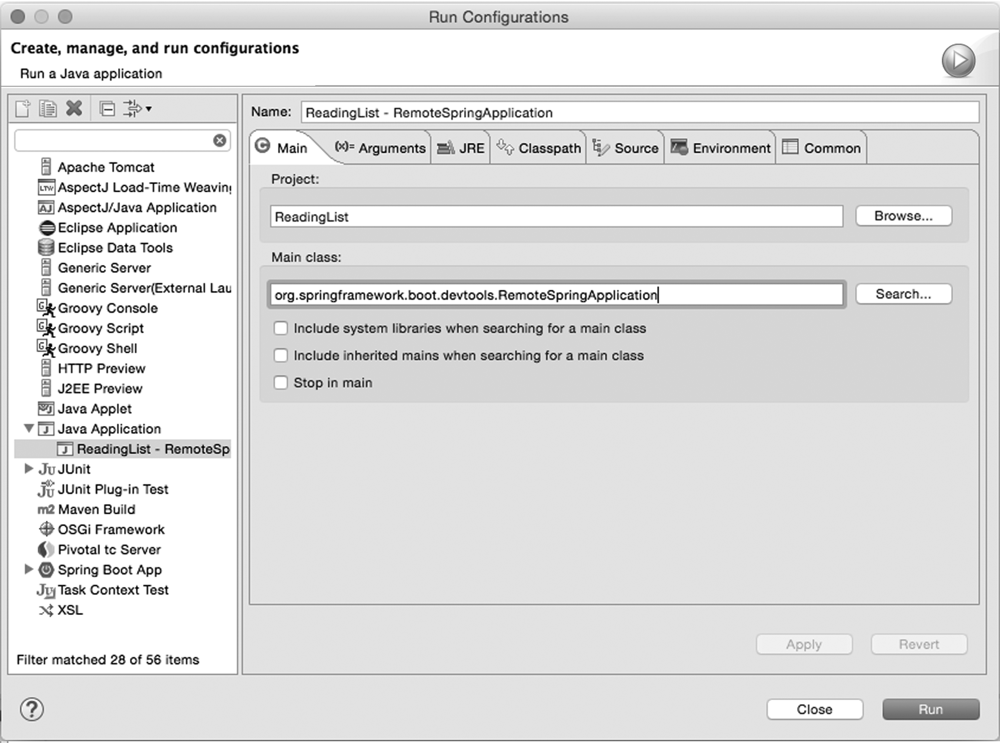
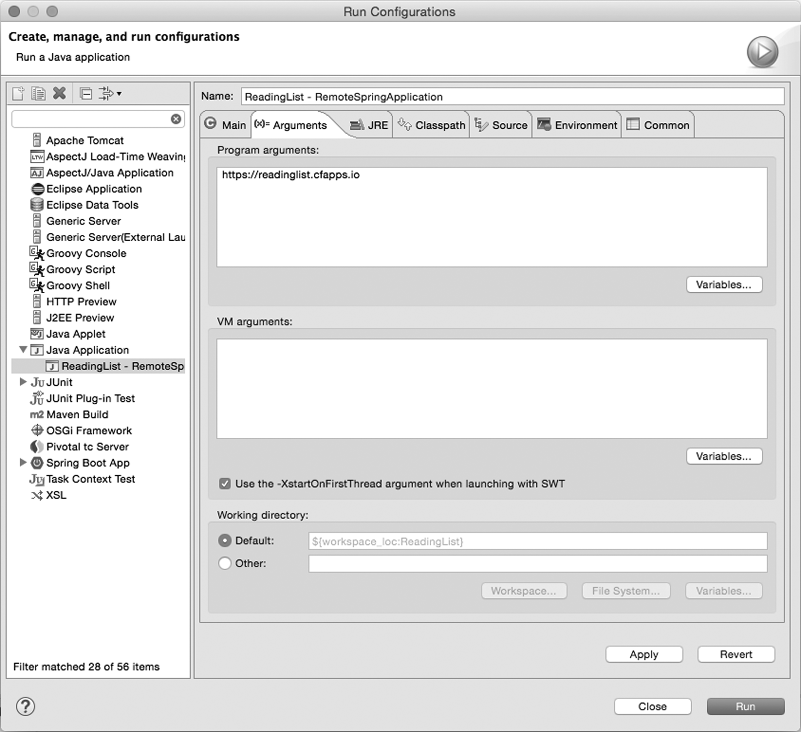

# appendix A Spring Boot Developer Tools
# 附录A Spring Boot开发者工具

Spring Boot 1.3 introduced a new set of developer tools that make it even easier to work with Spring Boot at development time. Among its many capabilities are  
Spring Boot 1.3引入了一组新的开发者工具，让你在开发时能更方便地使用Spring Boot。其功能包括

* Automatic restart—Restarts a running application when files are changed in the classpath
* LiveReload support—Changes to resources trigger a browser refresh automatically
* Remote development—Supports automatic restart and LiveReload when deployed remotely
* Development property defaults—Provides sensible development defaults for some configuration properties
* 自动重启——当Classpath里的文件发生变化时自动重启运行中的应用程序
* LiveReload支持——对资源的修改自动触发浏览器刷新
* 远程开发——远程部署时支持自动重启和LiveReload
* 默认开发时属性值——为一些属性提供有意义的默认开发时属性值

Spring Boot’s developer tools come in the form of a library that can be added to a project as a dependency. If you’re using Gradle to build your project, the development tools can be added with the following line in your build.gradle file:  
Spring Boot的开发者工具是一个可以加入项目的依赖，如果你使用Gradle来构建项目，可以像下面这样在build.gradle文件里添加开发工具：

```
compile "org.springframework.boot:spring-boot-devtools"
```

Or it can be added as a <dependency> in a Maven POM:  
在Maven POM里添加`<dependency>`是这样的：

```
<dependency>
  <groupId>org.springframework.boot</groupId>
  <artifactId>spring-boot-devtools</artifactId>
</dependency>
```

The developer tools will be disabled when your application is running from a fully packaged JAR or WAR file, so it’s unnecessary to remove this dependency before building a production deployment.  
当应用程序以完整打包好的JAR或WAR文件形式运行时，开发者工具会被禁用，所以没有必要在构建生产部署包前移除这个依赖。

## Automatic restart

With the developer tools active, any changes to files on the classpath will trigger an application restart. To make the restart as fast as possible, classes that won’t change (such as those in third-party JAR files) will be loaded into a base classloader, whereas application code that is being worked on will be loaded into a separate restart classloader. When changes are detected, only the restart classloader is restarted.

There are some classpath resources that don’t require an application restart when they change. View templates, such as Thymeleaf templates, can be edited on the fly without restarting the application. Static resources in /static or /public likewise don’t require an application restart, so Spring Boot developer tools exclude the following paths from restart consideration: /META-INF/resources, /resources, /static, /public, /templates.

The default set of restart path exclusions can be overridden by setting the spring.devtools.restart.exclude property. For example, to only exclude /static and /templates, set spring.devtools.restart.exclude like this:

```
spring:
  devtools:
    restart:
      exclude: /static/**,/templates/**
```

On the other hand, if you’d rather disable automatic restart completely, you can set spring.devtools.restart.enabled to false:

```
spring:
  devtools:
    restart:
      enabled: false
```

Another option is to set a trigger file that must be changed in order for the restart to take place. For example, suppose you don’t want a restart to happen unless a change is made to a file named .trigger. All you must do is set the spring.devtools.restart.trigger-file property like this:

```
spring:
  devtools:
    restart:
      trigger-file: .trigger
```

A trigger file is useful if your IDE continuously compiles changed files. Without a trigger file, every change would trigger a restart. With a trigger file, you can be sure that a restart doesn’t happen unless you want it to (by making a change to the trigger file).

## LiveReload

One of the most common rituals of web application development involves the following steps:

1. Make a change to rendered content (such as images, stylesheets, templates).
2. Click Refresh in the browser to see the results of the change.
3. Repeat starting at step 1.

Although it’s not an arduous process, it would be nice if you could see the results of a change immediately, without clicking Refresh.

Spring Boot’s developer tools integrate with LiveReload (http://livereload.com) to eliminate the Refresh step. When the developer tools are active, Spring Boot will start an embedded LiveReload server that can trigger a browser refresh whenever a resource is changed. All you need to do is install the LiveReload plugin into your web browser.

If you’d like to disable the embedded LiveReload server, you can do so by setting spring.devtools.livereload.enabled to false:

```
spring:
  devtools:
    livereload:
      enabled: false
```

# Remote development

The automatic restart and LiveReload features of the developer tools are also optionally available when running the applications remotely (such as when deployed on a server or in a cloud environment). In addition, Spring Boot’s developer tools enable remote debugging of Spring Boot applications.

In a typical deployment, you won’t want the remote development feature enabled, as it will hinder performance. But in special cases, such as when developing an application that’s deployed in a non-production environment set aside for development purposes, these tools can come in handy. This is especially useful if your application uses a cloud service that isn’t available in your local development environment.

You must opt in to remote development by setting a remote secret:

```
spring:
  devtools:
    remote:
      secret: myappsecret
```

By setting this property, a server component is enabled in the running application to support remote development. This server will listen for requests asking it to accept incoming changes and will either restart the application or trigger a browser refresh.

In order to put this remote server to use, you’ll need to run the remote development tools client locally. The remote client comes in the form of a class whose fully qualified name is org.springframework.boot.devtools.RemoteSpringApplication. It’s designed to run in your IDE with an argument telling it where your remote application is deployed.

For example, suppose you’re running the reading-list application remotely, deployed on Cloud Foundry at https://readinglist.cfapps.io. If you’re using Eclipse or Spring ToolSuite, you can start the remote client with the following steps:

1. Select the Run > Run Configurations menu item.
2. Create a new Java Application launch configuration.
3. Select the Reading List project in the Project field (either by typing the project name or clicking the Browse button and finding it). See figure A.1.
4. Enter org.springframework.boot.devtools.RemoteSpringApplication into the Main Class field. See figure A.1.
5. On the Arguments tab, enter https://readinglist.cfapps.io into the Program Arguments field. See figure A.2.



__Figure A.1 RemoteSpringApplication is the remote developer tools client.__



__Figure A.2 RemoteSpringApplication takes the remote app’s URL as an argument.__

Once the client has started, you can start making changes to the application in your IDE. As changes are detected, they’ll be pushed to the remote server and applied. If changes are made to a rendered web resource (such as a stylesheet or JavaScript), they’ll also trigger a browser refresh using LiveReload.

The remote client will also enable tunneling of remote debug traffic over HTTP so that you can debug a remotely deployed application in your IDE. All you must do is ensure that the remote application has remote debugging enabled. This can usually be done by configuring JAVA_OPTS.

For example, if your application is deployed to Cloud Foundry, you can set JAVA_OPTS in your application’s manifest.yml file like this:

```
---
  env:
    JAVA_OPTS: "-Xdebug -Xrunjdwp:server=y,transport=dt_socket,suspend=n"
```

Once the remote application is started and a connection is established with the local debug server, you should be able to set breakpoints and step through the code of the remote application much as if it were local (albeit a bit slower due to network latency).

## Development property defaults

There are some configuration properties that are usually set at development time, but never in a production setting. View template caching, for instance, is best disabled during development so that you can see the results of any changes you make immediately. But in production, view template caching should be left enabled for better performance.

By default, Spring Boot will enable caching for any of the supported view template options (Thymeleaf, Freemarker, Velocity, Mustache, and Groovy templates). But if Spring Boot’s developer tools are in play, that caching will be disabled.

Essentially what this means is that when the developer tools are active, the following properties are set to false:

* spring.thymeleaf.cache
* spring.freemarker.cache
* spring.velocity.cache
* spring.mustache.cache
* spring.groovy.template.cache

This saves you from having to disable them (likely in a development-profiled configuration) for development time.

## Globally configuring developer tools

As you work with the developer tools, you’ll probably find that you regularly use the same settings across multiple projects. For instance, if you use a restart trigger file, you’re likely to name the trigger file consistently across projects. Rather than repeat developer tool configuration in each project, it may be more convenient to configure the developer tools globally.

To do this, create a file named .spring-boot-devtools.properties in your home directory. (Note that the name starts with a period.) In that file, set whatever developer tool properties you want to have applied across all of your projects.

For example, suppose that you want to set a trigger file named .trigger and disable LiveReload across all of your Spring Boot projects. To do that, you can create a .spring-boot-devtools.properties file with the following lines:

```
spring.devtools.restart.trigger-file=.trigger
spring.devtools.livereload.enabled=false
```

Then, should you want to override any of these properties, you can do so on a project-by-project basis by setting them in each project’s application.properties or application.yml file.
